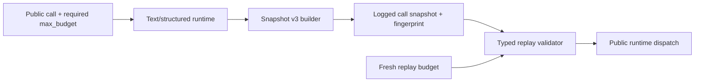
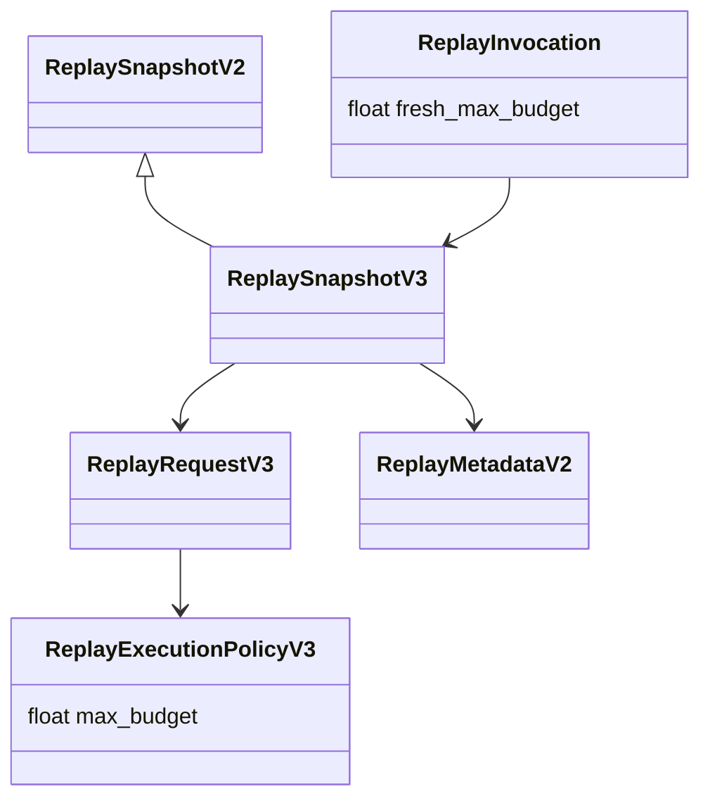

# Plan #100: Budget-Complete Call Snapshot V3

**Status:** Planned
**Type:** implementation
**Priority:** High
**Blocked By:** None; child branch preserves Plan 97 commit `d74b8ea`
**Blocks:** DoDAF fresh page-window diagnostic and every consumer requiring a
budget-complete full trace

## Goal And Scope

Retain the effective `max_budget` enforced by every public text and structured
call in a new closed snapshot v3, while preserving historical v1/v2 reads and
requiring fresh explicit budget authority for any v3 replay.

This is a deterministic shared-boundary repair. It does not authorize a provider
call, change budget enforcement, modify retry behavior, add production controls,
or decide any downstream extraction result.

## Modality And Decisions

Deductive: the required value, four producer paths, fingerprint behavior,
version compatibility, and replay failure states are fully testable before
implementation. No exploratory parameter is needed.

Premade decisions:

1. Add snapshot v3; never mutate closed v2 semantics.
2. Store the effective numeric value under `request.control.max_budget`.
3. Fingerprint the full v3 envelope, as v2 already does.
4. Continue reading v1/v2 with their exact historical behavior.
5. Require a fresh explicit replay budget for v3; never inherit captured spend
   authority.
6. Preserve Plan 97 by building on exact commit `d74b8ea` in a separate child
   worktree.

## Requirements

| ID | Requirement | Pass | Fail | Evidence target |
|---|---|---|---|---|
| L100-R1 | New snapshots retain effective budget | exact finite nonnegative value on text and structured sync/async paths | omission, raw caller value, or coercion drift | source + both-sign tests, A |
| L100-R2 | V3 identity is complete | changing only captured budget changes fingerprint | unchanged identity or request-only hash | source + test, A |
| L100-R3 | Historical reads remain exact | retained v1/v2 fixtures validate and replay as before | v2 requires v3 field or fingerprint changes | fixture + test, A |
| L100-R4 | V3 replay gets fresh authority | explicit fresh budget reaches dispatch; omission rejects before dispatch | captured budget reused or implicit default | source + both-sign test, A |
| L100-R5 | All malformed states fail loud | missing, negative, nonfinite, string, or unknown v3 control rejected | coercion or silent downgrade | negative tests, A |
| L100-R6 | Plan 97 behavior remains intact | structured attempt and retry suites pass | lifecycle regression | existing tests, A |

## Boundaries And Business Rules

| Boundary | Owned state | Business rules and invariants | Inputs/outputs | Failure | Forbidden |
|---|---|---|---|---|---|
| public runtime | effective checked budget | `_require_tags` result is the captured value | call args -> v3 builder | missing budget fails before snapshot | retaining unchecked raw kwargs |
| snapshot builder | versioned request envelope | v3 budget finite and nonnegative; closed typed shape | effective call controls -> JSON snapshot | invalid value rejected | v2 mutation or side receipt |
| fingerprint | deterministic request identity | full v2/v3 envelope; historical v1 request behavior | snapshot -> SHA-256 | malformed request fails | excluding v3 budget |
| replay validator | historical/v3 interpretation | v1/v2 readable; v3 requires fresh explicit budget | stored snapshot + new budget -> dispatch kwargs | reject before I/O | inheriting captured budget |
| downstream consumer | exact shared revision | independently pin and verify shared behavior | clean commit -> consumer preflight | remain blocked | assuming branch state is installed |

## Domain Model

Captured budget describes the original call. Fresh replay budget authorizes a
new derived call. They are deliberately separate values.

## Contracts Then Schema

| Contract | Producer -> consumer | Required fields/invariants |
|---|---|---|
| `_ReplayExecutionPolicyV3` | builder -> validator | all v2 fields plus strict finite `max_budget >= 0` |
| `_ReplayRequestV3` | builder -> replay | requested model, messages, prompt, v3 control, kwargs, response model identity/schema |
| `_ReplaySnapshotV3` | runtime -> log/replay | version 3, public API, call kind, request, replay metadata; `extra="forbid"` |
| replay invocation | operator -> replay | trace ID and explicit fresh finite nonnegative max budget for v3 |

Schema is derived directly through the Pydantic models. V2 models remain
unchanged. No database schema change is needed because call snapshots are stored
as versioned JSON.

## Backward Runtime Pass

New dispatch kwargs <- validated fresh replay budget + reconstructed v3 policy
<- fingerprint-verified v3 snapshot <- logged builder output <- effective budget
returned by `_require_tags` on the original public call.

If any link is absent, replay rejects before dispatch. A downstream consumer may
claim budget-complete tracing only after pinning a clean exact commit and proving
all four runtime paths.

## Runtime Contract Inventory

| Runtime object | Producer | Consumer |
|---|---|---|
| effective `max_budget` | `_require_tags` | budget checker and snapshot builder |
| v3 call snapshot | builder | fingerprint logger and replay reader |
| call fingerprint | snapshot fingerprint | observability row and replay integrity check |
| fresh replay budget | replay caller | reconstructed public call kwargs |

## State Transition

| Current | Trigger | Guard | Result | Trace |
|---|---|---|---|---|
| v2 builder | checked public call | effective budget valid | logged v3 snapshot | call row carries v3 + fingerprint |
| stored v1/v2 | replay request | historical validation | historical dispatch behavior | new call trace |
| stored v3 | explicit fresh budget | envelope, fingerprint, budget valid | new dispatch with fresh budget | new call trace |
| stored v3 | missing/invalid fresh budget | fail-loud guard | no dispatch | raised validation error |

## Worked Runtime Example

Original structured call checks `max_budget=0.35`; builder stores `0.35` in v3
and fingerprints the full envelope. Later replay supplies
`max_budget=0.20`. Replay verifies the stored `0.35` as original-call identity
but dispatches with fresh `0.20`. Omitting `0.20` rejects before the patched
dispatch test can observe a call.

## Files Affected

- `llm_client/observability/replay.py`
- `llm_client/execution/text_runtime.py`
- `llm_client/execution/structured_runtime.py`
- `tests/test_observability_replay.py`
- runtime tests only where needed to prove all producer paths
- this plan, investigation, progress file, and plan index

## Required Tests

### New Tests (TDD)

| Test File | Test Function | What It Verifies |
|---|---|---|
| `tests/test_observability_replay.py` | `test_v3_snapshot_retains_budget_and_fingerprint_changes` | exact v3 budget retention and full-envelope identity |
| `tests/test_observability_replay.py` | `test_v3_snapshot_rejects_missing_or_invalid_budget` | missing, string, negative, and nonfinite controls fail loud |
| `tests/test_observability_replay.py` | `test_historical_v1_v2_snapshots_remain_readable` | closed historical envelopes retain their prior validation behavior |
| `tests/test_observability_replay.py` | `test_v3_replay_requires_fresh_explicit_budget` | omission rejects before dispatch |
| `tests/test_observability_replay.py` | `test_v3_replay_dispatches_fresh_budget_not_captured_budget` | fresh replay authority is separate from captured identity |
| `tests/test_observability_replay.py` | `test_public_runtime_snapshots_retain_effective_budget_all_paths` | text sync/async and structured sync/async persist checked budgets |

### Existing Tests (Must Pass)

| Test Pattern | Why |
|---|---|
| `tests/test_observability_replay.py` | historical fingerprint and replay behavior |
| `tests/test_structured_attempts.py` | Plan 97 lifecycle remains intact |
| `tests/test_execution_kernel.py` | Plan 97 retry-boundary behavior remains intact |

## Failure Modes

| Failure | Response |
|---|---|
| v3 cannot distinguish omitted from default replay budget | change replay signature/guard before release |
| historical v2 test fails | restore v2 model/fingerprint semantics; do not migrate fixture |
| runtime path omits budget | remain unshippable until that path passes |
| full-envelope hash ignores budget | repair fingerprint before downstream pin |
| Plan 97 regression | stop and reconcile child branch; do not discard parent work |

## Plan

### Risk-Ordered Slices

1. **Plan and tests:** accept this contract and add failing builder/replay
   controls without changing runtime.
2. **Shared implementation:** add v3 models, builder, fingerprint, replay, and
   all four producer paths; run focused gates.
3. **Independent audit and integration:** adversarially verify exact branch,
   run full repository gates, commit/push, and publish a normal PR or exact
   integration commit.
4. **DoDAF successor:** pin the clean shared commit, run no-call preflight, then
   separately authorize the one fresh page-11 diagnostic with full-trace review.

No UI or notebook is justified: direct typed fixtures expose the complete seam.

## Audit Charter

**Stage:** shared-runtime repair supporting a PoC. **Next decision:** whether a
downstream project may pin this revision for one budget-complete diagnostic.
**Budget:** at most three current blocker groups. **Non-goals:** provider
quality, security hardening, deployment, and unrelated replay expansion.
**Stopping rule:** proceed only when all four producers, both historical reads,
v3 fingerprinting, and fresh replay authority pass by execution.
