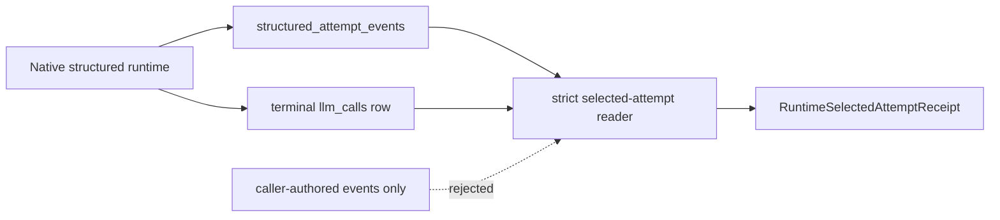

# Plan #101: Runtime-Selected Structured Attempt Receipt

**Status:** In Progress
**Type:** implementation
**Priority:** High
**Blocked By:** None; Plan 100 merged at `a5a4364`
**Blocks:** onto-canon6 Plan 0141 trusted-runner receipt pinning

## Goal And Scope

Expose a provider-free typed read that joins the terminal successful
`llm_calls` row owned by `llm_client` to its complete native JSON-schema
attempt history. The result identifies the one validated attempt selected by
the runtime without asking a caller to replay or reconstruct lifecycle events.

This plan does not execute a model, make a semantic judgment, add a security
boundary against hostile in-process code, or claim that the observability
database is an append-only audit service. This is **trusted-process runtime
provenance**, not provider attestation, source authentication, a signature, or
an independent audit. The consumer must pin the `logical_call_id` returned on
the actual `LLMCallResult`; trace lookup is diagnostic only.

## Modality And Decisions

Deductive: valid lifecycle sequences, required joins, hashes, and rejection
states follow from the existing persistence contracts and can be proven with
provider-free SQLite fixtures.

Premade decisions:

1. Certify only `native_schema` + `json_schema` structured calls. Other runtime
   paths do not have equivalent lossless events and fail loud.
2. Resolve by `logical_call_id`; provide a trace helper that succeeds only when
   the trace identifies exactly one eligible logical call.
3. Require exactly one successful terminal call row and exactly one validated
   attempt. Never select the latest row or highest-confidence candidate.
4. Bind the selected attempt to its preceding `received` event and carry that
   event's raw-content SHA-256 and optional artifact reference.
5. Recompute and verify the stored call-snapshot fingerprint.
6. Preserve the full ordered event history as typed lineage. The receipt does
   not discard failed attempts or fallback/recovery decisions.
7. Compute a receipt integrity digest over the normalized terminal-row identity and
   complete typed event history. This is an integrity fingerprint, not a
   signature or tamper-proof storage claim.
8. Do not change runtime writers or provider behavior in this slice.
9. Return the same `logical_call_id` on the actual sync/async `LLMCallResult`.
   A trusted consumer pins that exact value; trace lookup remains diagnostic and
   may not establish trusted selection.

## Requirements

| ID | Requirement | Pass | Fail | Evidence target |
|---|---|---|---|---|
| L101-R1 | Exact selected attempt | one validated attempt joined to one successful terminal row | latest/first heuristic or multiple successes | source + tests, A |
| L101-R2 | Exact request/result identity | requested model from verified v3 snapshot; resolved model/schema/task/trace match terminal row and events | mismatched projection | source + tests, A |
| L101-R3 | Evidence-bearing selection | selected received event contributes raw SHA-256 and optional artifact reference | selected result without evidence hash | source + tests, A |
| L101-R4 | Complete lineage | all ordered typed attempt events retained, including failures and recovery decisions | success-only history | source + retry/fallback fixture, A |
| L101-R5 | Fail-loud integrity | absent, nonterminal, ambiguous, incomplete, mismatched, or fingerprint-tampered state rejects | partial receipt or silent fallback | negative tests, A |
| L101-R6 | Runtime evidence join | public attempt events without a matching terminal runtime row cannot yield a receipt | caller-event-only receipt | negative test, A |
| L101-R7 | Provider-free verification | tests use real temporary SQLite and typed fixtures; no provider call | network/model dependency | test audit, A |
| L101-R8 | Returned identity binding | sync/async result ID exactly selects its persisted receipt | trace discovery or substituted ID | public-runtime tests, A |

## Boundaries And Domain Model

| Object | Meaning | Required invariants |
|---|---|---|
| terminal call row | runtime's final successful public-call record | one row; no error; native/json-schema path; v3 structured snapshot; matching call/trace/task/model/schema |
| attempt history | append-only generation lifecycle | one logical call; stable trace/task/schema per event; legal per-attempt order; one validated attempt |
| selected evidence | received payload associated with selected attempt | same ordinal/model/schema; nonblank SHA-256; precedes validated |
| receipt | typed trusted-process projection | requested/resolved model, selected ordinal, hashes/artifact, complete lineage, receipt digest |
| returned result identity | trusted-runner selection handle | exact `LLMCallResult.logical_call_id`; same value on terminal row and events |

The receipt is a Pydantic producer model with `extra="forbid"`. It carries no
LLM-generated identifier. The reader never accepts caller-supplied event
objects; it reads both stores itself.

Within each attempt ordinal, every event names one model. A `retry` must lead
to the same model, a `fallback` must lead to a different model, and `exhausted`
cannot precede a later selected success.

## Contracts Then Schema

`RuntimeSelectedAttemptReceipt` contains `logical_call_id`, `trace_id`, `task`,
terminal `call_id`, requested and resolved model, selected attempt ordinal,
schema hash, raw SHA-256, optional artifact reference, call fingerprint,
complete ordered `StructuredAttemptEvent` lineage, and a receipt digest over
the normalized joined evidence.

The low-level SQLite seam returns raw persisted rows only inside `llm_client`.
The cross-project public seam returns the typed model.

## Backward Runtime Pass

Downstream receipt pin <- typed selected-attempt receipt <- strict join and
lifecycle validation <- terminal `llm_calls` row + all structured attempt
events <- existing native-schema runtime writers.

If any link is absent or contradictory, the read raises before a downstream
consumer can reserve or run another task. No provider fallback repairs an
observability failure.

## State And Failure Rules

The valid selected lifecycle is `started -> received -> validated`. Earlier
attempts may fail and then carry `recovery_decided`. A validated attempt may not
also fail or carry recovery, and events after the selected validation are
invalid. Multiple terminal rows, multiple validations, mismatched identity,
missing received evidence, unsupported paths, malformed snapshots, and
fingerprint drift raise `SelectedAttemptReceiptError`.

## Files Affected

- `llm_client/observability/selected_attempts.py`
- `llm_client/observability/__init__.py`
- `llm_client/io_log.py`
- `llm_client/__init__.py`
- `tests/test_selected_attempts.py`
- generated API reference
- this plan, progress file, and plan index

## Required Tests

| Test | What it proves |
|---|---|
| successful single attempt | exact typed receipt from real temporary SQLite |
| validation retry then success | selected ordinal and full failed-attempt lineage retained |
| fallback then success | requested and resolved model differ truthfully; recovery retained |
| public events only / terminal row only | neither half can yield a receipt |
| duplicate terminal rows | ambiguity rejects |
| multiple/missing validated attempts | lifecycle rejects |
| missing/mismatched received evidence | evidence join rejects |
| task/trace/model/schema mismatch | cross-record mismatch rejects |
| error or unsupported terminal path | non-eligible result rejects |
| tampered call snapshot/fingerprint | identity rejects |
| trace helper with zero/multiple candidates | ambiguity rejects |

Existing structured-attempt, replay, public-surface, mypy, Ruff, and full
repository gates must remain green.

## Risk-Ordered Slices

1. Freeze this contract and add provider-free failing tests.
2. Implement the internal row reader and typed strict join.
3. Export the public surface and regenerate API documentation.
4. Run focused and repository-wide verification; independently audit the exact
   commit before downstream pinning.

No UI or notebook is justified: the consumer needs one typed machine boundary,
and temporary SQLite fixtures expose the entire seam.

## Evidence Coverage Before Enforcement

| Criterion | Initial grade | Target |
|---|---|---|
| contract and failure taxonomy | D (this plan) | A |
| successful receipt | A (source + sync/async provider-free runtime tests) | A |
| complete retry/fallback lineage | A (source + sync/async runtime tests) | A |
| public-event-only rejection | A (negative test) | A |
| mismatch/tamper rejection | A (negative tests) | A |
| returned-ID binding and substitution rejection | A (public-runtime tests) | A |
| downstream onto-canon6 integration | F | separate consumer-plan evidence |

The reader does not become a downstream hard gate until the target A-grade
provider-free tests pass. A provider call remains separately authorized work.

## Audit Charter

**Stage:** shared-runtime contract supporting a PoC. **Next decision:** whether
onto-canon6 may pin the exact runtime-returned logical call identity and read
its trusted-process receipt without claiming independent provider authority.
Review at most three blocker groups: false authority, incomplete lineage, and
unusable consumer identity. Security hardening, semantic quality, remote audit
storage, and unrelated observability cleanup are out of scope.

## References Reviewed

- `docs/adr/0007-observability-contract-boundary.md`
- `docs/adr/0013-stream-lifecycle-heartbeat-observability.md`
- `docs/plans/97_lossless_structured_output_attempt_observability.md`
- `docs/plans/99_strict_native_json_schema_execution.md`
- `docs/plans/100_budget_complete_call_snapshot_v3.md`
- `llm_client/execution/structured_runtime.py`
- `llm_client/observability/structured_attempts.py`
- `llm_client/observability/replay.py`
- `llm_client/io_log.py`
- `tests/test_structured_attempts.py`
