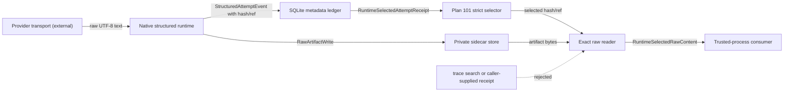
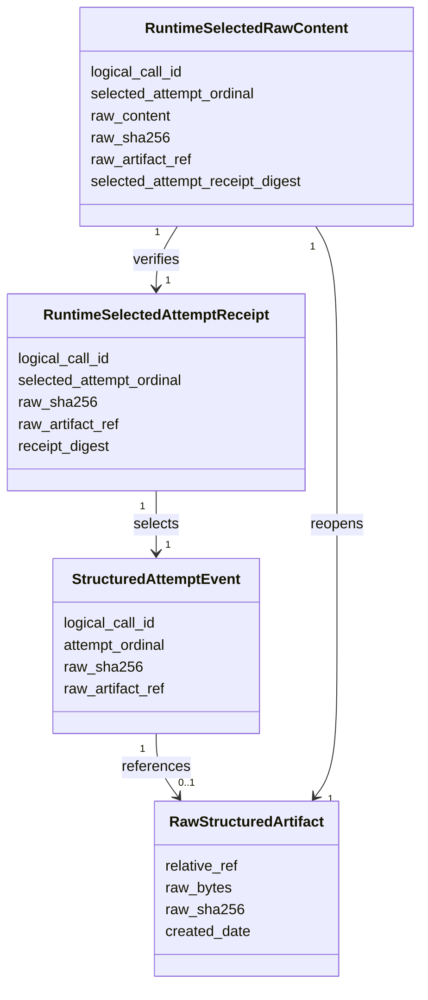

# Plan #102: Exact Selected Raw Structured Content

**Status:** In Progress
**Type:** implementation
**Priority:** High
**Blocked By:** Plan #101 complete at `40ca594d45304ec674ff57e8b969b15894f4be41`
**Blocks:** onto-canon6 Plan 0141 transport-receipt construction

---

## Frame

**Goal:** Let a trusted-process consumer reopen the exact raw UTF-8 content of
the structured attempt selected by Plan 101, using the exact
`logical_call_id` returned by the runtime, and verify it against the persisted
attempt hash.

**Constraints:** Raw-content retention is opt-in. Disabled retention remains a
valid configuration but cannot support exact raw replay. Enabled retention must
fail before provider dispatch when storage is unavailable or normal attempt
logging is disabled. No semantic judgment, provider attestation, encryption
service, model call, trace search, or automatic provider fallback belongs here.

**Modality:** Deductive. Identity, hashing, file containment, permissions,
lifecycle selection, and failure behavior have mechanical acceptance tests.
This plan does not measure or decide semantic quality.

**Borrow versus build:** Use Python's `pathlib`, `hashlib`, `os`, and atomic
same-filesystem replacement. A database blob would violate the metadata-only
boundary established by Plan 97. A new object-store dependency is unjustified
for a local trusted-process PoC and would move failures behind an external
boundary. The existing `raw_artifact_ref` field is the intended seam.

## Gap

**Current:** Plan 97 stores `raw_sha256` on each `received` event and an unused
nullable `raw_artifact_ref`. Plan 101 strictly selects one validated attempt.
`LLMCallResult.content` is normalized parsed JSON, not the raw provider text,
so consumers cannot truthfully verify a transport-content receipt.

**Target:** When explicitly enabled, persist exact raw structured content in a
private sidecar before the `received` event. The event carries an opaque
relative artifact reference. An exact-ID reader obtains the Plan 101 receipt,
reopens only its selected artifact, verifies bytes and SHA-256, decodes UTF-8
strictly, and returns a typed trusted-process projection.

**Why:** Hash-only evidence proves that the runtime observed some bytes but does
not let a downstream trusted process independently recompute the hash. Treating
normalized result JSON as those bytes is false provenance.

## Requirements

| ID | Requirement | Pass | Fail | Target evidence |
|---|---|---|---|---|
| L102-R1 | Opt-in retention | disabled mode writes no raw artifact and makes no replayability claim | raw content stored by default | source + tests, A |
| L102-R2 | Pre-dispatch readiness | enabled mode validates logging and writable private root before transport | provider runs before configuration failure | source + test, A |
| L102-R3 | Exact bytes | sidecar bytes hash to the event `raw_sha256` | normalized/re-serialized JSON stored instead | source + byte test, A |
| L102-R4 | Private contained storage | directories are owner-only, files owner read/write, references cannot escape root | permissive mode or traversal | source + tests, A |
| L102-R5 | Exact selected read | reader starts from exact `logical_call_id` and Plan 101 receipt | trace/latest/first discovery | source + tests, A |
| L102-R6 | Fail-loud integrity | absent ref/file, malformed ref, hash mismatch, non-UTF-8, or receipt mismatch raises | partial content or fallback | negative tests, A |
| L102-R7 | Attempt completeness | sync/async success, validation retry, and fallback attach refs to every received attempt | selected-only or success-only retention | runtime tests, A |
| L102-R8 | Bounded retention | configured age cleanup removes expired sidecars without deleting current artifacts | unbounded raw retention | source + tests, A |
| L102-R9 | No semantic authority | result is trusted-process transport evidence only | provider attestation or semantic correctness claim | contract review, A |

## Boundaries



| Boundary | Owns | Rules and invariants | Failure | Must not own |
|---|---|---|---|---|
| native structured runtime | dispatch order and received raw string | validate enabled store before transport; persist before received event | abort loudly | semantic judgment, provider attestation |
| sidecar store | exact bytes, root, permissions, retention cleanup | relative contained ref; SHA-256 filename binding; atomic write; `0700` dirs and `0600` files | raise on enabled write/read failure | attempt selection |
| metadata ledger | hash and artifact reference | body stays outside SQLite event row | existing integrity error | raw-body storage |
| Plan 101 selector | authoritative trusted-process selected attempt | exact logical call, one legal selected lifecycle | `SelectedAttemptReceiptError` | artifact I/O |
| exact raw reader | receipt/artifact join and verification | read selected ref only; recompute hash; strict UTF-8 | typed raw-artifact error | trace discovery, content normalization |

## Domain Model



## Contracts And Derived Schema

Configuration is environment-backed and read at runtime:

- `LLM_CLIENT_STRUCTURED_RAW_ARTIFACTS=off|on` (default `off`; invalid values
  raise rather than silently defaulting);
- `LLM_CLIENT_STRUCTURED_RAW_ARTIFACT_ROOT` (optional; default beneath the
  configured `LLM_CLIENT_DATA_ROOT`);
- `LLM_CLIENT_STRUCTURED_RAW_RETENTION_DAYS` (positive integer; default reuses
  `LLM_CLIENT_LOG_RETENTION_DAYS`; invalid values raise when enabled).

An artifact ref is a versioned relative POSIX path under the configured root:
`v1/YYYY-MM-DD/<sha256(logical_call_id)>/<ordinal>-<raw_sha256>.raw`.
The reader rejects absolute paths, `..`, unknown versions, unexpected suffixes,
call-key mismatch, ordinal mismatch, and hash-name mismatch before opening.

`RuntimeSelectedRawContent` is a frozen Pydantic producer model with
`extra="forbid"`. It returns raw text because the provider boundary already
delivers a Python `str`; decoding is strict UTF-8. It carries the selected
receipt digest so the joined evidence is explicit. It is not a signature.

```mermaid
sequenceDiagram
  participant Caller
  participant Runtime
  participant Store
  participant Ledger
  participant Selector
  participant Reader
  Runtime->>Store: validate readiness (before provider dispatch)
  alt disabled
    Store-->>Runtime: retention disabled
  else enabled but unavailable
    Store--xRuntime: fail loud; no provider dispatch
  end
  Runtime->>Store: write_raw(logical_call_id, ordinal, raw_text)
  Store-->>Runtime: RawArtifactWrite(ref, sha256)
  Runtime->>Ledger: received(raw_sha256, raw_artifact_ref)
  Caller->>Reader: get(logical_call_id)
  Reader->>Selector: get_runtime_selected_attempt_receipt(exact id)
  Selector-->>Reader: selected receipt
  Reader->>Store: read and verify selected ref
  alt absent, malformed, expired, or tampered
    Store--xReader: StructuredRawArtifactError
  else valid
    Store-->>Reader: exact UTF-8 bytes
    Reader-->>Caller: RuntimeSelectedRawContent
  end
```

## Backward Runtime Pass

`RuntimeSelectedRawContent` requires a verified selected receipt plus exact
artifact bytes. The receipt requires the terminal row and complete attempt
history. The history can truthfully name an artifact only if the runtime wrote
the sidecar before its `received` event. Therefore readiness must be checked
before transport, and artifact persistence failure in enabled mode must abort
the call rather than degrade to a null reference.

## State And Failure Rules

| State/input | Guard | Result | Trace |
|---|---|---|---|
| disabled before dispatch | explicit `off` | normal call; refs remain null | existing attempt ledger |
| enabled and ready | logging enabled + private writable root | provider dispatch allowed | no new semantic trace |
| enabled and not ready | readiness failure | abort before provider | exception context |
| received raw text | enabled store | exact sidecar then received event | hash + ref in event |
| exact read | Plan 101 receipt + valid ref/file/hash | typed raw content | selected receipt digest |
| exact read with any contradiction | strict verifier | raise, no fallback | typed error message |

## Risk-Ordered Slices

1. Freeze this contract and add provider-free storage/read negative controls.
2. Implement opt-in sidecar writer, containment verification, permissions, and
   retention cleanup using real temporary directories.
3. Wire every native-schema received boundary and prove sync/async retry and
   fallback completeness with controlled provider transports.
4. Export the exact reader, regenerate API docs, run repository verification,
   and obtain an independent adversarial review of the exact commit.
5. Only after merge, update onto-canon6 Plan 0141 to consume this reader. A real
   provider call remains separately authorized.

## Required Tests

### New Tests (TDD)

| Test File | Test Function | What It Verifies |
|---|---|---|
| `tests/test_structured_raw_artifacts.py` |  | Exact sidecar persistence, selection, and integrity controls |

### Existing Tests

| Test Pattern | Why |
|---|---|
| `tests/test_structured_attempts.py` | Native attempt lifecycle remains complete |
| `tests/test_selected_attempts.py` | Plan 101 exact selection remains strict |
| `tests/test_public_surface.py` | Export manifest remains exact |

### Coverage Scenarios

| Scenario | What it proves |
|---|---|
| disabled writer | no file/ref by default |
| enabled readiness before mocked transport | configuration failure prevents dispatch |
| exact odd-whitespace JSON bytes | no parse/re-serialization substitution |
| private mode and traversal mutation controls | access and containment |
| atomic duplicate write | identical content is stable; conflicting path fails |
| selected receipt exact read | strict joined typed projection |
| missing/ref/hash/UTF-8 mutations | all fail loudly |
| expired vs current cleanup | bounded retention without current deletion |
| sync/async success and validation retry/fallback | every received event has a verifiable ref |
| existing Plan 97/101/replay/public tests | no lifecycle or API regression |

No test performs a network or provider call. Controlled LiteLLM transports are
permitted because the runtime, retry policy, temporary SQLite database, and
real filesystem remain in use.

## Evidence Coverage Before Enforcement

All L102 criteria begin at **D (plan only)**. The gate remains visibility-only
until positive and negative controls reach **A (source + automated test)**.
onto-canon6 integration begins at **F** and is a separate downstream criterion;
this plan cannot raise it by construction.

## Audit Charter

**Stage:** shared-runtime PoC dependency. **Next decision:** whether onto-canon6
may construct a trusted-process transport receipt from exact raw structured
bytes. Review at most four blocker groups: false authority, raw-data leakage,
artifact substitution/traversal, and incomplete attempt wiring. Non-goals are
remote object storage, encryption-at-rest infrastructure, semantic quality,
provider attestation, and production multi-host durability. Stop after each
blocker is either reproduced and repaired with its original control passing, or
recorded as a dependency that prevents the downstream claim.

## References Reviewed

- `CLAUDE.md`
- `docs/plans/97_lossless-structured-output-attempt-observability.md`
- `docs/plans/101_runtime_selected_attempt_receipt.md`
- `docs/adr/0003-warning-taxonomy.md`
- `docs/adr/0007-observability-contract-boundary.md`
- `docs/adr/0012-shared-data-plane-boundary.md`
- `docs/adr/0014-call-replay-and-divergence-diagnosis-boundary.md`
- `llm_client/execution/structured_runtime.py`
- `llm_client/observability/structured_attempts.py`
- `llm_client/observability/selected_attempts.py`
- `llm_client/io_log.py`
- `tests/test_structured_attempts.py`
- `tests/test_selected_attempts.py`
