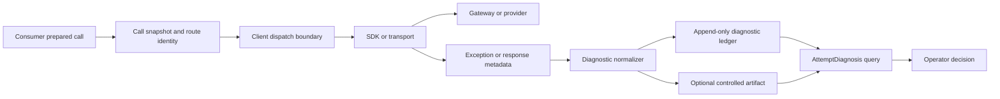
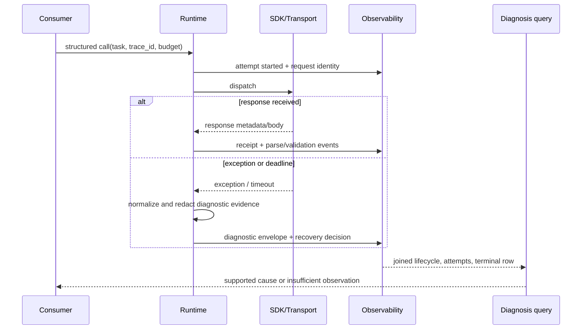
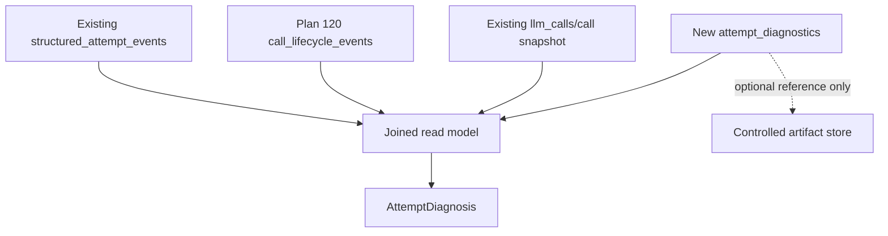

# Plan #121: Privacy-Bounded Attempt Diagnostic Envelope

**Status:** In Progress
**Type:** implementation
**Priority:** Critical
**Blocked By:** Plan #120 lifecycle identity and dispatch lineage landing
**Blocks:** Provider-attribution claims and cross-project diagnosis of failed structured calls

## Outcome

For one `logical_call_id` or `trace_id`, an operator can determine the
strongest client-observed explanation for each LLM attempt: the request
contract, the furthest observed execution phase, the normalized technical
evidence, the retry decision, and the limits of attribution. The output is a
typed `AttemptDiagnosis`, not an inference that a named provider is at fault.

This is **maximum authorized diagnostic observability**: enough retained
evidence to localize a failure without default persistence of prompts,
responses, credentials, authorization headers, or unbounded provider bodies.

## Gap

**Current:** Plan #97 retains ordered attempt events, failure class, exception
type, schema hash, and recovery decision. Plan #120 adds durable dispatch and
terminal lifecycle evidence. An `execution_failed` event intentionally omits
the exception message, HTTP status, provider/gateway request identifiers,
retry-after value, timeout phase, and normalized error code. Therefore
`provider_execution` means only that execution failed on the provider-facing
path; it cannot support a claim that DeepSeek, OpenRouter, or the client caused
the failure.

**Target:** Every attempt has an append-only diagnostic envelope that makes
failure origin and certainty explicit, preserves only allowlisted sanitized
diagnostic fields in SQLite, and links any authorized raw artifact by hash and
reference. One query joins lifecycle, attempt, routing, and terminal evidence
into a human- and agent-readable diagnosis.

**Why:** A route can be live yet fail because of request shape, SDK transport,
gateway policy, timeout behavior, native schema handling, or provider response.
Without the discriminating evidence, changing the model or retry count is
guesswork.

## References Reviewed

- `llm_client/observability/structured_attempts.py` - current typed attempt
  lifecycle, failure taxonomy, and intentionally limited execution evidence.
- `llm_client/execution/structured_runtime.py` - native-schema response and
  exception boundaries where diagnostics must be captured before wrapping.
- `llm_client/execution/retry.py` - existing status-code and retry-delay
  extraction that must become typed rather than prose-derived.
- `llm_client/io_log.py` and `llm_client/observability/query.py` - additive
  SQLite ledger/migration and existing lifecycle query seams.
- `docs/plans/97_lossless-structured-output-attempt-observability.md` -
  metadata-first attempt history and its deliberate exception/body exclusion.
- `docs/plans/120_durable_call_lifecycle.md` - dispatch/terminal lineage and
  process-interruption semantics that this plan extends.
- `docs/adr/0007-observability-contract-boundary.md`,
  `docs/adr/0012-shared-data-plane-boundary.md`,
  `docs/adr/0013-stream-lifecycle-heartbeat-observability.md`, and
  `docs/adr/0014-call-replay-and-divergence-diagnosis-boundary.md` -
  observability, privacy, lifecycle, and replay boundaries.
- `docs/adr/0001-model-identity-v0.md` and
  `docs/adr/0004-result-model-semantics-migration.md` - requested, resolved,
  and per-attempt model identities must remain additive and never be guessed.
- `docs/adr/0002-routing-config-precedence.md` and
  `docs/plans/117_explicit_reasoning_policy.md` - diagnostic tests set routing,
  timeout, and reasoning policy explicitly rather than reading ambient state.
- `docs/adr/0003-warning-taxonomy.md` - diagnostic persistence and missing
  required evidence are errors, not advisory warnings.
- `docs/adr/0009-long-thinking-background-polling.md` - background polling has
  a separate response identity and timeout lifecycle; it is not silently
  projected as a native-schema transport failure.
- `docs/adr/0010-cross-project-runtime-substrate.md` and
  `docs/adr/0016-provider-capability-and-vendor-telemetry-boundary.md` - this
  is a reusable local substrate; vendor telemetry is complementary and never
  replaces client-observed evidence.

## Target Consumer And Backward Trace

Target artifact: a `AttemptDiagnosis` for a failed Process Tracing central
claim review that states either a supported local cause or an explicit
`insufficient_observation` result. Its consumer is the operator deciding
whether to alter the request, wait/retry, escalate to a gateway/provider, or
stop.

| Target field or behavior | Required source/state | Owner | Contract | Acceptance check |
| --- | --- | --- | --- | --- |
| Exact request identity | existing v3 call snapshot, schema and prompt hashes | call preparation | `CallSnapshot` + lifecycle | matches the attempt and terminal call |
| Furthest observed phase | attempt and lifecycle events | runtime | `AttemptDiagnosticEnvelope.phase` | no phase invented after interruption |
| Evidence for classification | SDK exception/response metadata captured at boundary | adapter/runtime | typed sanitized diagnostic | status/request ID/error code survive readback |
| Attribution limit | available and unavailable evidence | diagnosis projector | `attribution` enum and rationale | provider claim rejected without provider evidence |
| Safe retention | redaction and artifact policy | observability | retention class + artifact ref | secrets/raw bodies absent from SQLite |

## Boundaries



`llm_client` owns capture, normalization, redaction, persistence, and query.
Provider internals, vendor dashboard data, source-corpus storage, and workflow
repair decisions remain outside this boundary. A downstream project may retain
the resulting IDs and diagnosis, but must not parse provider exceptions itself.

## Data Flow And Failure Semantics



Execution phases are ordered and non-inferential:
`pre_dispatch`, `dispatching`, `dispatched`, `awaiting_response`,
`response_received`, `parsing`, `validated`, `finalizing`, `cancelled`, and
`interrupted_or_abandoned`. A phase is emitted only when the client observes
the boundary; lack of a provider response is not proof that the provider never
received a request.

## Contract And Schema

`AttemptDiagnosticEnvelope` is a Pydantic producer model with `extra="forbid"`.
The SQLite row is an additive child of `structured_attempt_events`, keyed by
`diagnostic_id` and `attempt_event_id`; it never overwrites an event.

```json
{
  "diagnostic_id": "diag_...",
  "attempt_event_id": "...",
  "logical_call_id": "...",
  "attempt_ordinal": 0,
  "phase": "awaiting_response",
  "origin": "transport",
  "attribution": "client_observed_only",
  "exception_chain": ["APIConnectionError", "ConnectTimeout"],
  "exception_fingerprint": "sha256:...",
  "http_status": null,
  "provider_error_code": null,
  "provider_request_id": null,
  "gateway_request_id": null,
  "retry_after_s": null,
  "timeout_kind": "client_attempt_safety",
  "sanitized_summary": "client attempt safety deadline elapsed while awaiting response",
  "redaction_version": "v1",
  "artifact_ref": null,
  "artifact_sha256": null
}
```

### Invariants

1. `origin` is one of `pre_dispatch`, `client_serialization`, `transport`,
   `gateway_or_provider_response`, `response_parse`, `client_finalization`, or
   `unknown`; it describes where evidence was observed, not blame.
2. `attribution` is one of `client_confirmed`, `gateway_or_provider_confirmed`,
   `client_observed_only`, or `insufficient_observation`. The confirmed
   gateway/provider state requires an authenticated provider/gateway response
   code or request ID captured by the client.
3. `http_status`, provider/gateway error codes, request IDs, and `retry_after_s`
   are retained only from structured SDK response metadata, never regex guessed
   from arbitrary exception prose.
4. Exception chains contain class names only. A bounded sanitized summary may
   retain allowlisted operational detail but is rejected if it contains an API
   key, bearer token, prompt text, raw response body, or configured secret.
5. Raw exception bodies and request/response payloads remain out of SQLite.
   They require an explicit controlled artifact policy, a content hash, and a
   reference; unavailable artifacts are represented by nulls.
6. A client timeout records its own `timeout_kind`; it cannot be relabeled as a
   provider timeout. An externally interrupted process yields
   `interrupted_or_abandoned`, not a hypothetical terminal provider failure.

## Compatibility And Privacy



- Existing `llm_calls`, `structured_attempt_events`, `call_lifecycle_events`,
  and Foundation evidence remain readable and unchanged.
- New successful attempt events produce
  `diagnostic_status="not_applicable_success"`; they do not manufacture a
  failure diagnosis or masquerade as legacy. A failed event with no retained
  envelope produces `diagnostic_status="unavailable_no_diagnostic"`: this
  deliberately covers legacy rows and any current capture gap because the
  ledger cannot honestly distinguish them.
- The retention and redaction rules amend ADRs 0007 and 0012. They must be
  approved before diagnostic messages or response metadata are persisted.
- The public query returns typed values and a bounded summary. Raw artifacts
  require a separate explicit access path and are not rendered by default UIs.

## Files Affected

- `llm_client/observability/attempt_diagnostics.py` (new typed models,
  normalizer, and join projection)
- `llm_client/execution/structured_runtime.py` and provider adapters (capture
  at real exception/response boundaries)
- `llm_client/execution/retry.py` (structured status and retry-after extraction
  through a shared typed seam)
- `llm_client/execution/timeout_policy.py` (reject non-integral positive
  deadlines instead of silently disabling a caller's deadline)
- `llm_client/io_log.py` (additive migration, persistence, and reads)
- `llm_client/observability/__init__.py` and generated API reference
- `tests/test_attempt_diagnostics.py` (new), plus structured runtime, retry,
  lifecycle, persistence, and public-surface tests
- ADRs 0007, 0012, 0013, and 0014; Plans 97, 120, and this index

## Plan

1. Establish the typed diagnostic, redaction, and retention contract before
   changing execution paths.
2. Persist and query additive per-attempt diagnostics bound to Plan 120
   lifecycle identities.
3. Capture only typed adapter/transport facts at native-schema and Responses API
   structured boundaries.
4. Prove safe readback and attribution limits deterministically, then run the
   bounded governed live probes described below.

## Thin Slices

### Slice 1: Contract, Redaction, And Readback

1. Freeze the Pydantic schema and deterministic redactor before changing
   provider paths.
2. Add an additive diagnostics table and strict typed readback.
3. Prove migration, identity binding, redaction rejection, successful-attempt
   non-applicability, and unavailable-diagnostic behavior with real temporary
   SQLite.

### Slice 2: Structured Runtime Boundaries

1. Capture pre-dispatch, transport exception, SDK response, and client safety
   timeout facts in native JSON-schema and Responses API runtimes, sync and async.
2. Normalize only adapter-exposed typed metadata; do not scrape exception text
   for provider identity.
3. Join the new diagnostic record to the existing attempt/lifecycle sequence.

### Slice 3: Operator Query And Cross-Project Probe

1. Export `get_attempt_diagnosis()` and trace-level lookup, including an
   attribution-limits narrative assembled from typed fields.
2. Run a real, bounded DeepSeek V4 Flash structured success call and retain the
   exact trace/attempt diagnosis.
3. Run one safely reproducible live negative control only if it returns a real
   gateway/provider response without invalid credentials or excessive spend.
   Otherwise retain deterministic adapter-boundary evidence and state that live
   provider-error capture is unproven.
4. Re-run the Process Tracing V3 atomic probe. Its diagnosis must distinguish
   request/schema failure, transport/safety timeout, provider/gateway response,
   or insufficient observation before any model/provider conclusion is made.

## Required Tests

| Test | Evidence |
| --- | --- |
| `tests/test_attempt_diagnostics.py` | Temporary-SQLite identity binding, success non-applicability, unavailable-diagnostic status, redaction rejection, confirmation limits, writer failure, migration, typed status/error/ID/retry metadata, trace isolation, and timeout attribution. |
| `tests/test_structured_attempts.py` | Existing native structured-attempt lifecycle, retry, timeout, malformed-response, and strict-schema negative controls continue to pass. |
| `tests/test_timeout_policy.py` | A positive fractional timeout fails loud instead of truncating to zero and disabling a deadline. |
| governed live DeepSeek V4 Flash structured probe | Exact route produces a trace-bound diagnosis and lifecycle receipt; recorded in Slice 1 evidence. |
| governed Process Tracing V3 atomic probe | Downstream can make only the causal statement warranted by the returned diagnostic evidence; blocked until the runtime revision is promoted and the downstream harness is in a clean governed worktree. |

## Acceptance Criteria

| ID | Criterion | Required evidence |
| --- | --- | --- |
| L121-1 | Every new native structured failure has a typed diagnostic bound to the exact attempt event. | source plus temporary-SQLite readback |
| L121-2 | The diagnosis distinguishes observed origin from attribution and never claims provider fault from a client-side exception alone. | negative attribution controls |
| L121-3 | Typed status, error code, request ID, and retry-after are retained when exposed by the adapter. | provider-response fixture |
| L121-4 | Default SQLite evidence contains no prompt, raw response, credential, authorization header, or unredacted provider body. | hostile-content redaction controls |
| L121-5 | Timeouts identify their observed phase and kind without conflating request timeout, safety deadline, provider timeout, or interruption. | lifecycle and timeout fixtures |
| L121-6 | A typed public query returns a complete diagnosis or an explicit insufficiency/legacy status. | API and migration tests |
| L121-7 | A real governed DeepSeek V4 Flash structured call produces a trace-bound diagnosis. | live E2E trace and receipt |
| L121-8 | The rerun Process Tracing V3 probe supports only the localization warranted by its evidence. | exact trace inspection and downstream report |

## Non-Claims And Stop Rules

- This plan does not prove any provider's internal health, queue state, or
  model quality. Only vendor-side telemetry can establish provider-internal
  causes not exposed in a response.
- It does not retain all raw requests/responses, add a general telemetry
  warehouse, or bypass the shared data-plane boundary.
- It does not extend a deadline merely to obtain a more convenient diagnosis.
- If an adapter exposes no structured response metadata, the truthful result is
  `insufficient_observation`; do not introduce provider-specific message
  scraping as a substitute.
- A failed live negative control is evidence of its exact path only. Repeated
  calls that merely seek a favorable error are prohibited.

## Recommended Execution Order

Land Plan 120's remaining identity/interruption work first. Then execute Slices
1 and 2 under this plan, review the redaction implementation adversarially,
complete the live success probe, and use the Process Tracing V3 probe as the
first downstream decision test. Promote any provider-health statement only when
the returned diagnostic envelope satisfies L121-2 through L121-5.

## Slice 1 Evidence (2026-07-25)

Implemented the typed envelope, deterministic redaction boundary, additive
`attempt_diagnostics` SQLite ledger, exact attempt-identity binding, public
read model, and truthful unavailable-diagnostic status. Focused contract evidence:

- `tests/test_attempt_diagnostics.py`, `tests/test_structured_attempts.py`, and
  `tests/test_call_lifecycle_ledger.py`: 31 passed.
- Ruff and mypy passed for the new diagnostic module and focused tests.
- Real governed DeepSeek V4 Flash structured probe:
  `llm_client.plan121.slice1.live.b636d250456e44f6ab512a1d19bb36d8`;
  logical call `llmcall_a9faddf493374a989f4ef50ac855705d`; lifecycle
  `started -> received -> validated`; returned `status=ok`; observed cost
  `$0.0000112`. A manually recorded `insufficient_observation` diagnosis bound
  to the selected validated attempt and read back as `available`.

This proves storage/query binding on one real successful attempt. It does not
prove automatic adapter capture or provider/gateway attribution; those remain
Slice 2 work.

## Slice 2 Progress (2026-07-25)

Native-schema and Responses API pre-response failures now write a diagnostic
bound to the same `execution_failed` attempt event for both sync and async
execution. Typed adapter metadata retains validated status, error code,
provider/gateway request IDs, and numeric retry-after values, yielding
`gateway_or_provider_confirmed`; a timeout with no response remains
`client_observed_only`. Trace-level query is isolated by both trace and logical
call identity, so a caller-supplied logical-call collision cannot leak another
trace's evidence. This does not yet prove a live provider-error envelope.

## Slice 3 Progress (2026-07-25)

A fresh governed DeepSeek V4 Flash native structured success call from the
final Plan 121 branch completed with `reasoning_effort="high"`, no retry, a
300-second per-attempt deadline, and a `$0.02` maximum budget:
`llm_client.plan121.slice3.live.20260725T161715Z.27863`. It returned `status=ok`
on `openrouter/deepseek/deepseek-v4-flash` at observed cost `$0.000015846` and
retained `started -> received -> validated` for logical call
`llmcall_121fe96172db44f88b90f61ba8349f0a`.

The first read incorrectly labeled those no-failure events
`unavailable_legacy`; this run therefore found and closed a provenance defect.
They now return `not_applicable_success`. Failed events without an envelope
return `unavailable_no_diagnostic`, because the data plane cannot truthfully
prove that such a row predates Plan 121 rather than reflects a present capture
gap. The downstream V3 probe remains blocked on a promoted runtime revision
and a clean governed downstream harness.

The attempted 1-millisecond live client-deadline control initially completed
because the shared integer-seconds normalizer silently truncated `0.001` to
zero. That did not test a timeout and made no claim about model latency. Plan
121 now rejects any positive fractional deadline before dispatch. A non-mocked
public-API negative control confirmed that rejection with no provider request;
the combined timeout, diagnostic, structured-attempt, and deadline suite is 43
passing tests.

The trace-level projection was then exercised on a fresh governed DeepSeek V4
Flash success call, `llm_client.plan121.trace_query.live.20260725T162958Z.5299`.
It returned `status=ok` at observed cost `$0.00001428`; the projection retained
the exact `started -> received -> validated` attempt history and classified all
three no-failure events as `not_applicable_success`. This is live evidence for
the query boundary, not provider-error evidence.
