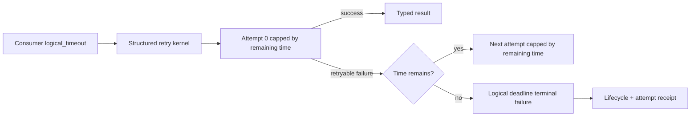
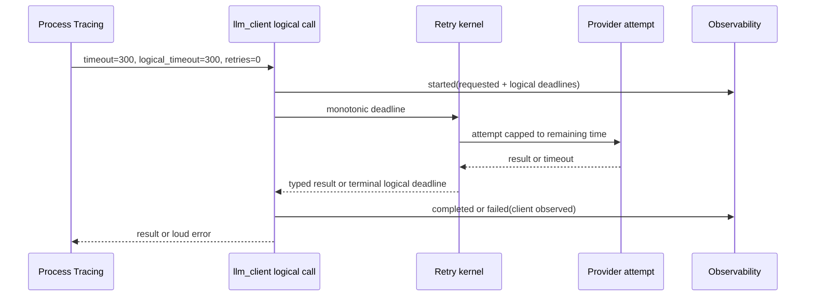

# Plan #124: Logical Structured-Call Deadline

**Status:** In Progress
**Type:** implementation
**Priority:** Critical
**Blocked By:** None
**Blocks:** Bounded one-shot process-tracing terminal repair and truthful cross-project liveness controls

---

## Outcome

For a structured call with retries, an opt-in `logical_timeout` bounds the
whole caller-visible retry/fallback chain, rather than only each provider
attempt. The terminal lifecycle and attempt ledger distinguish this
client-observed logical deadline from provider failure. A caller can therefore
choose a 300-second total budget without silently expanding it to four
300-second attempts.

The representative consumer is Process Tracing Plan 021: one terminal mechanism
proposal must either return a typed DAG within its declared budget or fail with
an inspectable lifecycle, before audit or synthesis begin.

## Boundary And Contract

| Boundary | Input | Output | Invariant |
|---|---|---|---|
| Structured public API | `timeout` plus optional `logical_timeout` | normalized runtime controls | `timeout` remains per attempt; omitted `logical_timeout` preserves compatibility |
| Retry kernel | monotonic logical deadline | invoke/sleep or terminal error | no retry starts and no backoff sleeps beyond remaining total time |
| Provider invocation | remaining total and per-attempt timeout | bounded attempt | effective attempt deadline is no longer than remaining total time |
| Observability | terminal timeout fact | metadata-only lifecycle/diagnostic | client-only attribution; no prompt, body, headers, or provider blame |
| Process Tracing adapter | one authorized terminal replacement | no-retry semantic call | semantic retry budget is explicit and cannot exceed one call |

### Non-goals

- Do not kill blocked third-party HTTP threads; Python cannot safely guarantee
  that. The caller-visible retry chain is the bounded object.
- Do not infer gateway/provider fault from a client deadline.
- Do not change existing callers that omit `logical_timeout`.
- Do not silently reduce a caller's chosen per-attempt timeout outside the
  remaining logical budget.

## Evidence And Current Diagnosis

The retained Process Tracing trace proves that the existing per-attempt control
worked: attempt 0 started at `19:42:51`, emitted `timeout_observed` at
`19:48:08`, and the retry kernel immediately started attempt 1. The observed
overrun was therefore a retry-chain policy gap, not a missing transport timeout.
The trace query itself timed out while the worker held the SQLite write path;
this plan retains the direct SQLite evidence but does not conflate query
contention with model behavior.

## Slices

1. **Kernel contract and fixtures:** add a monotonic deadline control to sync
   and async retry execution. Prove retry suppression, capped backoff, and
   compatibility when omitted.
2. **Structured runtime wiring:** normalize `logical_timeout`, cap every
   structured path to remaining time, and record a typed client-observed
   terminal outcome.
3. **Consumer closeout:** expose the control through Process Tracing, set the
   Plan 021 mechanism call to no semantic retries, then run one governed
   terminal replay only after the upstream change is released and pinned.

## Required Tests

| Test | Acceptance |
|---|---|
| Sync retry deadline | a retryable first failure cannot begin a second attempt after total expiry |
| Async retry deadline | async retry and sleep obey the same total cap |
| Remaining-attempt cap | an attempt receives no more than remaining logical time |
| Omitted compatibility | existing retry behavior is unchanged without `logical_timeout` |
| Privacy control | terminal record contains client classification but no raw exception/body content |
| Process Tracing live replay | one real bounded mechanism call returns an artifact or a terminal classified failure |

## Completion Claim

Completion establishes only caller-visible bounded structured retry chains and
their metadata-only diagnosis. It does not establish provider health, historical
truth, or cancellation of already-blocked daemon transport threads.
