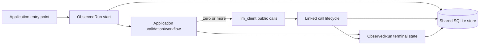

# Plan #338: Observed Application-Run Lifecycle

**Status:** 🧪 Implemented; downstream verification pending
**Type:** implementation
**Priority:** Critical
**Blocked By:** None
**Blocks:** cross-project enforcement and Process Tracing Luna-medium replay

---

## Gap

**Current:** `llm_client` durably observes public LLM calls and offers an
experiment-oriented run context, but ordinary LLM-capable executables can fail
before entering the client. Project-local provenance files do not guarantee a
terminal state, runtime identity, failure classification, or parent-child trace
lineage.

**Target:** A dependency-light `ObservedRun` context establishes durable outer
run custody before application validation, derives child trace IDs, records the
selected runtime/configuration without secrets, counts linked LLM calls, and
terminates in exactly one controlled state. Applications keep workflow and
domain semantics; this package owns only generic run persistence and query.

**Why:** Call-level observability cannot explain a program that never reaches a
call. Every initiated LLM-capable run must remain distinguishable as completed,
failed before a durable child call starts, failed after one starts, or cancelled.

---

## References Reviewed

- `docs/adr/0010-cross-project-runtime-substrate.md` - shared run/event
  persistence belongs here while workflow orchestration remains above it.
- `llm_client/observability/experiments.py` - reusable persistence/context
  precedent, but its schema and statuses are experiment-specific.
- `llm_client/execution/call_wrappers.py` - durable public-call start boundary.
- `llm_client/io_log.py` - authoritative SQLite schema and locked writes.
- Process Tracing `scripts/review_central_claims.py` - observed pre-client gap.
- workspace `AGENTS.md` and `migrate-to-llm-client/SKILL.md` - current
  call-level requirements that do not cover executable lifecycle.

**Landscape disposition:** linked. Extend the shared runtime substrate; do not
create a second project-local observability store or a workflow engine.

---

## Boundaries And Contract

- `llm_client` owns the typed run record, context manager, trace derivation,
  persistence, query, and failure classification boundary.
- Applications own input validation, targets, stages, outputs, retry policy,
  and the meaning of success.
- `project-meta` owns fleet policy and adoption enforcement.
- The migration skill owns the entry-point audit procedure.
- `ObservedRun` must not execute stages, catch and suppress exceptions, select
  models, impose budgets, or become a general workflow orchestrator.

### Durable schema

| Field | Rule |
|---|---|
| `run_id` | unique stable identity |
| `root_trace_id` | non-empty root used to derive child traces |
| `project`, `operation`, `executable` | non-empty ownership and entry-point identity |
| `status` | `running`, `completed`, `failed_before_call_start`, `failed_after_call_start`, or `cancelled` |
| `started_at`, `ended_at` | UTC lifecycle timestamps; terminal rows require `ended_at` |
| `runtime_revision`, `config_sha256` | optional immutable provenance; no secrets or raw config required |
| `requested_model`, `reasoning_effort`, `max_budget` | optional declared execution controls |
| `error_type`, `error_phase`, `error_message` | sanitized terminal failure metadata only |

Child traces use `<root_trace_id>/<validated-segment>`. Every linked public LLM
call is joined by exact root or slash-delimited descendant. A run with no linked
call fails as `failed_before_call_start`; a run with any linked lifecycle row
fails as `failed_after_call_start`. This classifies lifecycle chronology without
claiming whether application or client predispatch code caused the former, or
attributing the latter to the provider. Explicit cancellation records
`cancelled`. Success is an
explicit application action or clean context exit, never inferred from a model
response.

---

## Files Affected

- `llm_client/observability/observed_runs.py` (create)
- `llm_client/observability/__init__.py` (modify)
- `llm_client/io_log.py` (schema migration and compatibility exports)
- `llm_client/__init__.py` (public typed API)
- `tests/test_observed_runs.py` (create)
- `tests/test_client_lifecycle.py` (lineage regression if required)
- `docs/adr/0010-cross-project-runtime-substrate.md` (contract clarification)
- `docs/guides/observed-runs.md` (create)
- generated API reference and plan index

---

## Plan

1. Add the additive `observed_runs` table, strict typed statuses, query API,
   trace-segment validation, and fail-loud persistence.
2. Implement sync/async context management that records start before body
   execution and classifies terminal state using linked call rows.
3. Add both-sign fixtures for clean success, pre-call failure, call-time
   failure, cancellation, malformed lineage, duplicate IDs, sink failure, and
   exception propagation.
4. Document the boundary and regenerate the public API reference.
5. Require a downstream live consumer receipt before claiming fleet readiness.

---

## Required Tests

| Test surface | What it verifies |
|---|---|
| `tests/test_observed_runs.py` | start precedes application work; all terminal states persist and exceptions propagate |
| `tests/test_observed_runs.py` | child trace validation and linked-call classification are exact |
| `tests/test_observed_runs.py` | duplicate IDs, invalid state changes, and sink failures fail loudly |
| `tests/test_client_lifecycle.py` | a real public call remains joinable to its observed root |
| downstream live Process Tracing probe | one non-mocked run exposes root, child call, cost/attempt evidence, and terminal state |

---

## Acceptance Criteria

- [x] Start is durable before caller validation or stage execution.
- [x] Every normal, exceptional, and cancellation exit has exactly one terminal
      state without suppressing the caller exception.
- [x] Pre-call and post-call-start failures are deterministically distinguishable.
- [x] Child traces are valid root descendants and linked calls are queryable.
- [x] Runtime/config/model controls are recorded without credentials or raw
      prompt/response content.
- [x] Persistence failure is visible; no best-effort success claim is possible.
- [x] Focused tests, lifecycle regressions, static checks, and API generation pass.
- [ ] One downstream non-mocked consumer receipt proves the integrated boundary.

---

## Non-Goals And Failure Behavior

- No workflow DAG, scheduler, resume engine, semantic stage taxonomy, or model
  fallback belongs in this API.
- Process death may leave `running`; the query surface must report it as
  incomplete/stale rather than invent a terminal state. Recovery is an explicit
  caller or supervisor action.
- Existing `ExperimentRun` remains compatible and is not silently reinterpreted.
- A project is not “fully integrated” merely because imports or unit tests pass;
  the live root-to-child-to-terminal receipt is required.

---

## Implementation Progress

2026-07-28:

- Added the additive `observed_runs` ledger, typed query API, sync/async context,
  strict child-trace derivation, sanitized failures, and exact terminal writes.
- Public text and structured call wrappers reject unrelated traces while an
  observed context is active, before budget reservation or provider dispatch.
- Opt-in `LLM_CLIENT_REQUIRE_OBSERVED_RUN=1` rejects public calls with no active
  outer run, providing a fail-loud migration and enforcement gate.
- Query results compute current descendant-call counts, including while a run
  is still active; terminal status `failed_after_call_start` deliberately avoids
  attributing later application failures to the provider.
- Deterministic verification covers start, success, both failure classes,
  cancellation, nesting, malformed lineage, duplicate/terminal writes, sink
  failure, redaction, public-wrapper joins, and rejected dispatch.
- Remaining acceptance is the Process Tracing non-mocked receipt after the
  released revision is pinned by its governed runtime.
