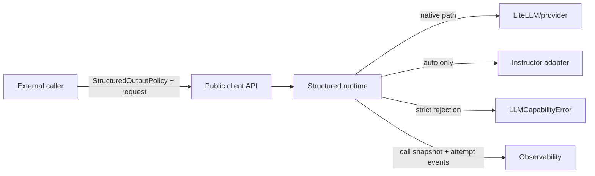
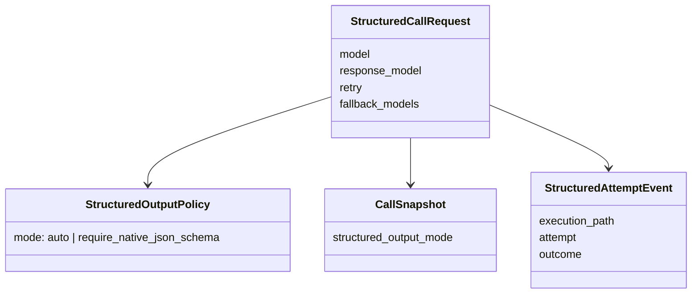
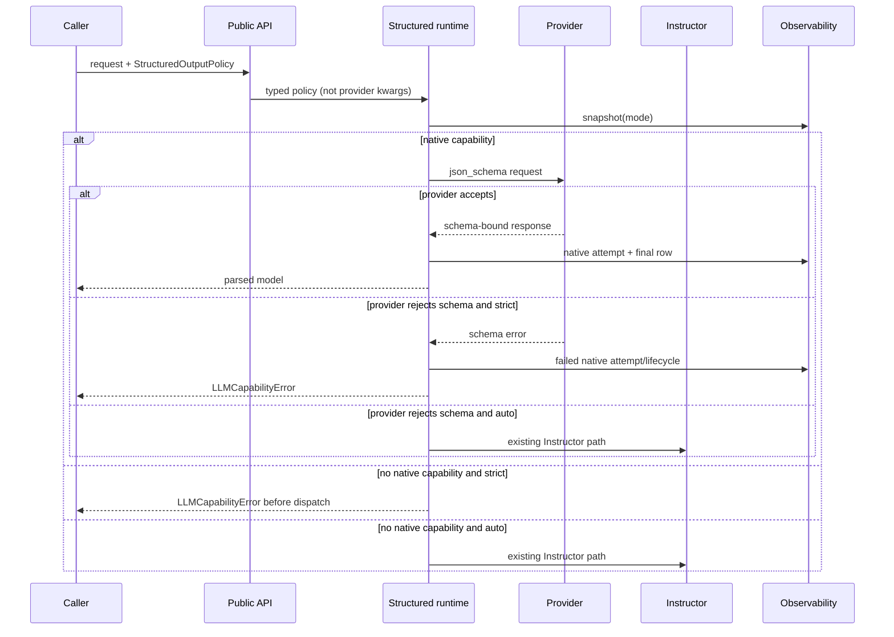

# Plan #99: Strict Native JSON-Schema Execution

**Status:** In Progress (implemented; mandatory completion helper stalled)
**Type:** implementation
**Priority:** High
**Blocked By:** None
**Blocks:** onto-canon6 Plan 0141 R2 runtime authorization

---

## Gap

**Current:** `call_llm_structured` and `acall_llm_structured` automatically switch
from native `json_schema` to Instructor when the selected model is not registered as
native-schema capable or when the provider rejects the schema. Instructor then owns
an additional validation retry loop with a hardcoded retry count. Consequently,
`RetryPolicy(max_retries=0)` and an empty model fallback chain cannot enforce “native
JSON schema only, no execution-path fallback, one outer attempt.”

**Target:** Add an opt-in typed `StructuredOutputPolicy` whose strict mode requires a
native provider JSON-schema path. Strict mode must fail with `LLMCapabilityError`
before Instructor for unsupported models and after exactly the provider rejection for
rejected schemas. Default auto routing remains backward compatible. The chosen mode
is part of the replayable call snapshot.

**Why:** Callers doing governed construction or evaluation must be able to distinguish
provider-enforced JSON schema from Instructor repair. A configuration fixture is not
runtime control.

## Frame And Modality

Goal: make the execution-path choice explicit, typed, replayable, and fail-loud while
preserving current defaults. Out of scope: changing retry counts, removing Instructor,
forbidding model fallback or cache globally, or claiming provider schema quality.

This is deductive: both success and failure paths are known and can be tested without
network calls. Borrow the existing Pydantic policy convention, capability registry,
`LLMCapabilityError`, call snapshot, and native-schema attempt ledger. Build only the
missing policy seam; do not add a project-local workaround.

No new ADR is needed: ADR 0007 already assigns attempt truth to observability, ADR 0010
assigns shared execution policy to `llm_client`, and ADR 0014 requires caller-visible
execution controls in replay identity. This plan updates their verification context if
the public implementation changes those proven claims.

## References Reviewed

- `llm_client/execution/structured_runtime.py` — current native/Instructor routing.
- `llm_client/core/client.py` — public sync/async structured entry points.
- `llm_client/execution/call_contracts.py` — typed execution-policy home.
- `llm_client/observability/replay.py` — replayable control identity.
- `tests/test_client.py`, `tests/test_observability_replay.py`, and
  `tests/test_structured_attempts.py` — current boundary and trace fixtures.
- Plans 97 and 98 — attempt history and async attempt liveness.
- ADRs 0007, 0010, and 0014 — execution/observability/replay ownership.
- onto-canon6 findings `sm-020ed4c22ad9` and `sm-1d483b58e2c0`.

## Requirements To Schema Derivation

Requirements:

1. Auto mode remains the default and retains current routing.
2. Strict mode permits native Chat Completions JSON schema and Responses API JSON
   schema, but not Agent SDK or Instructor structured paths.
3. An unsupported capability fails before provider dispatch or Instructor import.
4. A provider schema rejection fails after that attempt without Instructor dispatch.
5. Retry and model fallback remain independently controlled by their existing types.
6. The mode changes call fingerprint/replay identity and is restored on replay.

Boundary diagram:



Boundary responsibilities:

| Boundary | Owns | Invariant | Failure | Must not own |
|---|---|---|---|---|
| caller | policy choice, retry/fallback/cache choice | explicit strict opt-in | receives typed error | provider capability inference |
| public API | typed policy propagation | policy never enters provider kwargs | validation/type error | routing decision |
| structured runtime | execution-path selection | strict never reaches Agent SDK/Instructor | `LLMCapabilityError` | workflow retry authorization |
| provider | schema acceptance and generation | one provider attempt per outer attempt | provider/schema error | client fallback policy |
| observability | snapshot and attempt truth | mode changes request identity | persistence failure is visible | semantic quality judgment |

Domain model:



Typed data flow and failures:



Derived schema:

```python
class StructuredOutputPolicy(BaseModel):
    model_config = ConfigDict(extra="forbid", frozen=True)
    mode: Literal["auto", "require_native_json_schema"] = Field(
        default="auto",
        description="Allowed structured execution paths for this logical call.",
    )
```

The public entry points accept `structured_output_policy: StructuredOutputPolicy | None`.
`None` resolves to auto. `build_call_snapshot` stores the normalized mode under request
control; replay passes it back through the same public API.

## Backward Runtime Pass

Final transition: `strict request -> native schema result | typed capability failure`.
The structured runtime produces it from the typed policy, model capability registry,
and observed provider outcome. Preconditions are the selected model, exact response
schema, retry/fallback controls, and policy mode. Offline authority is the registry;
provider acceptance remains runtime evidence. The call snapshot and attempt ledger are
the canonical trace, not a caller-side configuration fixture.

Worked rejection: caller selects MiniMax-M3, strict mode, retry zero, and no model
fallback. The registry selects native Chat Completions JSON schema. If OpenRouter
rejects that exact schema, attempt 0 is retained and the call raises
`LLMCapabilityError`; Instructor is never constructed and no second provider request is
issued.

## Files Affected

- `llm_client/execution/call_contracts.py`
- `llm_client/core/client.py`
- `llm_client/execution/structured_runtime.py`
- `llm_client/observability/replay.py`
- `llm_client/__init__.py`
- `tests/test_client.py`, `tests/test_observability_replay.py`,
  `tests/test_structured_attempts.py`
- generated API reference and coupled plan/ADR verification context as required
- coupled verification contexts: ADRs 0001, 0002, 0003, 0004, 0007, 0009, 0010,
  0012, 0013, and 0014

## Thin Slice

Slice 1 — strict path from public API through runtime and replay identity

- advances: governed callers can enforce native-schema-only execution.
- vertical scope: typed policy -> public sync/async API -> runtime selection -> error or
  native result -> snapshot/replay.
- de-risks: hidden Instructor switching and hidden extra attempts.
- success: deterministic sync/async unsupported-model and provider-rejection controls,
  default-auto regression, and replay round trip pass.
- audit: try Agent SDK, unsupported Chat model, provider schema rejection, model
  fallback, replay omission, and accidental provider-kwarg leakage.
- cleanup: remove duplicated sync/async policy branching through a shared helper if it
  remains readable; regenerate API docs; triage concerns.
- done-when: focused/full gates pass, adversarial findings are dispositioned, and the
  branch is committed/pushed for downstream binding.

## Required Tests

### New Tests (TDD)

| Test File | Test Function | What It Verifies |
|---|---|---|
| `tests/test_client.py` | `test_strict_native_schema_rejects_unsupported_model_before_instructor_sync` | unsupported model fails before provider and Instructor |
| `tests/test_client.py` | `test_strict_native_schema_rejects_unsupported_model_before_instructor_async` | async unsupported model fails before provider and Instructor |
| `tests/test_client.py` | `test_strict_native_schema_rejects_provider_schema_fallback_sync` | exactly one native dispatch; Instructor unused |
| `tests/test_client.py` | `test_strict_native_schema_rejects_provider_schema_fallback_async` | async exactly one native dispatch; Instructor unused |
| `tests/test_client.py` | `test_strict_native_schema_accepts_native_success_sync` | sync native result remains parsed and traced |
| `tests/test_client.py` | `test_strict_native_schema_accepts_native_success_async` | async native result remains parsed and traced |
| `tests/test_client.py` | `test_strict_native_schema_rejects_agent_sdk_before_dispatch` | Agent SDK cannot satisfy provider-native JSON schema |
| `tests/test_observability_replay.py` | `test_structured_output_mode_changes_snapshot_fingerprint` | auto vs strict request identities differ |
| `tests/test_observability_replay.py` | `test_replay_restores_strict_structured_output_policy` | replay restores policy instead of forwarding it as provider data |
| `tests/test_structured_attempts.py` | `test_strict_generated_validation_failure_exhausts_without_mechanism_fallback` | retry zero retains one invalid generation, records exhausted, and avoids Instructor |
| `tests/test_structured_attempts.py` | `test_strict_schema_request_rejection_records_terminal_trace_without_fallback` | rejected request records terminal strict identity, no generation event, and no Instructor |

### Existing Tests (Must Pass)

| Test Pattern | Why |
|---|---|
| `tests/test_client.py -k structured` | default auto path remains compatible |
| `tests/test_structured_attempts.py` | attempt truth remains lossless |
| `tests/test_observability_replay.py` | historical snapshot/replay compatibility remains intact |

## Acceptance Criteria

| ID | Criterion | Evidence target | Baseline |
|---|---|---|---|
| L99-1 | Strict mode never executes Instructor or Agent SDK. | source + sync/async negatives | F |
| L99-2 | Provider schema request rejection dispatches once, records terminal strict identity, then fails typed; invalid generations remain lossless. | terminal-call + attempt-ledger readback tests | F |
| L99-3 | Auto mode is backward compatible. | existing + explicit regression | B |
| L99-4 | Mode is replayable request identity. | snapshot/fingerprint/replay tests | F |
| L99-5 | Public API/docs expose the typed policy. | generated API + import test | F |

Coverage before implementation: A=0, B=1, C=0, D=0, F=4. Visibility precedes
enforcement; strict mode is opt-in and no default changes in this plan.

## Coverage

Post-implementation distribution: A=5, B=0, C=0, D=0, F=0. Each row has
source plus an automated test; no new hard repository-wide gate is added by this
plan.

| Requirement | Grade | Evidence class | Positive control | Negative control |
|---|---|---|---|---|
| L99-1 strict excludes Instructor and Agent SDK | A | test | strict native sync/async success tests | unsupported-model, Agent SDK, and schema-rejection tests assert forbidden adapters are unused |
| L99-2 rejection and invalid-generation traces are truthful | A | test | native success records the accepted path | real SQLite readbacks prove terminal strict rejection or one exhausted generation without fallback |
| L99-3 auto mode remains compatible | A | test | existing native structured success | existing schema-rejection-to-Instructor regression remains green |
| L99-4 policy is replay identity | A | test | strict snapshot replays a typed strict policy | auto and strict snapshots produce different fingerprints |
| L99-5 typed public API and docs expose the policy | A | test | top-level imports in runtime tests | Pydantic forbids unknown policy fields and generated API signature includes the argument |

Verification on 2026-07-13: the final focused structured/replay/trace gate passed
42 tests. The full repository run reached
334 passed / 1 skipped before an unrelated long event wait was interrupted; its two
completed failures were missing `prompt_eval`/SciPy environment dependencies and
passed after installing the declared editable dependency. Scoped Ruff passed. Strict
mypy reports the documented 181-error repository baseline and no new
`StructuredOutputPolicy` error after canonicalizing imports. Two-pass pre-landing
review passed after adding terminal logging for strict Agent-SDK rejection and explicit
`mock-ok` rationale on controlled provider-boundary tests. The mandatory
`complete_plan.py --plan 99 --dry-run --skip-real-e2e` gate reproduced the broad-suite
wait. A verbose rerun identified slow multi-process CLI smoke imports followed by a
quota test inheriting real provider-cooldown state before its mock; the latter is now
isolated and concern `LLM-VERIFY-007` tracks the remaining diagnostic-harness follow-up.

## Failure Modes And Pre-Made Decisions

| Failure | Decision |
|---|---|
| registry says unsupported | strict fails before dispatch; auto uses Instructor |
| provider rejects exact schema | strict fails typed; auto retains current fallback |
| transient transport error | existing RetryPolicy decides; do not relabel capability |
| fallback model configured | existing model fallback may select another model; each model still obeys strict path |
| cache configured | existing cache semantics remain; caller requiring a physical attempt must disable cache separately |
| Agent SDK selected | strict fails; agent structured mode is not provider `json_schema` |
| Responses API selected | allowed as native JSON-schema execution |
| snapshot lacks mode (historical) | replay defaults to auto for compatibility |

## Uncertainty And Concern Register

| Concern | Status | Disposition |
|---|---|---|
| Instructor has its own hardcoded retry count. | mitigated for strict callers | Strict mode never reaches Instructor; changing auto mode is out of scope. |
| “Native” could be confused with one specific HTTP API shape. | resolved | Contract includes provider-native Chat JSON schema and Responses API JSON schema; excludes Agent SDK/Instructor. |
| Strict mode alone does not ensure one physical attempt if retry/cache/model fallback are enabled. | accepted boundary | Docs require callers to combine strict mode with retry zero, cache disabled, and empty fallback when that stronger claim is needed. |
| Public replay schema could break historical snapshots. | mitigated | Missing mode defaults to auto; snapshot version need not change for additive control. |
