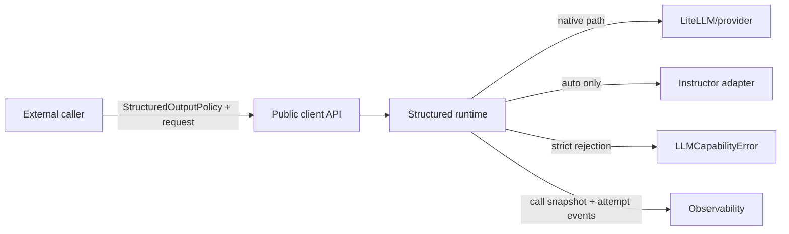
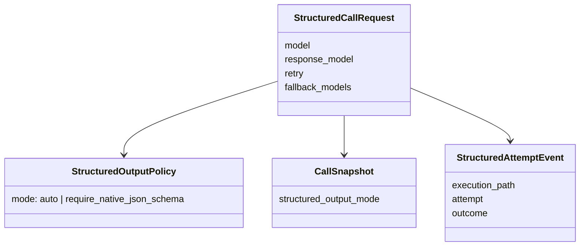
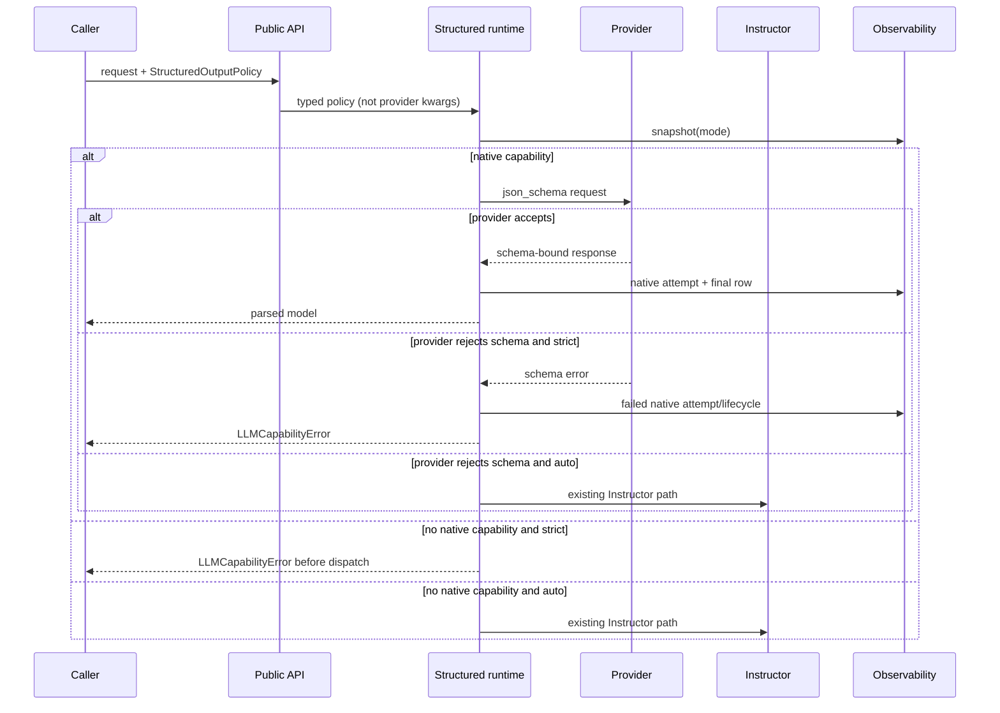

# Plan #99: Strict Native JSON-Schema Execution

**Status:** Complete — current-main integration and downstream Plan 0141 binding
independently accepted

**Completion reconciliation (2026-07-25):** OntoCanon Plan 0141 subsequently
bound the accepted Plan 99 implementation and review evidence, verified the
merged dependency revision and public contracts from a clean detached checkout,
and independently replayed the dependency boundary. This closes the downstream
binding condition below. It does not grant semantic-quality, provider,
promotion, or production-readiness claims to OntoCanon.

**Reopened:** 2026-07-13 after onto-canon6 Plan 0141 independently rejected merge
`84253ed`. Strict native-schema routing is implemented and remains green, but the
snapshot stores legacy `num_retries` rather than the effective typed retry policy,
omits cache state, and the mandatory declared-test command exits nonzero. The earlier
completion record below is retained as historical evidence, not current acceptance.

**First repair rejection:** independent review rejected exact commit `9016721`
(tree `ada2429`) for six reproduced classes: persisted fingerprint drift, fail-open
replay metadata, v2-to-v1 downgrade, coordinated structured-to-text reinterpretation,
captured-but-omitted text `execution_mode`, and incomplete/coercive v2 control parsing.
That commit is not bindable by onto-canon6 Plan 0141.

**Second repair rejection:** independent review rejected exact commit `f63788b`
(tree `89ab942`) despite 47/47 focused tests passing. A real public call under
`LLM_CLIENT_TIMEOUT_POLICY=ban` persisted the effective timeout sentinel `0`, while the
v2 replay consumer required `timeout > 0`, so the runtime could not replay its own
snapshot. The review also found that lossy Python-to-JSON coercions could change
provider-visible values while being labeled replay-safe, and that forged empty support
metadata could allow diagnostic substitutions to dispatch. This commit is not bindable
by onto-canon6 Plan 0141.

**Third repair acceptance:** independent read-only review accepted exact commit
`5ed2a1e9ee4209d8e300e2fb1d6cfaf59622cc3a` (tree
`6f0e0ca0fd5ce663c074f75033ddeb1d35cd3523`) after 61 focused tests, the
375-test mandatory Plan 99 gate, and 35 independent adversarial tests. The
review record is
`docs/reviews/2026-07-13_plan99_exact_replay_acceptance.md`. Plan 99 remains In
Progress until the downstream Plan 0141 pinned replay required by R99-4 passes.

**Verified:** 2026-07-13T18:44:10Z
**Verification Evidence:**
```yaml
completed_by: scripts/complete_plan.py
timestamp: 2026-07-13T18:44:10Z
tests:
  unit: 1572 passed, 3 skipped, 11 deselected, 13 warnings in 221.42s (0:03:41)
  e2e_smoke: skipped (no e2e directory)
  e2e_real: skipped (--skip-real-e2e)
  doc_coupling: passed
commit: c51f983
```
**Type:** implementation
**Priority:** High
**Blocked By:** None
**Blocks:** onto-canon6 Plan 0141 R2 runtime authorization

---

## Gap

**Current:** `call_llm_structured` and `acall_llm_structured` automatically switch
from native `json_schema` to Instructor when the selected model is not registered as
native-schema capable or when the provider rejects the schema. Instructor then owns
an additional validation retry loop with a hardcoded retry count. Consequently,
`RetryPolicy(max_retries=0)` and an empty model fallback chain cannot enforce “native
JSON schema only, no execution-path fallback, one outer attempt.”

**Target:** Add an opt-in typed `StructuredOutputPolicy` whose strict mode requires a
native provider JSON-schema path. Strict mode must fail with `LLMCapabilityError`
before Instructor for unsupported models and after exactly the provider rejection for
rejected schemas. Default auto routing remains backward compatible. The chosen mode
is part of the replayable call snapshot. The normalized **effective** retry policy,
fallback chain, and cache-disabled state must also survive replay exactly; non-replayable
callbacks or cache objects must fail loud rather than degrading to legacy defaults.

**Why:** Callers doing governed construction or evaluation must be able to distinguish
provider-enforced JSON schema from Instructor repair. A configuration fixture is not
runtime control.

## Frame And Modality

Goal: make the execution-path choice explicit, typed, replayable, and fail-loud while
preserving current defaults. Out of scope: changing retry counts, removing Instructor,
forbidding model fallback or cache globally, or claiming provider schema quality.

This is deductive: both success and failure paths are known and can be tested without
network calls. Borrow the existing Pydantic policy convention, capability registry,
`LLMCapabilityError`, call snapshot, and native-schema attempt ledger. Build only the
missing policy seam; do not add a project-local workaround.

No new ADR is needed: ADR 0007 already assigns attempt truth to observability, ADR 0010
assigns shared execution policy to `llm_client`, and ADR 0014 requires caller-visible
execution controls in replay identity. This plan updates their verification context if
the public implementation changes those proven claims.

## References Reviewed

- `llm_client/execution/structured_runtime.py` — current native/Instructor routing.
- `llm_client/core/client.py` — public sync/async structured entry points.
- `llm_client/execution/call_contracts.py` — typed execution-policy home.
- `llm_client/observability/replay.py` — replayable control identity.
- `tests/test_client.py`, `tests/test_observability_replay.py`, and
  `tests/test_structured_attempts.py` — current boundary and trace fixtures.
- Plans 97 and 98 — attempt history and async attempt liveness.
- `docs/adr/0001-model-identity-v0.md`,
  `docs/adr/0002-routing-config-precedence.md`,
  `docs/adr/0003-warning-taxonomy.md`,
  `docs/adr/0004-result-model-semantics-migration.md`,
  `docs/adr/0007-observability-contract-boundary.md`,
  `docs/adr/0009-long-thinking-background-polling.md`,
  `docs/adr/0010-cross-project-runtime-substrate.md`,
  `docs/adr/0012-shared-data-plane-boundary.md`,
  `docs/adr/0013-stream-lifecycle-heartbeat-observability.md`, and
  `docs/adr/0014-call-replay-and-divergence-diagnosis-boundary.md` (`ADR-0001`,
  `ADR-0002`, `ADR-0003`, `ADR-0004`, `ADR-0007`, `ADR-0009`, `ADR-0010`,
  `ADR-0012`, `ADR-0013`, and `ADR-0014`) — model identity, routing precedence,
  fail-loud errors, result semantics, execution/observability, timeout,
  shared-runtime/data-plane, stream, and replay ownership contracts required by
  `scripts/relationships.yaml`.
- onto-canon6 findings `sm-020ed4c22ad9` and `sm-1d483b58e2c0`.

## Requirements To Schema Derivation

Requirements:

1. Auto mode remains the default and retains current routing.
2. Strict mode permits native Chat Completions JSON schema and Responses API JSON
   schema, but not Agent SDK or Instructor structured paths.
3. An unsupported capability fails before provider dispatch or Instructor import.
4. A provider schema rejection fails after that attempt without Instructor dispatch.
5. Retry and model fallback remain independently controlled by their existing types.
6. The mode changes call fingerprint/replay identity and is restored on replay.
7. Snapshot/replay uses the effective typed retry policy after override resolution, not
   the shadowed public `num_retries` argument.
8. Disabled cache and the exact fallback chain are replay identity. Enabled arbitrary
   cache objects and custom retry callbacks are explicitly replay-unsupported.
9. The mandatory Plan 99 declared-test command resolves exact pytest nodes, runs them,
   and exits zero; async/class ownership cannot be inferred by indentation regex state.

Boundary diagram:



Boundary responsibilities:

| Boundary | Owns | Invariant | Failure | Must not own |
|---|---|---|---|---|
| caller | policy choice, retry/fallback/cache choice | explicit strict opt-in | receives typed error | provider capability inference |
| public API | typed policy propagation | policy never enters provider kwargs | validation/type error | routing decision |
| structured runtime | execution-path selection | strict never reaches Agent SDK/Instructor | `LLMCapabilityError` | workflow retry authorization |
| provider | schema acceptance and generation | one provider attempt per outer attempt | provider/schema error | client fallback policy |
| observability | snapshot and attempt truth | mode changes request identity | persistence failure is visible | semantic quality judgment |

Domain model:



Typed data flow and failures:



Derived schema:

```python
class StructuredOutputPolicy(BaseModel):
    model_config = ConfigDict(extra="forbid", frozen=True)
    mode: Literal["auto", "require_native_json_schema"] = Field(
        default="auto",
        description="Allowed structured execution paths for this logical call.",
    )
```

The public entry points accept `structured_output_policy: StructuredOutputPolicy | None`.
`None` resolves to auto. `build_call_snapshot` stores the normalized mode under request
control; replay passes it back through the same public API.

## Backward Runtime Pass

Final transition: `strict request -> native schema result | typed capability failure`.
The structured runtime produces it from the typed policy, model capability registry,
and observed provider outcome. Preconditions are the selected model, exact response
schema, retry/fallback controls, and policy mode. Offline authority is the registry;
provider acceptance remains runtime evidence. The call snapshot and attempt ledger are
the canonical trace, not a caller-side configuration fixture.

Worked rejection: caller selects MiniMax-M3, strict mode, retry zero, and no model
fallback. The registry selects native Chat Completions JSON schema. If OpenRouter
rejects that exact schema, attempt 0 is retained and the call raises
`LLMCapabilityError`; Instructor is never constructed and no second provider request is
issued.

## Files Affected

- `llm_client/execution/call_contracts.py`
- `llm_client/core/client.py`
- `llm_client/execution/structured_runtime.py`
- `llm_client/observability/replay.py`
- `llm_client/__init__.py`
- `tests/test_client.py`, `tests/test_observability_replay.py`,
  `tests/test_structured_attempts.py`
- generated API reference and coupled plan/ADR verification context as required
- coupled verification contexts: ADRs 0001, 0002, 0003, 0004, 0007, 0009, 0010,
  0012, 0013, and 0014
- `scripts/meta/complete_plan.py`, `tests/test_complete_plan.py` (completion-gate
  configurability and timeout diagnostics exposed while closing this plan)
- `tests/test_public_surface.py` (top-level export-count contract)
- `llm_client/tools/decorator.py`, `tests/test_tool_decorator.py` (restore accepted
  Plans 32/47 contracts overwritten by the later backup merge and exposed by the
  mandatory completion gate)

## Thin Slice

Slice 1 — strict path from public API through runtime and replay identity

- advances: governed callers can enforce native-schema-only execution.
- vertical scope: typed policy -> public sync/async API -> runtime selection -> error or
  native result -> snapshot/replay.
- de-risks: hidden Instructor switching and hidden extra attempts.
- success: deterministic sync/async unsupported-model and provider-rejection controls,
  default-auto regression, and replay round trip pass.
- audit: try Agent SDK, unsupported Chat model, provider schema rejection, model
  fallback, replay omission, and accidental provider-kwarg leakage.
- cleanup: remove duplicated sync/async policy branching through a shared helper if it
  remains readable; regenerate API docs; triage concerns.
- done-when: focused/full gates pass, adversarial findings are dispositioned, and the
  branch is committed/pushed for downstream binding.

## Required Tests

### New Tests (TDD)

| Test File | Test Function | What It Verifies |
|---|---|---|
| `tests/test_client.py` | `test_strict_native_schema_rejects_unsupported_model_before_instructor_sync` | unsupported model fails before provider and Instructor |
| `tests/test_client.py` | `test_strict_native_schema_rejects_unsupported_model_before_instructor_async` | async unsupported model fails before provider and Instructor |
| `tests/test_client.py` | `test_strict_native_schema_rejects_provider_schema_fallback_sync` | exactly one native dispatch; Instructor unused |
| `tests/test_client.py` | `test_strict_native_schema_rejects_provider_schema_fallback_async` | async exactly one native dispatch; Instructor unused |
| `tests/test_client.py` | `test_strict_native_schema_accepts_native_success_sync` | sync native result remains parsed and traced |
| `tests/test_client.py` | `test_strict_native_schema_accepts_native_success_async` | async native result remains parsed and traced |
| `tests/test_client.py` | `test_strict_native_schema_rejects_agent_sdk_before_dispatch` | Agent SDK cannot satisfy provider-native JSON schema |
| `tests/test_observability_replay.py` | `test_structured_output_mode_changes_snapshot_fingerprint` | auto vs strict request identities differ |
| `tests/test_observability_replay.py` | `test_replay_restores_strict_structured_output_policy` | replay restores policy instead of forwarding it as provider data |
| `tests/test_observability_replay.py` | `test_snapshot_records_effective_retry_and_disabled_cache` | explicit retry overrides shadowed legacy values in replay identity |
| `tests/test_observability_replay.py` | `test_replay_restores_effective_retry_fallback_and_disabled_cache` | replay rebuilds the exact typed policy and disabled cache state |
| `tests/test_observability_replay.py` | `test_runtime_snapshot_uses_effective_retry_and_disabled_cache` | real public structured call persists resolved policy rather than shadowed defaults |
| `tests/test_observability_replay.py` | `test_async_runtime_snapshot_uses_effective_retry_and_disabled_cache` | async structured runtime persists the same effective policy and strict mode |
| `tests/test_observability_replay.py` | `test_text_runtimes_snapshot_effective_retry_cache_and_execution_mode` | sync and async text runtimes persist effective policy plus capability mode |
| `tests/test_observability_replay.py` | `test_public_runtime_snapshots_round_trip_timeout_disabled` | real sync/async text/structured producers persist and consume identical timeout-disabled snapshots with identical provider-visible controls |
| `tests/test_observability_replay.py` | `test_replay_rejects_lossy_normalization_when_support_metadata_is_empty` | `Path`, tuple, set, non-finite float, non-string mapping keys, and diagnostic substitutions cannot dispatch even if support metadata is false-empty |
| `tests/test_observability_replay.py` | `test_json_native_nested_kwargs_round_trip_exactly` | recursively JSON-native values remain replayable without false rejection or value drift |
| `tests/test_observability_replay.py` | `test_snapshot_marks_custom_retry_and_enabled_cache_replay_unsupported` | non-serializable execution policy fails loud on replay |
| `tests/test_observability_replay.py` | `test_replay_rejects_coerced_or_inconsistent_execution_policy` | malformed or contradictory v2 policy state cannot replay by coercion |
| `tests/test_observability_replay.py` | `test_replay_rejects_missing_structured_mode_or_reserved_public_control` | tampered kwargs cannot override the typed replay authority |
| `tests/test_observability_replay.py` | `test_replay_rejects_public_api_call_kind_mismatch` | a v2 structured snapshot cannot be reinterpreted as a text call |
| `tests/test_observability_replay.py` | `test_historical_v1_snapshot_replays_with_legacy_controls` | genuine v1 shape retains legacy compatibility without v2 authority fields |
| `tests/test_observability_replay.py` | `test_v2_replay_rejects_downgrade_missing_metadata_or_cross_kind_reinterpretation` | v2 cannot shed its version/metadata or change semantic call kind |
| `tests/test_observability_replay.py` | `test_v2_replay_rejects_persisted_snapshot_fingerprint_mismatch` | persisted snapshot drift is rejected before dispatch |
| `tests/test_observability_replay.py` | `test_v2_replay_rejects_persisted_full_version_downgrade` | a persisted v2 envelope cannot be reduced to a shape-valid v1 snapshot |
| `tests/test_observability_replay.py` | `test_v2_replay_rejects_missing_or_unmodeled_envelope_state` | missing or unknown fixed-envelope state cannot default or disappear |
| `tests/test_observability_replay.py` | `test_v2_snapshot_fingerprint_includes_public_api` | sync/async dispatch authority is bound into v2 identity |
| `tests/test_observability_replay.py` | `test_snapshot_marks_non_json_message_content_as_replay_unsupported` | diagnostic summaries never substitute for original message content on replay |
| `tests/test_observability_replay.py` | `test_v2_replay_rejects_response_model_schema_drift` | imported class identity cannot hide a changed structured schema |
| `tests/test_observability_replay.py` | `test_v2_text_replay_restores_execution_mode` | text replay restores its captured capability contract |
| `tests/test_structured_attempts.py` | `test_strict_generated_validation_failure_exhausts_without_mechanism_fallback` | retry zero retains one invalid generation, records exhausted, and avoids Instructor |
| `tests/test_structured_attempts.py` | `test_strict_schema_request_rejection_records_terminal_trace_without_fallback` | rejected request records terminal strict identity, no generation event, and no Instructor |
| `tests/test_complete_plan.py` | `test_positive_seconds_rejects_invalid_timeout_values` | completion timeout parser rejects invalid values |
| `tests/test_complete_plan.py` | `test_unit_timeout_reports_recent_captured_progress` | timeout diagnostics retain bounded progress |
| `tests/test_complete_plan.py` | `test_main_threads_explicit_timeout_to_completion` | CLI threads configured timeout to completion |
| `tests/test_check_plan_tests.py` | `test_find_test_class_uses_ast_scope_for_async_and_top_level_tests` | declared async and top-level nodes resolve to their real scopes |
| `tests/test_check_plan_tests.py` | `test_plan99_required_tests_are_exact_and_executable` | no selector/prose pseudo-path enters the Plan 99 test inventory |

### Existing Tests (Must Pass)

| Test Pattern | Why |
|---|---|
| `tests/test_client.py` | default auto path remains compatible |
| `tests/test_structured_attempts.py` | attempt truth remains lossless |
| `tests/test_observability_replay.py` | historical snapshot/replay compatibility remains intact |

## Acceptance Criteria

| ID | Criterion | Evidence target | Baseline |
|---|---|---|---|
| L99-1 | Strict mode never executes Instructor or Agent SDK. | source + sync/async negatives | F |
| L99-2 | Provider schema request rejection dispatches once, records terminal strict identity, then fails typed; invalid generations remain lossless. | terminal-call + attempt-ledger readback tests | F |
| L99-3 | Auto mode is backward compatible. | existing + explicit regression | B |
| L99-4 | Mode is replayable request identity. | snapshot/fingerprint/replay tests | F |
| L99-5 | Public API/docs expose the typed policy. | generated API + import test | F |
| L99-6 | Effective retry/fallback/cache state is exact replay identity. | real snapshot + replay reconstruction negatives | F |
| L99-7 | The declared Plan 99 test inventory is exact and executable. | helper unit controls + mandatory command | F |

Current coverage after independent acceptance: A=7, B=0, C=0, D=0, F=0. L99-1
through L99-7 have executable evidence. L99-6 is accepted at exact implementation
commit `5ed2a1e`; completion remains pending only on the downstream Plan 0141 pinned
replay required by R99-4. Visibility precedes enforcement; strict mode is opt-in and
no default execution behavior changes in this repair.

## Coverage

Current distribution: A=7, B=0, C=0, D=0, F=0. Fresh independent exact-commit
acceptance supersedes the two earlier rejection records. No new hard repository-wide
gate is added by this plan.

| Requirement | Grade | Evidence class | Positive control | Negative control |
|---|---|---|---|---|
| L99-1 strict excludes Instructor and Agent SDK | A | test | strict native sync/async success tests | unsupported-model, Agent SDK, and schema-rejection tests assert forbidden adapters are unused |
| L99-2 rejection and invalid-generation traces are truthful | A | test | native success records the accepted path | real SQLite readbacks prove terminal strict rejection or one exhausted generation without fallback |
| L99-3 auto mode remains compatible | A | test | existing native structured success | existing schema-rejection-to-Instructor regression remains green |
| L99-4 policy is replay identity | A | test | strict snapshot replays a typed strict policy | auto and strict snapshots produce different fingerprints |
| L99-5 typed public API and docs expose the policy | A | test | top-level imports in runtime tests | Pydantic forbids unknown policy fields and generated API signature includes the argument |
| L99-6 effective execution policy replays exactly | A | test + independently observed | all four public APIs capture and consume identical timeout-disabled snapshots with identical provider-visible controls | exact-commit review re-executed lossy-value, false-empty metadata, envelope, downgrade, kind, schema, and execution-mode attacks before accepting `5ed2a1e` |
| L99-7 mandatory declared tests execute exactly | A | test + observed command | AST resolver finds exact sync, async, class, and top-level nodes; after integration with current main, the canonical-venv Plan 99 command executes 320 tests | pseudo selectors, prose function cells, false class ownership, and ambient-pytest escape are rejected by helper tests |

### Post-Merge Repair Slices

1. **R99-1 plan/test authority:** replace pseudo/prose test declarations with exact
   tests; use Python AST scope for sync/async node resolution; add both-sign helper
   controls; require `check_plan_tests.py --plan 99` exit zero.
2. **R99-2 effective policy snapshot:** normalize the effective `RetryPolicy`, exact
   fallback list, cache-disabled state, and strict mode before persistence. Mark custom
   callbacks/backoff/should-retry functions and enabled arbitrary caches unsupported.
3. **R99-3 exact replay:** reconstruct the typed retry policy and explicit disabled
   cache state. Historical v1 snapshots keep their legacy reconstruction; new snapshots
   fail loud on malformed or unsupported policy state.
4. **R99-4 independent acceptance:** focused/full gates and one downstream Plan 0141
   replay must accept an exact pushed commit before the plan can return to Complete.
5. **R99-5 envelope-integrity repair:** bind v2 fingerprint to replay-critical metadata;
   distinguish genuine v1 from downgraded v2; strictly forbid unknown/coerced controls;
   restore text `execution_mode`; reject semantic call-kind reinterpretation; and retain
   the exact independent attacks as permanent tests.
6. **R99-6 producer-consumer round trip:** accept the runtime's effective timeout-disabled
   sentinel, round-trip real snapshots from all four public call paths, and permit only
   JSON-native values whose types and values survive persistence unchanged. Every lossy
   normalization carries an intrinsic diagnostic marker that replay rejects even when
   support metadata is empty or inconsistent.

Superseded first-repair local verification on 2026-07-13: the focused replay/helper gate passed
20 tests; `python scripts/meta/check_plan_tests.py --plan 99` resolved every declared
node and passed 311 tests in 52.57 seconds. Scoped Ruff passed for the repaired replay,
structured-runtime, helper, and test files. Strict mypy reports the same 11 errors in
`observability/replay.py` on both `origin/main` and this branch, so this increment adds
no type-check error but does not claim to clear the documented baseline. Independent
review then rejected exact `9016721` on the six envelope/control classes listed above.
Its independent positive probe confirmed all four sync/async text/structured paths did
persist effective retry `0/.25/2.0`, exact fallback order, disabled cache, and strict
mode where applicable. Its negative evidence controls current status; `9016721` is not
accepted or bindable. The changed `text_runtime.py` retains six parent-revision Ruff
findings and was intentionally checked with those exact baseline codes excluded; the
remaining changed Python files passed scoped Ruff.

Second-repair local verification on 2026-07-13: replay/helper controls passed 38 tests;
the final mandatory `check_plan_tests.py --plan 99` command collected and passed 347
tests in 75.43 seconds; and the full repository suite passed 1,604 tests with 3 skipped and 11
deselected in 178.19 seconds. Scoped Ruff, `compileall`, and `git diff --check` passed.
The then-current ambient strict-mypy run reported 181 repository findings, including the
same 11 `observability/replay.py` findings recorded before this increment; that historical,
unversioned count is not a current baseline and this repair did not claim to clear the debt.
One earlier broad run before the final envelope additions had
an isolated provider-cooldown timing assertion fail; its test and file reruns passed,
followed by clean full runs of 1,599 and 1,604 tests. At that historical point these
were local results only: L99-6 was F and Plan 0141 could not bind the repair without a
fresh independent audit of the exact pushed commit.

Independent review of exact `f63788b` then passed its 47-test focused command but
rejected the commit on the producer-consumer and lossy-normalization classes above.
That negative evidence supersedes the local green readout. The third repair must prove
capture-to-replay behavior for sync/async text/structured public calls, including the
timeout-disabled runtime default, rather than inspecting persisted fields alone.

Third-repair local verification on 2026-07-13: the focused replay/structured/helper
matrix passes 61 tests; the exact declared Plan 99 gate collects and passes 375 tests;
and the full repository suite passes 1,618 tests with 3 skipped and 11 deselected.
Real sync/async text/structured calls captured with timeout policy `ban` replay through
the same public runtime under policy `allow`; each replay persists the identical call
snapshot and reaches the mocked provider transport with identical non-observability
kwargs. Scoped Ruff, `compileall`, API-reference generation/check, relationship
validation, and `git diff --check` pass. Repository-wide Ruff retains the exact
`f63788b` baseline of 315 unrelated errors. Strict mypy improves from 210 to 209 total
errors and from 11 to 10 in `observability/replay.py`; no new type error is introduced.
These local results were subsequently confirmed by the independent exact-commit review
recorded below.

Independent acceptance on 2026-07-13: a fresh read-only reviewer pinned clean commit
`5ed2a1e9ee4209d8e300e2fb1d6cfaf59622cc3a` and tree
`6f0e0ca0fd5ce663c074f75033ddeb1d35cd3523`, confirmed the remote branch matched,
passed the 61-test focused gate, the 375-test mandatory Plan 99 gate, and a 35-test
adversarial subset, then found no blocking correctness issue. The review independently
retested real four-public-API capture-to-replay, lossy and diagnostic value rejection,
false-empty support metadata, fingerprint/envelope drift, downgrade, cross-kind,
missing-control, schema-drift, and execution-mode attacks. See
`docs/reviews/2026-07-13_plan99_exact_replay_acceptance.md`. This satisfies L99-6;
R99-4 still requires the downstream Plan 0141 pinned replay before Plan 99 returns to
Complete.

Current-main integration candidate on 2026-07-13: merged `origin/main` at `e30e088`
without rewriting accepted implementation `5ed2a1e` or evidence `340157f`; both remain
ancestors. The production runtime auto-merged. Generated API references were rebuilt
from the combined source, and overlapping ADR verification contexts preserve both exact
replay and Plan 97/tool-trace evidence. After repairing the helper to retain its invoking
interpreter, the canonical-venv mandatory Plan 99 command passes 320 tests; the earlier
379-test ambient-Python readout is not accepted evidence. A wider canonical-venv Plan
97/99 replay/attempt/io-log/runtime selection passes 400 tests. The Plan 99-touched
Python surface is Ruff-clean after removing six inherited findings from
`text_runtime.py`; repository-wide Ruff improves from the clean-main baseline of 315 to
309 findings. Type checking remains red but improves by one finding under both measured
toolchains: exact `mypy 1.19.1 --strict llm_client/` reports 209 candidate findings versus
210 on clean `e30e088`, while exact canonical-venv `python -m mypy 1.20.0 --strict
llm_client/` reports 210 versus 211. These are environment-pinned baseline comparisons,
not a green type-check claim. A full venv-backed run is not accepted evidence: both clean
`origin/main` and this candidate
can segfault when a lifecycle heartbeat writer races a test fixture that closes the
shared SQLite connection (`LLM-VERIFY-012`). A post-commit audit also rejected the first
integration commit because its worktree hook generated API docs with ambient system
Python and suppressed generator failures; the repo venv produced a different reference.
The repaired hook requires and reports a repository venv, fails if branch freshness cannot
be fetched, and fails loud on generators (`LLM-VERIFY-013`). The mandatory plan-test helper
now launches pytest through its invoking `sys.executable`, so a venv-selected gate cannot
escape to ambient Python.
Independent read-only review accepted exact candidate
`c38aea4546b9a8318d233dd49b6fda7060d665c4` (tree
`d8ff2406611ea20434687274c7d71df0e409b7be`) after reproducing the canonical-venv
320-test mandatory gate, 400-test wider gate, 99-test lifecycle overlap subset, both
hook negatives, interpreter binding, exact base/candidate Ruff and mypy comparisons,
API generation, relationships, compile, diff, and GitHub checks. The record is
`docs/reviews/2026-07-13_plan99_current_main_integration_acceptance.md`. Normal PR merge
and downstream installed-runtime binding remain pending; Plan 0141 remains fail-closed.

Historical pre-repair verification on 2026-07-13 (retained for chronology, not as the
current integration baseline): the final focused structured/replay/trace gate passed
42 tests. The full repository run reached
334 passed / 1 skipped before an unrelated long event wait was interrupted; its two
completed failures were missing `prompt_eval`/SciPy environment dependencies and
passed after installing the declared editable dependency. Scoped Ruff passed. The
then-current ambient strict-mypy run reported 181 findings and no new
`StructuredOutputPolicy` finding after canonicalizing imports; that historical count is
not comparable to the interpreter-pinned current integration counts above. Two-pass pre-landing
review passed after adding terminal logging for strict Agent-SDK rejection and explicit
`mock-ok` rationale on controlled provider-boundary tests. The mandatory
`complete_plan.py --plan 99 --dry-run --skip-real-e2e` gate reproduced the broad-suite
wait. A verbose rerun identified slow multi-process CLI smoke imports followed by a
mocked client test inheriting real provider-cooldown state before its mock. The client
test isolation fixture now disables shared cooldown waiting (dedicated rate-limit and
kernel tests retain that coverage); concern `LLM-VERIFY-007` tracks the remaining
diagnostic-harness follow-up. The helper now accepts
`--test-timeout-seconds` (900-second default) and prints bounded captured pytest output
on timeout; three harness contract tests pass. Its first completed full readout found
one stale Plan 99 public-export count plus seven `origin/main` tool-decorator failures.
The count is corrected, and the accepted Plans 32/47 sync/registry/type contracts lost
by the later backup merge are restored without removing later metadata; the combined
decorator/public-surface/harness gate passes 41 tests.

## Failure Modes And Pre-Made Decisions

| Failure | Decision |
|---|---|
| registry says unsupported | strict fails before dispatch; auto uses Instructor |
| provider rejects exact schema | strict fails typed; auto retains current fallback |
| transient transport error | existing RetryPolicy decides; do not relabel capability |
| fallback model configured | existing model fallback may select another model; each model still obeys strict path |
| cache configured | existing cache semantics remain; caller requiring a physical attempt must disable cache separately |
| Agent SDK selected | strict fails; agent structured mode is not provider `json_schema` |
| Responses API selected | allowed as native JSON-schema execution |
| v1 snapshot lacks mode (historical) | replay defaults to auto for compatibility |
| v2 structured snapshot lacks mode or conflicts with public API/call kind | fail loud before dispatch |
| v2 snapshot fingerprint, support metadata, or semantic call kind drifts | fail loud before dispatch |
| v2 snapshot is relabeled v1 while retaining v2 policy fields | reject as downgrade; genuine v1 shape remains replayable |
| text snapshot records a non-default capability mode | restore that exact `execution_mode` on replay |

## Uncertainty And Concern Register

| Concern | Status | Disposition |
|---|---|---|
| Instructor has its own hardcoded retry count. | mitigated for strict callers | Strict mode never reaches Instructor; changing auto mode is out of scope. |
| “Native” could be confused with one specific HTTP API shape. | resolved | Contract includes provider-native Chat JSON schema and Responses API JSON schema; excludes Agent SDK/Instructor. |
| Strict mode alone does not ensure one physical attempt if retry/cache/model fallback are enabled. | accepted boundary | Docs require callers to combine strict mode with retry zero, cache disabled, and empty fallback when that stronger claim is needed. |
| Public replay schema could break historical snapshots. | mitigated | Version 1 keeps legacy reconstruction and missing-mode behavior; version 2 carries typed effective execution policy and rejects malformed state. |
| Request fingerprint alone does not protect replay support metadata or dispatch authority. | independently accepted | Version 2 identity includes version, public API, call kind, request, and replay-support metadata; every replay verifies the stored fingerprint before a closed envelope can dispatch. Exact commit `5ed2a1e` passed the fresh adversarial review. |
