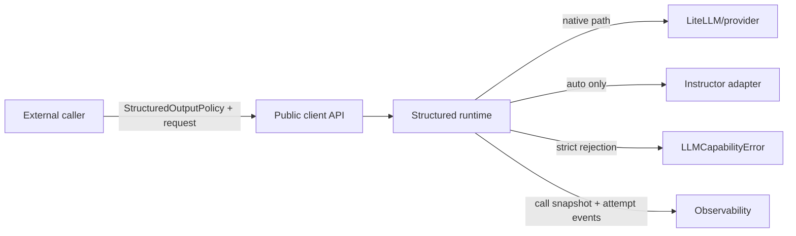
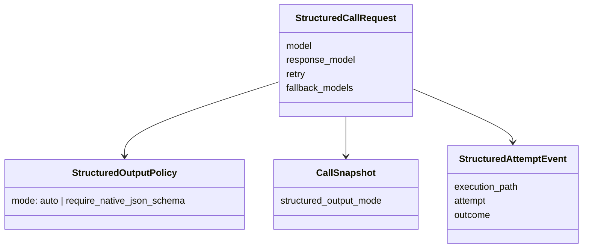
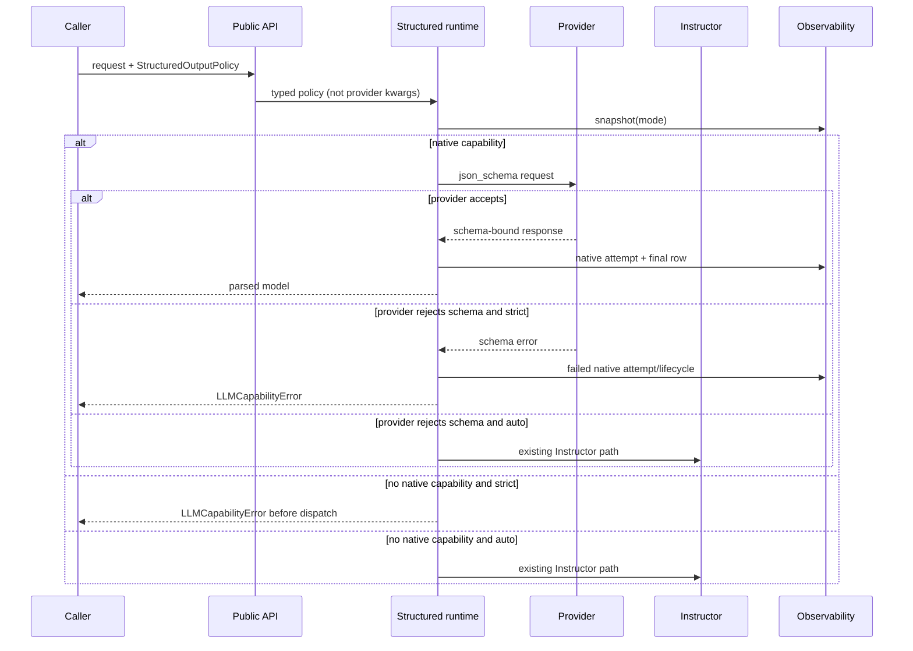

# Completed Plans

Plans whose own Status line says Complete. Active and in-progress plans stay as separate `NN_name.md` files because the plan tooling (`sync_plan_status.py`, `check_plan_tests.py`) reads and edits them per file. The plan index is [AGENTS.md](AGENTS.md).

Each section below was a separate file until 2026-10-07. Its anchor is the old file name without `.md`, so an old path such as `docs/plans/33_deliberation_workflow.md` maps to `docs/plans/COMPLETED_PLANS.md#33_deliberation_workflow`. Section bodies are the original text with headings demoted one level and links to other consolidated records repointed.

## Contents

- [Plan #33: Deliberation Workflow (Symmetric N-Agent Debate)](#33_deliberation_workflow)
- [Plan #34: Deliberation Verifier / Adjudicator Stage](#34_deliberation_verifier_adjudicator)
- [Plan #99: Strict Native JSON-Schema Execution](#99_strict_native_json_schema_execution)
- [Plan #104: OpenRouter Provider-Limit Observer](#104_openrouter-provider-limit-observer)
- [Plan #110: Provider Capabilities and Opus Ban](#110_provider-capabilities-opus-ban)
- [Plan #117: Explicit Reasoning Policy](#117_explicit_reasoning_policy)
- [Plan #348: GPT-5.4 Ban and Luna Default](#348_gpt54_ban_luna_default)

---

<a id="33_deliberation_workflow"></a>

## Plan #33: Deliberation Workflow (Symmetric N-Agent Debate)

*Originally `docs/plans/33_deliberation_workflow.md`; consolidated 2026-10-07. Full history: `git log --follow -- docs/plans/33_deliberation_workflow.md`.*


**Status:** Complete (core workflow shipped; obsolete Opus default superseded)
**Type:** implementation
**Priority:** High
**Blocked By:** Plan #31 (TaskFamily abstraction reused here)
**Blocks:** Future eval_audit profile (which may attach to either duet or deliberation depending on shape fit)

---

### Gap

**Current:** The duet workflow (Plans #29-32) is asymmetric: one agent implements, the other gates with `verdict ∈ {pass, revise, block}`. One revise cycle. That's the right shape when there's a plan to execute and a reviewer to check it. It is the **wrong** shape for what Brian actually does most often: hand a task or question to two coding agents (Codex + Claude Code), let each do independent investigation and form a position, then have them argue back and forth until they converge or hit explicit unresolved disagreement.

The manual workflow Brian's been doing by hand:
1. Give Codex a task → it investigates and produces analysis.
2. Paste Codex's output to Claude Code → "review this."
3. Paste Claude's response back to Codex → "respond."
4. Loop until convergence (or until Brian decides one side is right).

The duet's `plan_doc_review` profile can do step 2-3 once, but not the multi-round symmetric back-and-forth, and not the "each agent investigates independently first" framing.

**Target:** A sibling workflow `deliberate` that:
- **Symmetric.** Both agents get the same task. No implementer/reviewer roles.
- **Independent investigation round 1.** Each agent reads the task + workspace and writes its own `Position` (claims, evidence, open questions, confidence).
- **Argument rounds 2+.** Each agent reads the other's prior Position plus its own prior and emits a new Position that acknowledges agreed points, disagrees explicitly with cited evidence, and may revise its own claims.
- **Convergence detection.** A rule-based check after each round: agents agree (all claims acknowledged with no `disagrees_with_peer` entries) → terminal `converged`. Cycle cap exceeded with unresolved disagreement → terminal `productive_disagreement`. Both agents emit empty positions or fail to engage → terminal `stalled`.
- **Synthesis.** Final stage produces a merged finding + residual disagreements artifact.
- **Reuses the chassis.** TaskFamily, grounded schemas with `evidence_path`, CLI surface, artifact persistence, model alias resolution.

**Why:** The single-pass adversarial review pattern (`duet-review`) is one valid mode but doesn't replace the back-and-forth model. Many real questions don't have a "right answer" the reviewer can verdict on; they need two minds independently chewing on a problem and surfacing where they disagree. Without `deliberate`, Brian keeps doing this manually.

---

### References Reviewed

- `llm_client/workflow/duet.py:62-87` — `DuetTask` schema with `extra: dict[str, Any]`; reusable as `DeliberationTask`.
- `llm_client/workflow/duet_base.py:30-50` — `PlanReviewBase` / `ImplementReviewBase` pattern. The deliberation analog is `PositionBase` carrying `confidence` + `state ∈ {initial, revised, agreed, disagreed}` instead of `verdict`.
- `llm_client/workflow/duet.py:535-635` — node factory pattern; deliberation has only one node type (`agent_position_node`) plus a `convergence_check_node` and a `synthesis_node`. Much smaller than the duet's four asymmetric nodes.
- `llm_client/workflow/duet_registry.py:1-65` — TaskFamily registry. Deliberation profiles register against the same registry; the `task_family` resolution lookup is identical (registry doesn't know whether a family is duet-shaped or deliberation-shaped — that's determined by which builder consumes it).
- `llm_client/cli/duet.py:99-228` — established CLI subcommand pattern; `deliberate-task` mirrors the shape with `--agents` (comma-separated), `--max-rounds`, `--task-file` (task brief from file rather than CLI string).
- Existing duet self-review artifacts at `runs/plan-{29,30,31,32}-*-review/` — evidence that the single-pass review pattern works for plan critique. Deliberation is *not* a replacement for that — it's a different shape for different questions.

---

### Files Affected

- `llm_client/workflow/deliberate.py` (create) — chassis: schemas (Position, PositionClaim, PositionEvidence, DisagreementAtom, DeliberationSignoff), node factories (agent_position, convergence_check, synthesis), `build_deliberation_workflow()`.
- `llm_client/workflow/__init__.py` (modify) — export new types.
- `llm_client/cli/deliberate.py` (create) — `cmd_deliberate_task` + `register_parser` mirroring `cli/duet.py`.
- `llm_client/__main__.py` (modify) — register `deliberate-task` subcommand.
- `tests/test_workflow_deliberate.py` (create) — offline tests with stubbed agents: round-1 produces independent positions; round-2 reads peer position; convergence detector fires on agreement; cycle cap promotes to `productive_disagreement`; synthesis produces final artifact.
- `tests/test_cli_deliberate.py` (create) — CLI flag routing, --agents parsing, --max-rounds threading.
- `tests/test_cli_smoke.py` (modify) — extend smoke list with `deliberate-task --help`.
- `docs/plans/COMPLETED_PLANS.md#33_deliberation_workflow` (this file).
- `docs/plans/CLAUDE.md` (modify) — append index row; update the "Duet stack" section to mention the deliberation sibling.

Out of scope (deliberately):
- LLM-based convergence detection. Rule-based for v1 (cheap, predictable). LLM-judge layer can come later if rules prove brittle.
- N-agent (3+) topology in v1. Two-agent is the manual pattern Brian's doing today; symmetric N is a natural extension but more LangGraph wiring without proven need.
- Profile-specific positions. The `generic` profile carries `PositionBase`; domain profiles can subclass when there's evidence they need to.
- `--read-only` flag. Default to full workspace access (matches the manual flow where Codex actually edits/explores).
- Live integration tests against real `claude-code` / `codex`. Offline unit tests prove wiring; first dry-run is a separate slice.

---

### Plan

#### Steps

1. `deliberate.py`: `DeliberationVerdict = Literal["converged", "productive_disagreement", "stalled"]`. `DeliberationTask(BaseModel)` with `task_id, title, question, workspace_path, success_criteria, constraints, extra` — mirrors DuetTask but reframes the goal as a question rather than a plan-to-implement.
2. `Position` schema: `agent_name: str`, `round: int`, `claims: list[PositionClaim]`, `evidence: list[PositionEvidence]`, `open_questions: list[str]`, `agreed_with_peer: list[str]` (claim IDs from peer's prior position), `disagreed_with_peer: list[DisagreementAtom]`, `confidence: Literal["low", "medium", "high"]`, `state: Literal["initial", "revised", "stable"]`, `reviewer_summary: str`.
3. `PositionClaim(claim_id, claim, severity, evidence_path)` — claims are atomic so peer can refer by `claim_id`. `evidence_path` required (groundedness rule from Plan #30).
4. `PositionEvidence(label, citation, content_snippet)` — explicit citations the agent pulls into its position; peer can scrutinize.
5. `DisagreementAtom(peer_claim_id, my_counterclaim, evidence_path)` — required `evidence_path` so disagreement is grounded.
6. `DeliberationSignoff(task_id, final_verdict, total_rounds, agents, residual_disagreements, trace_id, artifacts_index)`.
7. Node factories: `_make_agent_position_node(agent_model, agent_name, family)` produces a node that, given state, reads the task brief + the *other* agent's most-recent position (if any) + its own prior position (if any), and emits a new Position via `call_llm_structured`. `_make_convergence_check_node()` — pure-Python rule check, no LLM call: agents converged when (a) round ≥ 2 and (b) both latest positions have empty `disagreed_with_peer` lists and (c) each agent acknowledged each of the peer's claims. `_make_synthesis_node()` calls an LLM (configurable model; default the more "objective" agent or a third model) to produce a synthesis artifact summarizing merged findings + residual disagreements.
8. Router: after each round, run convergence_check; if `converged` → synthesis → signoff_pass; if `productive_disagreement` (cycle cap hit) → synthesis (still useful — surfaces what they couldn't agree on) → signoff_block; if `stalled` (both empty) → signoff_block.
9. `build_deliberation_workflow(run_dir, task, trace_id, max_budget, agents=[(name, model), ...], max_rounds=3, task_family="generic", checkpointer=None, synthesis_model=None)`. Two-agent default if `agents=None`: `[("agent_a", "codex/gpt-5.4"), ("agent_b", "claude-code/opus")]`.
10. Cycle topology in LangGraph: parallel two-agent step is a Send-pattern in LangGraph, or simpler: sequential agent_a → agent_b in each round so each sees the latest peer position (the conventional model for two-agent debate). v1 uses sequential; parallel is a refinement once we see real round shape.
11. `cli/deliberate.py`: `cmd_deliberate_task` reads `--task-file` (JSON or YAML), parses `--agents "agent_a:codex/gpt-5.4,agent_b:claude-code/opus"`, passes `--max-rounds`, optional `--task-family`, optional `--synthesis-model`. Writes per-round artifacts `position_<agent>_round_<N>.json` plus `synthesis.json` + `signoff.json`.
12. Public exports + CLI registration + smoke test entry.
13. Plan index update.

---

### Required Tests

#### New Tests (TDD)

| Test File | Test Function | What It Verifies |
|-----------|---------------|------------------|
| `tests/test_workflow_deliberate.py` | `test_round_1_produces_independent_positions` | First round: both agents read task only, neither sees the other's output. |
| `tests/test_workflow_deliberate.py` | `test_round_2_reads_peer_prior_position` | Second round: each agent's prompt includes the peer's round-1 position. |
| `tests/test_workflow_deliberate.py` | `test_convergence_detector_fires_on_empty_disagreement_lists` | Rule: round ≥ 2 + both `disagreed_with_peer == []` + acknowledgments cover peer's claims → `converged`. |
| `tests/test_workflow_deliberate.py` | `test_cycle_cap_promotes_to_productive_disagreement` | Hit `max_rounds` with residual `disagreed_with_peer` → terminal `productive_disagreement`. |
| `tests/test_workflow_deliberate.py` | `test_stalled_when_both_agents_emit_empty_positions` | Both agents return positions with zero claims → terminal `stalled`. |
| `tests/test_workflow_deliberate.py` | `test_position_claim_requires_evidence_path` | Groundedness: schema rejects `PositionClaim` without `evidence_path`. |
| `tests/test_workflow_deliberate.py` | `test_disagreement_atom_requires_evidence_path` | Groundedness on the disagreement side too. |
| `tests/test_workflow_deliberate.py` | `test_synthesis_produces_residual_disagreements_list` | When verdict is `productive_disagreement`, synthesis artifact lists what they couldn't agree on. |
| `tests/test_workflow_deliberate.py` | `test_two_agent_default_uses_codex_and_claude_code` | When `agents=None`, defaults to codex/gpt-5.4 + claude-code/opus. |
| `tests/test_cli_deliberate.py` | `test_cli_parses_agents_flag` | `--agents "a:codex/gpt-5.4,b:claude-code/opus"` → `[("a", "codex/gpt-5.4"), ("b", "claude-code/opus")]`. |
| `tests/test_cli_deliberate.py` | `test_cli_default_task_family_is_generic` | Mirrors duet CLI default. |
| `tests/test_cli_deliberate.py` | `test_cli_threads_max_rounds_into_builder` | --max-rounds N reaches the builder kwarg. |
| `tests/test_cli_smoke.py` | `test_cli_help_smoke` | `deliberate-task --help` exits 0. |

#### Existing Tests (Must Pass)

| Test Pattern | Why |
|--------------|-----|
| `tests/test_workflow_duet.py` | Duet still works; deliberate is a sibling, not a replacement. |
| `tests/test_workflow_profiles.py` | TaskFamily registry shared between duet and deliberate. |
| `tests/test_cli_duet.py` | Duet CLI unchanged. |
| `tests/test_agents.py::TestWorkspaceKwargAliasing` | cwd aliasing applies to both workflows. |

---

### Acceptance Criteria

- [x] Full sweep `pytest tests/test_workflow_deliberate.py tests/test_workflow_duet.py tests/test_workflow_profiles.py tests/test_workflow_builder.py tests/test_workflow_context_config.py tests/test_agents.py::TestBuildAgentOptions tests/test_agents.py::TestWorkspaceKwargAliasing tests/test_cli_smoke.py tests/test_cli_duet.py tests/test_cli_deliberate.py -q` exits 0.
- [x] `python -m llm_client deliberate-task --help` exits 0 and prints `--agents`, `--max-rounds`, `--task-file`, `--task-family`, `--synthesis-model`.
- [x] Convergence detector is pure-Python (no LLM call) and deterministic for given inputs.
- [x] `PositionClaim` and `DisagreementAtom` both reject payloads missing `evidence_path` at Pydantic validation time.
- [x] The two-agent default is explicit. The original `claude-code/opus`
  criterion was superseded by the later Opus ban; the retained default uses
  `codex/gpt-5.4` and `claude-code/sonnet`.
- [x] Synthesis stage runs even on `productive_disagreement` — surfaces what wasn't resolved instead of suppressing it.

---

### Notes

**Design decisions**

- **Sequential per round, not parallel.** Two-agent debate typically wants each agent to see the latest peer position. Parallel (Send pattern in LangGraph) is a refinement once we have real round-shape evidence; sequential is the standard interpretation of the manual workflow.
- **Rule-based convergence, not LLM-judge.** A rule check (both `disagreed_with_peer == []` and acknowledgments covered) is cheap and predictable. LLM-judge convergence is appealing but adds a non-deterministic gate that's harder to reason about. Layer in later if rules prove too coarse.
- **`Position.state ∈ {initial, revised, stable}` not `{pass, revise, block}`.** Verdicts don't apply to deliberation — there's no gating, just stance evolution.
- **Synthesis runs even on `productive_disagreement`.** The whole point of deliberation is to surface what two minds genuinely disagree about. A "they disagreed" terminal that hides the disagreements would defeat the workflow.
- **Reuses `TaskFamily` registry.** The chassis-vs-profile split from Plan #31 applies to deliberation too. A `code_review_deliberation` profile could specialize the Position schema later. v1 ships only `generic`.
- **No verdict-based router on the deliberation side.** The duet's router checks `verdict`; deliberation's "router" is the convergence detector reading both latest positions. Different mechanism, same chassis position (LangGraph conditional edge).

**Risks**

- **Schema verbosity.** `Position` has more fields than the duet's `PlanReview`. Bigger structured-output payloads = higher LLM error rate on Pydantic validation. Mitigated by required `evidence_path` keeping the schema disciplined and by groundedness tests at validation time.
- **Convergence-detector false positives.** Two agents might emit empty `disagreed_with_peer` because they're being polite, not because they actually agree. Rule check is "necessary but not sufficient" for true convergence. Worth pairing with a "confidence ≥ medium" requirement on both sides, or downgrading `converged` to "apparent_agreement" until LLM-judge validates. v1 stays simple.
- **Sequential bias.** If agent_a always goes first, it anchors the framing. Mitigated by alternating which agent leads each round (round 1 a→b, round 2 b→a, etc.) — small wiring change, worth doing in v1.
- **Synthesis model choice.** Defaulting to one of the two debating agents introduces a meta-bias (the agent doing synthesis re-asserts its own position). Default `synthesis_model=None` → use a third model if one is configured, otherwise default to claude-code/opus (it's the more structured-output-disciplined model). This is a design call worth revisiting after first real runs.

**Follow-ups not in scope**

- LLM-judge convergence detection.
- N-agent (≥3) topology.
- Parallel-per-round Send pattern in LangGraph.
- Domain-specific deliberation profiles (e.g. `eval_design_deliberation`).
- Streaming positions (currently structured-output single-shot per round).
- Human-in-the-loop interrupt between rounds.
- A meta-duet that consumes deliberation `signoff.json` corpora.

---

<a id="34_deliberation_verifier_adjudicator"></a>

## Plan #34: Deliberation Verifier / Adjudicator Stage

*Originally `docs/plans/34_deliberation_verifier_adjudicator.md`; consolidated 2026-10-07. Full history: `git log --follow -- docs/plans/34_deliberation_verifier_adjudicator.md`.*


**Status:** ✅ Complete (2026-05-22)
**Type:** implementation
**Priority:** High
**Blocked By:** Plan #33 (deliberation chassis must exist before a verifier can attach to it)
**Blocks:** Long-running deliberation (>5 rounds reliability), DeliberationFamily extension point

---

### Gap

**Current:** The deliberation chassis (Plan #33) drives convergence from agents' **self-reported** metadata: `agreed_with_peer: list[str]` and `disagreed_with_peer: list[DisagreementAtom]`. `detect_convergence()` checks set-subset semantics on free-text strings. Findings carry `evidence_path: str` with no sub-grammar — `'docs/x.md#sec'`, `'file.py:LL-LL'`, and `'because I said so'` all pass schema validation. Nothing opens the cited file, resolves the line range, or checks that the snippet supports the claim.

**Evidence:** The deliberation just dogfood-reviewed itself (`runs/plan-33-self-deliberation/`). Both `codex/gpt-5.4` and `claude-code/opus` independently converged across 3 rounds on the same diagnosis (`synthesis.json:s1-s3`):
- s1: highest-priority next improvement is a chassis-owned verifier/adjudicator stage
- s2: convergence detector is structurally weaker than "polite agents trust" — agents can rename, retire, or fabricate peer claim IDs
- s3: `evidence_path` is unfalsifiable bare-string; even filesystem-only verification is insufficient (agent can cite a real `file:LL-LL` with misstated content)

**Target:** A non-LLM verifier pass that runs after each round, before `convergence_check`, and:
- Opens every claim's `evidence_path`, resolves it to `file_path + optional_line_range`, attaches the actual content snippet (5 lines around the cited range)
- Records per-claim status ∈ `{verified, unresolved_path, unparseable_evidence, file_not_found, content_mismatch_warning}`
- Tracks claim lineage across rounds: detects silent rename (same content, different `claim_id`), silent retire (`claim_id` present in round N, absent in round N+1 without explicit acknowledgment), fabricated peer reference (`agreed_with_peer` or `disagreed_with_peer.peer_claim_id` references an ID that doesn't exist in the peer's actual position)
- `detect_convergence()` consumes the ledger output rather than agents' self-reported `agreed_with_peer` / `disagreed_with_peer`

Stays pure-Python — no LLM in the verifier path. Preserves the rule-based determinism that's the convergence detector's reason for being.

---

### References Reviewed

- `runs/plan-33-self-deliberation/synthesis.json` — manual synthesis from the deliberation that produced this plan. Both agents converged on the verifier/adjudicator as #1 by round 3.
- `runs/plan-33-self-deliberation/position_agent_a_round_3.json`, `position_agent_b_round_3.json` — final positions with full file:line citations for each finding.
- `llm_client/workflow/deliberate.py:217-280` — current `detect_convergence` implementation. The convergence rule is `(round >= 2) AND (every agent has disagreed_with_peer == []) AND (every agent's agreed_with_peer covers peer's claim IDs)`. All three predicates trust agent self-reports.
- `llm_client/workflow/deliberate.py:95-138` — `PositionClaim` and `DisagreementAtom` schemas with `evidence_path: str`. No sub-grammar, no validator beyond non-empty string.
- `llm_client/workflow/deliberate.py:431-476, 683-693` — sequential `agent_a → agent_b` round topology that creates the round-1 non-independence issue (deliberation finding s4). Verifier doesn't fix this directly but can surface it: a round-1 position from agent_b that references agent_a's claims should be flagged.
- `llm_client/workflow/profiles/plan_doc_review.py:59-61` — existing `CitationRef(cited_as: str, reason_unverified: str)` shape in the duet's plan_doc_review profile. The verifier can borrow this shape for its per-claim ledger entries.
- `llm_client/execution/call_contracts.py:136-145` — `_check_budget(trace_id, max_budget)` already does cumulative-per-trace_id enforcement (counter to the deliberation's recanted s7). Verifier shouldn't add a parallel budget mechanism.

---

### Files Affected

- `llm_client/workflow/deliberate_verifier.py` (create) — `VerifierLedger`, `LedgerEntry`, `verify_position`, `verify_round`, claim-lineage tracker.
- `llm_client/workflow/deliberate.py` (modify) — `detect_convergence()` accepts the ledger as second arg; signature change. New `_make_verifier_node()` runs between agent_b's position write and `round_increment`. State carries `verifier_ledger: list[dict]`.
- `tests/test_workflow_deliberate_verifier.py` (create) — verifier covers: file resolution (resolved/unresolved), line-range parsing (parseable/unparseable), content snippet attachment, silent rename detection, silent retire detection, fabricated peer reference detection.
- `tests/test_workflow_deliberate.py` (modify) — update `test_convergence_detector_*` and `test_round_*` tests to thread the new ledger arg; one new test that ledger-based convergence fires when agents agree AND citations resolve, and fires-as-warning when agents agree BUT citations don't resolve.
- `docs/plans/COMPLETED_PLANS.md#34_deliberation_verifier_adjudicator` (this file).
- `docs/plans/CLAUDE.md` (modify) — append index row.

Out of scope (deliberately):
- LLM-semantic content match (does the cited snippet actually support the claim). Filesystem + snippet attachment is the v1 floor; semantic match is v2 if needed.
- `DeliberationFamily` registry (full TaskFamily parity for deliberation). Verifier MUST include a `verifier_hook` override point so a future profile can plug in domain-specific verification logic, but the full registry surface waits until evidence demands it.
- Verifier coverage for the duet's reviewer schemas (`PlanReviewBlocker.evidence_path`, `CorrectnessFinding.file_path+line`). The duet's `CorrectnessFinding` already has typed `file_path: str` and `line: int` fields. Worth a separate pass.
- Parallel agent execution / round-1 independence fix (deliberation finding s4). Separate change. Verifier can flag round-1 cross-agent references but doesn't restructure the topology.
- Synthesis context-bloat truncation (deliberation finding s5). Separate change.
- Cumulative budget ledger across runs (turns out it already works correctly per recanted s7).

---

### Plan

#### Steps

1. `deliberate_verifier.py`: `LedgerEntry(claim_id, agent_name, round, evidence_path, status: Literal[...], file_path: Optional[str], line_range: Optional[tuple[int,int]], snippet: Optional[str], notes: str)`. `VerifierLedger` is `list[LedgerEntry]` with helper methods `entries_for_claim(claim_id, agent_name)`, `latest_status_for(claim_id)`, `lineage_for_round(round_num)`.
2. `verify_position(position: dict, workspace_path: str) -> list[LedgerEntry]`: for each claim in `position.claims`, parse `evidence_path` into one or more `file_path[:line_range]` references (split on `;`); for each, attempt resolution. Records `verified` only when the file exists AND the line range parses AND the range is within file length. Attaches a 5-line snippet centered on the cited range. Same for `position.disagreed_with_peer[*].evidence_path`.
3. `verify_round(latest_positions: dict[str, dict], prior_ledger: VerifierLedger, round_num: int, workspace_path: str) -> VerifierLedger`: extends the prior ledger with this round's entries plus lineage checks: (a) `silent_rename` — same `claim` string, different `claim_id` between rounds; (b) `silent_retire` — `claim_id` present in round N-1 absent in round N without acknowledgment; (c) `fabricated_peer_ref` — `agreed_with_peer` or `disagreed_with_peer[*].peer_claim_id` references an ID that doesn't exist in the peer's actual position at the relevant round.
4. `detect_convergence` signature change: `detect_convergence(latest_positions, round_num, max_rounds, ledger: VerifierLedger | None = None) -> DeliberationVerdict | None`. When ledger is provided: (a) refuse to fire `converged` if any agent's most recent claims have ledger entries with status != `verified`; (b) refuse `converged` if any lineage check (`silent_rename`, `silent_retire`, `fabricated_peer_ref`) is positive in the most recent round; (c) when ledger is None, fall back to today's behavior so the tests-without-ledger still work during migration.
5. `_make_verifier_node()`: a LangGraph node that runs after each `round_increment` (i.e. after both agents have spoken in a round). Reads `state["latest_positions"]` and `state["verifier_ledger"]`, calls `verify_round`, writes back the extended ledger. Returns updated state. No LLM call.
6. `build_deliberation_workflow` graph: insert `verifier` between `round_increment` and the conditional `post_round_router`. Router now consumes the ledger via the state field.
7. Persist `verifier_ledger.json` to `run_dir` alongside `signoff.json` so consumers of a finished run can inspect the per-claim verification trace.
8. Tests: see Required Tests table.
9. Optional `--verifier off` CLI flag on `deliberate-task` so callers can opt out (e.g. when iterating prompts and verification noise isn't helpful).
10. Plan index update.

---

### Required Tests

#### New Tests (TDD)

| Test File | Test Function | What It Verifies |
|-----------|---------------|------------------|
| `tests/test_workflow_deliberate_verifier.py` | `test_verify_position_resolved_file_line` | A claim with `evidence_path = "foo.py:10-15"` against a real workspace file resolves; ledger entry has `status="verified"` and a non-empty `snippet`. |
| `tests/test_workflow_deliberate_verifier.py` | `test_verify_position_file_not_found` | `evidence_path = "nonexistent.py:1"` records `status="file_not_found"`, no snippet. |
| `tests/test_workflow_deliberate_verifier.py` | `test_verify_position_unparseable_evidence` | `evidence_path = "because I said so"` records `status="unparseable_evidence"`. |
| `tests/test_workflow_deliberate_verifier.py` | `test_verify_position_line_out_of_range` | Cited line range exceeds file length → `status="unresolved_path"` with the actual file length in `notes`. |
| `tests/test_workflow_deliberate_verifier.py` | `test_lineage_detects_silent_rename` | Round N has claim_id `a1` with content "X"; round N+1 has claim_id `a1_revised` with same content. Lineage check flags it as `silent_rename`. |
| `tests/test_workflow_deliberate_verifier.py` | `test_lineage_detects_silent_retire` | Round N has claim_id `a3`; round N+1 omits it without acknowledgment. Flagged as `silent_retire`. |
| `tests/test_workflow_deliberate_verifier.py` | `test_lineage_detects_fabricated_peer_ref` | `agreed_with_peer=["b99"]` where peer position has no claim with `claim_id="b99"`. Flagged as `fabricated_peer_ref`. |
| `tests/test_workflow_deliberate.py` | `test_convergence_refused_when_ledger_has_unverified_claims` | Even with empty `disagreed_with_peer` and complete `agreed_with_peer`, ledger entries with non-`verified` status block the `converged` verdict. |
| `tests/test_workflow_deliberate.py` | `test_convergence_refused_when_lineage_flag_in_latest_round` | A `fabricated_peer_ref` in the most recent round blocks `converged`. |
| `tests/test_workflow_deliberate.py` | `test_verifier_ledger_persisted_to_run_dir` | After a stubbed run, `verifier_ledger.json` exists in `run_dir`. |

#### Existing Tests (Must Pass)

| Test Pattern | Why |
|--------------|-----|
| `tests/test_workflow_deliberate.py::*` (existing) | Convergence semantics changed; existing tests must be updated to either pass a ledger explicitly or rely on the `ledger=None` backward-compat path. |
| `tests/test_workflow_schema_smoke.py` | Schemas unchanged; smoke must still pass live. |
| `tests/test_workflow_duet.py::*` | Duet path untouched. |

---

### Acceptance Criteria

- [ ] `pytest tests/test_workflow_deliberate_verifier.py tests/test_workflow_deliberate.py tests/test_workflow_schema_smoke.py tests/test_workflow_duet.py tests/test_workflow_profiles.py tests/test_cli_deliberate.py tests/test_cli_duet.py tests/test_cli_smoke.py -q` exits 0.
- [ ] A deliberation run with `--max-rounds 4` against the same task as `runs/plan-33-self-deliberation/` writes `verifier_ledger.json` alongside `signoff.json`; the ledger contains a `verified` entry for at least the citations in `position_agent_a_round_3.json` claim `a1` (`deliberate.py:217-280`, which definitely exists in the workspace).
- [ ] `detect_convergence(latest_positions, round_num, max_rounds, ledger)` refuses `converged` when ledger has any unverified entries OR any lineage flag in the most recent round.
- [ ] Backward compat: `detect_convergence(latest_positions, round_num, max_rounds)` (no ledger arg) preserves today's behavior.
- [ ] Verifier is pure-Python — no LLM calls, no network, no observability DB writes. Determinism is the point.

---

### Notes

**Design decisions**

- **Filesystem + snippet attachment as v1, LLM semantic match deferred.** The deliberation's own residual disagreement (a vs. b on whether syntactic verification is "enough") resolved as: filesystem alone is insufficient (agent can cite a real file:line with misstated content), but snippet attachment is enough for v1 because a human or downstream consumer can read the snippet and judge whether it supports the claim. LLM-semantic match becomes Plan #35 if needed.
- **Verifier is pure-Python, no LLM.** The convergence detector's reason for existing is determinism; an LLM-judge convergence detector is a different design (sketched in Plan #33 Notes as future, still future). Keep the layers distinct.
- **Ledger as a side-channel, not a replacement.** `agreed_with_peer` / `disagreed_with_peer` stay on the Position — they're useful for the synthesis prompt and for human consumers. The verifier ledger is the SOURCE OF TRUTH for `detect_convergence` but the agent self-reports remain visible.
- **Lineage tracking uses claim CONTENT, not claim_id.** Same-claim-different-id is the silent-rename signature; same-id-different-content is a different (less-common) drift mode that v1 can ignore.
- **Verifier shipped before full `DeliberationFamily` registry.** Per the deliberation's round-3 narrowing of b4: include an override hook (`verifier_hook: Callable[[Position, str], list[LedgerEntry]] | None`) on the workflow builder so a future profile can plug in domain-specific verification (e.g. PCM-layer-aware verification for twin_update). Don't ship the full registry until a second deliberation profile actually wants it.

**Risks**

- **Verifier false-positives** — `silent_retire` might fire when an agent legitimately abandons a claim because peer convinced them. Mitigation: require an explicit `acknowledged_retire` field on Position that the agent can populate to suppress the flag. v2 question.
- **`evidence_path` parsing brittleness.** Agents emit `"file.py:LL-LL; other_file.py#section; doc.md:42"` — multi-citation strings with mixed delimiters. v1 splits on `;` and tries `file:line[-line]` and bare-`file#section` parsers; complex citations get `unparseable_evidence`. Acceptable for v1.
- **Workspace path mismatch.** Verifier resolves paths relative to `task.workspace_path`. If agents cite paths that ARE inside the workspace but use absolute paths (or vice versa), the resolution can miss. Mitigation: try both relative-to-workspace AND absolute interpretations; record which one resolved.
- **Performance.** A 5-round deliberation with ~6 claims per agent per round = 60 ledger entries, each requiring a file read. File I/O is cheap; this isn't a real concern unless the workspace itself is on a slow filesystem.

**Follow-ups not in scope (queued for future plans)**

- LLM-semantic match: does the cited snippet actually support the claim? Plan #35 if needed.
- `DeliberationFamily` full registry parity with `TaskFamily`. Plan #36 if a domain profile demands it.
- Parallel agent execution per round (fixes round-1 non-independence). Plan #37.
- Synthesis context-bloat fix (truncation / summarization). Plan #38.
- Streaming round-by-round CLI output. Plan #39.
- Verifier coverage extended to duet's reviewer schemas.

---

<a id="99_strict_native_json_schema_execution"></a>

## Plan #99: Strict Native JSON-Schema Execution

*Originally `docs/plans/99_strict_native_json_schema_execution.md`; consolidated 2026-10-07. Full history: `git log --follow -- docs/plans/99_strict_native_json_schema_execution.md`.*


**Status:** Complete — current-main integration and downstream Plan 0141 binding
independently accepted

**Completion reconciliation (2026-07-25):** OntoCanon Plan 0141 subsequently
bound the accepted Plan 99 implementation and review evidence, verified the
merged dependency revision and public contracts from a clean detached checkout,
and independently replayed the dependency boundary. This closes the downstream
binding condition below. It does not grant semantic-quality, provider,
promotion, or production-readiness claims to OntoCanon.

**Reopened:** 2026-07-13 after onto-canon6 Plan 0141 independently rejected merge
`84253ed`. Strict native-schema routing is implemented and remains green, but the
snapshot stores legacy `num_retries` rather than the effective typed retry policy,
omits cache state, and the mandatory declared-test command exits nonzero. The earlier
completion record below is retained as historical evidence, not current acceptance.

**First repair rejection:** independent review rejected exact commit `9016721`
(tree `ada2429`) for six reproduced classes: persisted fingerprint drift, fail-open
replay metadata, v2-to-v1 downgrade, coordinated structured-to-text reinterpretation,
captured-but-omitted text `execution_mode`, and incomplete/coercive v2 control parsing.
That commit is not bindable by onto-canon6 Plan 0141.

**Second repair rejection:** independent review rejected exact commit `f63788b`
(tree `89ab942`) despite 47/47 focused tests passing. A real public call under
`LLM_CLIENT_TIMEOUT_POLICY=ban` persisted the effective timeout sentinel `0`, while the
v2 replay consumer required `timeout > 0`, so the runtime could not replay its own
snapshot. The review also found that lossy Python-to-JSON coercions could change
provider-visible values while being labeled replay-safe, and that forged empty support
metadata could allow diagnostic substitutions to dispatch. This commit is not bindable
by onto-canon6 Plan 0141.

**Third repair acceptance:** independent read-only review accepted exact commit
`5ed2a1e9ee4209d8e300e2fb1d6cfaf59622cc3a` (tree
`6f0e0ca0fd5ce663c074f75033ddeb1d35cd3523`) after 61 focused tests, the
375-test mandatory Plan 99 gate, and 35 independent adversarial tests. The
review record is
`docs/reviews/2026-07-13_plan99_exact_replay_acceptance.md`. Plan 99 remains In
Progress until the downstream Plan 0141 pinned replay required by R99-4 passes.

**Verified:** 2026-07-13T18:44:10Z
**Verification Evidence:**
```yaml
completed_by: scripts/complete_plan.py
timestamp: 2026-07-13T18:44:10Z
tests:
  unit: 1572 passed, 3 skipped, 11 deselected, 13 warnings in 221.42s (0:03:41)
  e2e_smoke: skipped (no e2e directory)
  e2e_real: skipped (--skip-real-e2e)
  doc_coupling: passed
commit: c51f983
```
**Type:** implementation
**Priority:** High
**Blocked By:** None
**Blocks:** onto-canon6 Plan 0141 R2 runtime authorization

---

### Gap

**Current:** `call_llm_structured` and `acall_llm_structured` automatically switch
from native `json_schema` to Instructor when the selected model is not registered as
native-schema capable or when the provider rejects the schema. Instructor then owns
an additional validation retry loop with a hardcoded retry count. Consequently,
`RetryPolicy(max_retries=0)` and an empty model fallback chain cannot enforce “native
JSON schema only, no execution-path fallback, one outer attempt.”

**Target:** Add an opt-in typed `StructuredOutputPolicy` whose strict mode requires a
native provider JSON-schema path. Strict mode must fail with `LLMCapabilityError`
before Instructor for unsupported models and after exactly the provider rejection for
rejected schemas. Default auto routing remains backward compatible. The chosen mode
is part of the replayable call snapshot. The normalized **effective** retry policy,
fallback chain, and cache-disabled state must also survive replay exactly; non-replayable
callbacks or cache objects must fail loud rather than degrading to legacy defaults.

**Why:** Callers doing governed construction or evaluation must be able to distinguish
provider-enforced JSON schema from Instructor repair. A configuration fixture is not
runtime control.

### Frame And Modality

Goal: make the execution-path choice explicit, typed, replayable, and fail-loud while
preserving current defaults. Out of scope: changing retry counts, removing Instructor,
forbidding model fallback or cache globally, or claiming provider schema quality.

This is deductive: both success and failure paths are known and can be tested without
network calls. Borrow the existing Pydantic policy convention, capability registry,
`LLMCapabilityError`, call snapshot, and native-schema attempt ledger. Build only the
missing policy seam; do not add a project-local workaround.

No new ADR is needed: ADR 0007 already assigns attempt truth to observability, ADR 0010
assigns shared execution policy to `llm_client`, and ADR 0014 requires caller-visible
execution controls in replay identity. This plan updates their verification context if
the public implementation changes those proven claims.

### References Reviewed

- `llm_client/execution/structured_runtime.py` — current native/Instructor routing.
- `llm_client/core/client.py` — public sync/async structured entry points.
- `llm_client/execution/call_contracts.py` — typed execution-policy home.
- `llm_client/observability/replay.py` — replayable control identity.
- `tests/test_client.py`, `tests/test_observability_replay.py`, and
  `tests/test_structured_attempts.py` — current boundary and trace fixtures.
- Plans 97 and 98 — attempt history and async attempt liveness.
- `docs/adr/DECISIONS.md#0001-model-identity-v0`,
  `docs/adr/DECISIONS.md#0002-routing-config-precedence`,
  `docs/adr/DECISIONS.md#0003-warning-taxonomy`,
  `docs/adr/DECISIONS.md#0004-result-model-semantics-migration`,
  `docs/adr/DECISIONS.md#0007-observability-contract-boundary`,
  `docs/adr/DECISIONS.md#0009-long-thinking-background-polling`,
  `docs/adr/DECISIONS.md#0010-cross-project-runtime-substrate`,
  `docs/adr/DECISIONS.md#0012-shared-data-plane-boundary`,
  `docs/adr/DECISIONS.md#0013-stream-lifecycle-heartbeat-observability`, and
  `docs/adr/DECISIONS.md#0014-call-replay-and-divergence-diagnosis-boundary` (`ADR-0001`,
  `ADR-0002`, `ADR-0003`, `ADR-0004`, `ADR-0007`, `ADR-0009`, `ADR-0010`,
  `ADR-0012`, `ADR-0013`, and `ADR-0014`) — model identity, routing precedence,
  fail-loud errors, result semantics, execution/observability, timeout,
  shared-runtime/data-plane, stream, and replay ownership contracts required by
  `scripts/relationships.yaml`.
- onto-canon6 findings `sm-020ed4c22ad9` and `sm-1d483b58e2c0`.

### Requirements To Schema Derivation

Requirements:

1. Auto mode remains the default and retains current routing.
2. Strict mode permits native Chat Completions JSON schema and Responses API JSON
   schema, but not Agent SDK or Instructor structured paths.
3. An unsupported capability fails before provider dispatch or Instructor import.
4. A provider schema rejection fails after that attempt without Instructor dispatch.
5. Retry and model fallback remain independently controlled by their existing types.
6. The mode changes call fingerprint/replay identity and is restored on replay.
7. Snapshot/replay uses the effective typed retry policy after override resolution, not
   the shadowed public `num_retries` argument.
8. Disabled cache and the exact fallback chain are replay identity. Enabled arbitrary
   cache objects and custom retry callbacks are explicitly replay-unsupported.
9. The mandatory Plan 99 declared-test command resolves exact pytest nodes, runs them,
   and exits zero; async/class ownership cannot be inferred by indentation regex state.

Boundary diagram:



Boundary responsibilities:

| Boundary | Owns | Invariant | Failure | Must not own |
|---|---|---|---|---|
| caller | policy choice, retry/fallback/cache choice | explicit strict opt-in | receives typed error | provider capability inference |
| public API | typed policy propagation | policy never enters provider kwargs | validation/type error | routing decision |
| structured runtime | execution-path selection | strict never reaches Agent SDK/Instructor | `LLMCapabilityError` | workflow retry authorization |
| provider | schema acceptance and generation | one provider attempt per outer attempt | provider/schema error | client fallback policy |
| observability | snapshot and attempt truth | mode changes request identity | persistence failure is visible | semantic quality judgment |

Domain model:



Typed data flow and failures:



Derived schema:

```python
class StructuredOutputPolicy(BaseModel):
    model_config = ConfigDict(extra="forbid", frozen=True)
    mode: Literal["auto", "require_native_json_schema"] = Field(
        default="auto",
        description="Allowed structured execution paths for this logical call.",
    )
```

The public entry points accept `structured_output_policy: StructuredOutputPolicy | None`.
`None` resolves to auto. `build_call_snapshot` stores the normalized mode under request
control; replay passes it back through the same public API.

### Backward Runtime Pass

Final transition: `strict request -> native schema result | typed capability failure`.
The structured runtime produces it from the typed policy, model capability registry,
and observed provider outcome. Preconditions are the selected model, exact response
schema, retry/fallback controls, and policy mode. Offline authority is the registry;
provider acceptance remains runtime evidence. The call snapshot and attempt ledger are
the canonical trace, not a caller-side configuration fixture.

Worked rejection: caller selects MiniMax-M3, strict mode, retry zero, and no model
fallback. The registry selects native Chat Completions JSON schema. If OpenRouter
rejects that exact schema, attempt 0 is retained and the call raises
`LLMCapabilityError`; Instructor is never constructed and no second provider request is
issued.

### Files Affected

- `llm_client/execution/call_contracts.py`
- `llm_client/core/client.py`
- `llm_client/execution/structured_runtime.py`
- `llm_client/observability/replay.py`
- `llm_client/__init__.py`
- `tests/test_client.py`, `tests/test_observability_replay.py`,
  `tests/test_structured_attempts.py`
- generated API reference and coupled plan/ADR verification context as required
- coupled verification contexts: ADRs 0001, 0002, 0003, 0004, 0007, 0009, 0010,
  0012, 0013, and 0014
- `scripts/meta/complete_plan.py`, `tests/test_complete_plan.py` (completion-gate
  configurability and timeout diagnostics exposed while closing this plan)
- `tests/test_public_surface.py` (top-level export-count contract)
- `llm_client/tools/decorator.py`, `tests/test_tool_decorator.py` (restore accepted
  Plans 32/47 contracts overwritten by the later backup merge and exposed by the
  mandatory completion gate)

### Thin Slice

Slice 1 — strict path from public API through runtime and replay identity

- advances: governed callers can enforce native-schema-only execution.
- vertical scope: typed policy -> public sync/async API -> runtime selection -> error or
  native result -> snapshot/replay.
- de-risks: hidden Instructor switching and hidden extra attempts.
- success: deterministic sync/async unsupported-model and provider-rejection controls,
  default-auto regression, and replay round trip pass.
- audit: try Agent SDK, unsupported Chat model, provider schema rejection, model
  fallback, replay omission, and accidental provider-kwarg leakage.
- cleanup: remove duplicated sync/async policy branching through a shared helper if it
  remains readable; regenerate API docs; triage concerns.
- done-when: focused/full gates pass, adversarial findings are dispositioned, and the
  branch is committed/pushed for downstream binding.

### Required Tests

#### New Tests (TDD)

| Test File | Test Function | What It Verifies |
|---|---|---|
| `tests/test_client.py` | `test_strict_native_schema_rejects_unsupported_model_before_instructor_sync` | unsupported model fails before provider and Instructor |
| `tests/test_client.py` | `test_strict_native_schema_rejects_unsupported_model_before_instructor_async` | async unsupported model fails before provider and Instructor |
| `tests/test_client.py` | `test_strict_native_schema_rejects_provider_schema_fallback_sync` | exactly one native dispatch; Instructor unused |
| `tests/test_client.py` | `test_strict_native_schema_rejects_provider_schema_fallback_async` | async exactly one native dispatch; Instructor unused |
| `tests/test_client.py` | `test_strict_native_schema_accepts_native_success_sync` | sync native result remains parsed and traced |
| `tests/test_client.py` | `test_strict_native_schema_accepts_native_success_async` | async native result remains parsed and traced |
| `tests/test_client.py` | `test_strict_native_schema_rejects_agent_sdk_before_dispatch` | Agent SDK cannot satisfy provider-native JSON schema |
| `tests/test_observability_replay.py` | `test_structured_output_mode_changes_snapshot_fingerprint` | auto vs strict request identities differ |
| `tests/test_observability_replay.py` | `test_replay_restores_strict_structured_output_policy` | replay restores policy instead of forwarding it as provider data |
| `tests/test_observability_replay.py` | `test_snapshot_records_effective_retry_and_disabled_cache` | explicit retry overrides shadowed legacy values in replay identity |
| `tests/test_observability_replay.py` | `test_replay_restores_effective_retry_fallback_and_disabled_cache` | replay rebuilds the exact typed policy and disabled cache state |
| `tests/test_observability_replay.py` | `test_runtime_snapshot_uses_effective_retry_and_disabled_cache` | real public structured call persists resolved policy rather than shadowed defaults |
| `tests/test_observability_replay.py` | `test_async_runtime_snapshot_uses_effective_retry_and_disabled_cache` | async structured runtime persists the same effective policy and strict mode |
| `tests/test_observability_replay.py` | `test_text_runtimes_snapshot_effective_retry_cache_and_execution_mode` | sync and async text runtimes persist effective policy plus capability mode |
| `tests/test_observability_replay.py` | `test_public_runtime_snapshots_round_trip_timeout_disabled` | real sync/async text/structured producers persist and consume identical timeout-disabled snapshots with identical provider-visible controls |
| `tests/test_observability_replay.py` | `test_replay_rejects_lossy_normalization_when_support_metadata_is_empty` | `Path`, tuple, set, non-finite float, non-string mapping keys, and diagnostic substitutions cannot dispatch even if support metadata is false-empty |
| `tests/test_observability_replay.py` | `test_json_native_nested_kwargs_round_trip_exactly` | recursively JSON-native values remain replayable without false rejection or value drift |
| `tests/test_observability_replay.py` | `test_snapshot_marks_custom_retry_and_enabled_cache_replay_unsupported` | non-serializable execution policy fails loud on replay |
| `tests/test_observability_replay.py` | `test_replay_rejects_coerced_or_inconsistent_execution_policy` | malformed or contradictory v2 policy state cannot replay by coercion |
| `tests/test_observability_replay.py` | `test_replay_rejects_missing_structured_mode_or_reserved_public_control` | tampered kwargs cannot override the typed replay authority |
| `tests/test_observability_replay.py` | `test_replay_rejects_public_api_call_kind_mismatch` | a v2 structured snapshot cannot be reinterpreted as a text call |
| `tests/test_observability_replay.py` | `test_historical_v1_snapshot_replays_with_legacy_controls` | genuine v1 shape retains legacy compatibility without v2 authority fields |
| `tests/test_observability_replay.py` | `test_v2_replay_rejects_downgrade_missing_metadata_or_cross_kind_reinterpretation` | v2 cannot shed its version/metadata or change semantic call kind |
| `tests/test_observability_replay.py` | `test_v2_replay_rejects_persisted_snapshot_fingerprint_mismatch` | persisted snapshot drift is rejected before dispatch |
| `tests/test_observability_replay.py` | `test_v2_replay_rejects_persisted_full_version_downgrade` | a persisted v2 envelope cannot be reduced to a shape-valid v1 snapshot |
| `tests/test_observability_replay.py` | `test_v2_replay_rejects_missing_or_unmodeled_envelope_state` | missing or unknown fixed-envelope state cannot default or disappear |
| `tests/test_observability_replay.py` | `test_v2_snapshot_fingerprint_includes_public_api` | sync/async dispatch authority is bound into v2 identity |
| `tests/test_observability_replay.py` | `test_snapshot_marks_non_json_message_content_as_replay_unsupported` | diagnostic summaries never substitute for original message content on replay |
| `tests/test_observability_replay.py` | `test_v2_replay_rejects_response_model_schema_drift` | imported class identity cannot hide a changed structured schema |
| `tests/test_observability_replay.py` | `test_v2_text_replay_restores_execution_mode` | text replay restores its captured capability contract |
| `tests/test_structured_attempts.py` | `test_strict_generated_validation_failure_exhausts_without_mechanism_fallback` | retry zero retains one invalid generation, records exhausted, and avoids Instructor |
| `tests/test_structured_attempts.py` | `test_strict_schema_request_rejection_records_terminal_trace_without_fallback` | rejected request records terminal strict identity, no generation event, and no Instructor |
| `tests/test_complete_plan.py` | `test_positive_seconds_rejects_invalid_timeout_values` | completion timeout parser rejects invalid values |
| `tests/test_complete_plan.py` | `test_unit_timeout_reports_recent_captured_progress` | timeout diagnostics retain bounded progress |
| `tests/test_complete_plan.py` | `test_main_threads_explicit_timeout_to_completion` | CLI threads configured timeout to completion |
| `tests/test_check_plan_tests.py` | `test_find_test_class_uses_ast_scope_for_async_and_top_level_tests` | declared async and top-level nodes resolve to their real scopes |
| `tests/test_check_plan_tests.py` | `test_plan99_required_tests_are_exact_and_executable` | no selector/prose pseudo-path enters the Plan 99 test inventory |

#### Existing Tests (Must Pass)

| Test Pattern | Why |
|---|---|
| `tests/test_client.py` | default auto path remains compatible |
| `tests/test_structured_attempts.py` | attempt truth remains lossless |
| `tests/test_observability_replay.py` | historical snapshot/replay compatibility remains intact |

### Acceptance Criteria

| ID | Criterion | Evidence target | Baseline |
|---|---|---|---|
| L99-1 | Strict mode never executes Instructor or Agent SDK. | source + sync/async negatives | F |
| L99-2 | Provider schema request rejection dispatches once, records terminal strict identity, then fails typed; invalid generations remain lossless. | terminal-call + attempt-ledger readback tests | F |
| L99-3 | Auto mode is backward compatible. | existing + explicit regression | B |
| L99-4 | Mode is replayable request identity. | snapshot/fingerprint/replay tests | F |
| L99-5 | Public API/docs expose the typed policy. | generated API + import test | F |
| L99-6 | Effective retry/fallback/cache state is exact replay identity. | real snapshot + replay reconstruction negatives | F |
| L99-7 | The declared Plan 99 test inventory is exact and executable. | helper unit controls + mandatory command | F |

Current coverage after independent acceptance: A=7, B=0, C=0, D=0, F=0. L99-1
through L99-7 have executable evidence. L99-6 is accepted at exact implementation
commit `5ed2a1e`; completion remains pending only on the downstream Plan 0141 pinned
replay required by R99-4. Visibility precedes enforcement; strict mode is opt-in and
no default execution behavior changes in this repair.

### Coverage

Current distribution: A=7, B=0, C=0, D=0, F=0. Fresh independent exact-commit
acceptance supersedes the two earlier rejection records. No new hard repository-wide
gate is added by this plan.

| Requirement | Grade | Evidence class | Positive control | Negative control |
|---|---|---|---|---|
| L99-1 strict excludes Instructor and Agent SDK | A | test | strict native sync/async success tests | unsupported-model, Agent SDK, and schema-rejection tests assert forbidden adapters are unused |
| L99-2 rejection and invalid-generation traces are truthful | A | test | native success records the accepted path | real SQLite readbacks prove terminal strict rejection or one exhausted generation without fallback |
| L99-3 auto mode remains compatible | A | test | existing native structured success | existing schema-rejection-to-Instructor regression remains green |
| L99-4 policy is replay identity | A | test | strict snapshot replays a typed strict policy | auto and strict snapshots produce different fingerprints |
| L99-5 typed public API and docs expose the policy | A | test | top-level imports in runtime tests | Pydantic forbids unknown policy fields and generated API signature includes the argument |
| L99-6 effective execution policy replays exactly | A | test + independently observed | all four public APIs capture and consume identical timeout-disabled snapshots with identical provider-visible controls | exact-commit review re-executed lossy-value, false-empty metadata, envelope, downgrade, kind, schema, and execution-mode attacks before accepting `5ed2a1e` |
| L99-7 mandatory declared tests execute exactly | A | test + observed command | AST resolver finds exact sync, async, class, and top-level nodes; after integration with current main, the canonical-venv Plan 99 command executes 320 tests | pseudo selectors, prose function cells, false class ownership, and ambient-pytest escape are rejected by helper tests |

#### Post-Merge Repair Slices

1. **R99-1 plan/test authority:** replace pseudo/prose test declarations with exact
   tests; use Python AST scope for sync/async node resolution; add both-sign helper
   controls; require `check_plan_tests.py --plan 99` exit zero.
2. **R99-2 effective policy snapshot:** normalize the effective `RetryPolicy`, exact
   fallback list, cache-disabled state, and strict mode before persistence. Mark custom
   callbacks/backoff/should-retry functions and enabled arbitrary caches unsupported.
3. **R99-3 exact replay:** reconstruct the typed retry policy and explicit disabled
   cache state. Historical v1 snapshots keep their legacy reconstruction; new snapshots
   fail loud on malformed or unsupported policy state.
4. **R99-4 independent acceptance:** focused/full gates and one downstream Plan 0141
   replay must accept an exact pushed commit before the plan can return to Complete.
5. **R99-5 envelope-integrity repair:** bind v2 fingerprint to replay-critical metadata;
   distinguish genuine v1 from downgraded v2; strictly forbid unknown/coerced controls;
   restore text `execution_mode`; reject semantic call-kind reinterpretation; and retain
   the exact independent attacks as permanent tests.
6. **R99-6 producer-consumer round trip:** accept the runtime's effective timeout-disabled
   sentinel, round-trip real snapshots from all four public call paths, and permit only
   JSON-native values whose types and values survive persistence unchanged. Every lossy
   normalization carries an intrinsic diagnostic marker that replay rejects even when
   support metadata is empty or inconsistent.

Superseded first-repair local verification on 2026-07-13: the focused replay/helper gate passed
20 tests; `python scripts/meta/check_plan_tests.py --plan 99` resolved every declared
node and passed 311 tests in 52.57 seconds. Scoped Ruff passed for the repaired replay,
structured-runtime, helper, and test files. Strict mypy reports the same 11 errors in
`observability/replay.py` on both `origin/main` and this branch, so this increment adds
no type-check error but does not claim to clear the documented baseline. Independent
review then rejected exact `9016721` on the six envelope/control classes listed above.
Its independent positive probe confirmed all four sync/async text/structured paths did
persist effective retry `0/.25/2.0`, exact fallback order, disabled cache, and strict
mode where applicable. Its negative evidence controls current status; `9016721` is not
accepted or bindable. The changed `text_runtime.py` retains six parent-revision Ruff
findings and was intentionally checked with those exact baseline codes excluded; the
remaining changed Python files passed scoped Ruff.

Second-repair local verification on 2026-07-13: replay/helper controls passed 38 tests;
the final mandatory `check_plan_tests.py --plan 99` command collected and passed 347
tests in 75.43 seconds; and the full repository suite passed 1,604 tests with 3 skipped and 11
deselected in 178.19 seconds. Scoped Ruff, `compileall`, and `git diff --check` passed.
The then-current ambient strict-mypy run reported 181 repository findings, including the
same 11 `observability/replay.py` findings recorded before this increment; that historical,
unversioned count is not a current baseline and this repair did not claim to clear the debt.
One earlier broad run before the final envelope additions had
an isolated provider-cooldown timing assertion fail; its test and file reruns passed,
followed by clean full runs of 1,599 and 1,604 tests. At that historical point these
were local results only: L99-6 was F and Plan 0141 could not bind the repair without a
fresh independent audit of the exact pushed commit.

Independent review of exact `f63788b` then passed its 47-test focused command but
rejected the commit on the producer-consumer and lossy-normalization classes above.
That negative evidence supersedes the local green readout. The third repair must prove
capture-to-replay behavior for sync/async text/structured public calls, including the
timeout-disabled runtime default, rather than inspecting persisted fields alone.

Third-repair local verification on 2026-07-13: the focused replay/structured/helper
matrix passes 61 tests; the exact declared Plan 99 gate collects and passes 375 tests;
and the full repository suite passes 1,618 tests with 3 skipped and 11 deselected.
Real sync/async text/structured calls captured with timeout policy `ban` replay through
the same public runtime under policy `allow`; each replay persists the identical call
snapshot and reaches the mocked provider transport with identical non-observability
kwargs. Scoped Ruff, `compileall`, API-reference generation/check, relationship
validation, and `git diff --check` pass. Repository-wide Ruff retains the exact
`f63788b` baseline of 315 unrelated errors. Strict mypy improves from 210 to 209 total
errors and from 11 to 10 in `observability/replay.py`; no new type error is introduced.
These local results were subsequently confirmed by the independent exact-commit review
recorded below.

Independent acceptance on 2026-07-13: a fresh read-only reviewer pinned clean commit
`5ed2a1e9ee4209d8e300e2fb1d6cfaf59622cc3a` and tree
`6f0e0ca0fd5ce663c074f75033ddeb1d35cd3523`, confirmed the remote branch matched,
passed the 61-test focused gate, the 375-test mandatory Plan 99 gate, and a 35-test
adversarial subset, then found no blocking correctness issue. The review independently
retested real four-public-API capture-to-replay, lossy and diagnostic value rejection,
false-empty support metadata, fingerprint/envelope drift, downgrade, cross-kind,
missing-control, schema-drift, and execution-mode attacks. See
`docs/reviews/2026-07-13_plan99_exact_replay_acceptance.md`. This satisfies L99-6;
R99-4 still requires the downstream Plan 0141 pinned replay before Plan 99 returns to
Complete.

Current-main integration candidate on 2026-07-13: merged `origin/main` at `e30e088`
without rewriting accepted implementation `5ed2a1e` or evidence `340157f`; both remain
ancestors. The production runtime auto-merged. Generated API references were rebuilt
from the combined source, and overlapping ADR verification contexts preserve both exact
replay and Plan 97/tool-trace evidence. After repairing the helper to retain its invoking
interpreter, the canonical-venv mandatory Plan 99 command passes 320 tests; the earlier
379-test ambient-Python readout is not accepted evidence. A wider canonical-venv Plan
97/99 replay/attempt/io-log/runtime selection passes 400 tests. The Plan 99-touched
Python surface is Ruff-clean after removing six inherited findings from
`text_runtime.py`; repository-wide Ruff improves from the clean-main baseline of 315 to
309 findings. Type checking remains red but improves by one finding under both measured
toolchains: exact `mypy 1.19.1 --strict llm_client/` reports 209 candidate findings versus
210 on clean `e30e088`, while exact canonical-venv `python -m mypy 1.20.0 --strict
llm_client/` reports 210 versus 211. These are environment-pinned baseline comparisons,
not a green type-check claim. A full venv-backed run is not accepted evidence: both clean
`origin/main` and this candidate
can segfault when a lifecycle heartbeat writer races a test fixture that closes the
shared SQLite connection (`LLM-VERIFY-012`). A post-commit audit also rejected the first
integration commit because its worktree hook generated API docs with ambient system
Python and suppressed generator failures; the repo venv produced a different reference.
The repaired hook requires and reports a repository venv, fails if branch freshness cannot
be fetched, and fails loud on generators (`LLM-VERIFY-013`). The mandatory plan-test helper
now launches pytest through its invoking `sys.executable`, so a venv-selected gate cannot
escape to ambient Python.
Independent read-only review accepted exact candidate
`c38aea4546b9a8318d233dd49b6fda7060d665c4` (tree
`d8ff2406611ea20434687274c7d71df0e409b7be`) after reproducing the canonical-venv
320-test mandatory gate, 400-test wider gate, 99-test lifecycle overlap subset, both
hook negatives, interpreter binding, exact base/candidate Ruff and mypy comparisons,
API generation, relationships, compile, diff, and GitHub checks. The record is
`docs/reviews/2026-07-13_plan99_current_main_integration_acceptance.md`. Normal PR merge
and downstream installed-runtime binding remain pending; Plan 0141 remains fail-closed.

Historical pre-repair verification on 2026-07-13 (retained for chronology, not as the
current integration baseline): the final focused structured/replay/trace gate passed
42 tests. The full repository run reached
334 passed / 1 skipped before an unrelated long event wait was interrupted; its two
completed failures were missing `prompt_eval`/SciPy environment dependencies and
passed after installing the declared editable dependency. Scoped Ruff passed. The
then-current ambient strict-mypy run reported 181 findings and no new
`StructuredOutputPolicy` finding after canonicalizing imports; that historical count is
not comparable to the interpreter-pinned current integration counts above. Two-pass pre-landing
review passed after adding terminal logging for strict Agent-SDK rejection and explicit
`mock-ok` rationale on controlled provider-boundary tests. The mandatory
`complete_plan.py --plan 99 --dry-run --skip-real-e2e` gate reproduced the broad-suite
wait. A verbose rerun identified slow multi-process CLI smoke imports followed by a
mocked client test inheriting real provider-cooldown state before its mock. The client
test isolation fixture now disables shared cooldown waiting (dedicated rate-limit and
kernel tests retain that coverage); concern `LLM-VERIFY-007` tracks the remaining
diagnostic-harness follow-up. The helper now accepts
`--test-timeout-seconds` (900-second default) and prints bounded captured pytest output
on timeout; three harness contract tests pass. Its first completed full readout found
one stale Plan 99 public-export count plus seven `origin/main` tool-decorator failures.
The count is corrected, and the accepted Plans 32/47 sync/registry/type contracts lost
by the later backup merge are restored without removing later metadata; the combined
decorator/public-surface/harness gate passes 41 tests.

### Failure Modes And Pre-Made Decisions

| Failure | Decision |
|---|---|
| registry says unsupported | strict fails before dispatch; auto uses Instructor |
| provider rejects exact schema | strict fails typed; auto retains current fallback |
| transient transport error | existing RetryPolicy decides; do not relabel capability |
| fallback model configured | existing model fallback may select another model; each model still obeys strict path |
| cache configured | existing cache semantics remain; caller requiring a physical attempt must disable cache separately |
| Agent SDK selected | strict fails; agent structured mode is not provider `json_schema` |
| Responses API selected | allowed as native JSON-schema execution |
| v1 snapshot lacks mode (historical) | replay defaults to auto for compatibility |
| v2 structured snapshot lacks mode or conflicts with public API/call kind | fail loud before dispatch |
| v2 snapshot fingerprint, support metadata, or semantic call kind drifts | fail loud before dispatch |
| v2 snapshot is relabeled v1 while retaining v2 policy fields | reject as downgrade; genuine v1 shape remains replayable |
| text snapshot records a non-default capability mode | restore that exact `execution_mode` on replay |

### Uncertainty And Concern Register

| Concern | Status | Disposition |
|---|---|---|
| Instructor has its own hardcoded retry count. | mitigated for strict callers | Strict mode never reaches Instructor; changing auto mode is out of scope. |
| “Native” could be confused with one specific HTTP API shape. | resolved | Contract includes provider-native Chat JSON schema and Responses API JSON schema; excludes Agent SDK/Instructor. |
| Strict mode alone does not ensure one physical attempt if retry/cache/model fallback are enabled. | accepted boundary | Docs require callers to combine strict mode with retry zero, cache disabled, and empty fallback when that stronger claim is needed. |
| Public replay schema could break historical snapshots. | mitigated | Version 1 keeps legacy reconstruction and missing-mode behavior; version 2 carries typed effective execution policy and rejects malformed state. |
| Request fingerprint alone does not protect replay support metadata or dispatch authority. | independently accepted | Version 2 identity includes version, public API, call kind, request, and replay-support metadata; every replay verifies the stored fingerprint before a closed envelope can dispatch. Exact commit `5ed2a1e` passed the fresh adversarial review. |

---

<a id="104_openrouter-provider-limit-observer"></a>

## Plan #104: OpenRouter Provider-Limit Observer

*Originally `docs/plans/104_openrouter-provider-limit-observer.md`; consolidated 2026-10-07. Full history: `git log --follow -- docs/plans/104_openrouter-provider-limit-observer.md`.*


**Status:** Complete
**Type:** implementation
**Priority:** Critical
**Blocked By:** None
**Blocks:** onto-canon6 Plan 0141 provider-capped semantic sentinel and Greer governed-mapping stress test

---

### Gap

**Current:** `llm_client` can discover and rotate OpenRouter credentials, but it
cannot prove which credential sources are active or read a key's provider-reported
limit state through a typed, secret-free public boundary. Import-time loading can
also silently repopulate a scrubbed process from the default key file.

**Target:** Provide one source-aware environment inventory plus one explicitly
authorized, canonical `GET /api/v1/key` observer. The shared output preserves exact
decimal lexemes, unlimited/reset/BYOK/management/provisioning/expiry state, and a
SHA-256 key join without exposing the key or claiming enforcement.

**Why:** Greer's hard OSINT corpus needs a real semantic-authoring sentinel. The
generic credential/limit observation belongs in shared infrastructure; onto-canon6
owns attempt eligibility, reservation, and semantic execution policy.

---

### References Reviewed

- `investigations/cross-project/2026-07-15-plan0141-llm-client-provider-observer-seam.md` — source/key/transport seam investigation and failure taxonomy.
- `onto-canon6/docs/plans/plan0141_provider_spend_cap_contract_mockup.md` at `4044cfe7` — accepted observation-versus-enforcement boundary.
- `llm_client/utils/openrouter.py` — current deduplicating key discovery and rotation owner.
- `llm_client/__init__.py` — import-time key-file loading order.
- `llm_client/__main__.py` and `llm_client/cli/adoption.py` — modular CLI registration pattern.
- `docs/adr/DECISIONS.md#0002-routing-config-precedence` — explicit configuration precedence.
- `docs/adr/DECISIONS.md#0003-warning-taxonomy` — fail-loud typed error boundary.
- `docs/adr/DECISIONS.md#0010-cross-project-runtime-substrate` — generic provider/runtime ownership.
- OpenRouter `GET /api/v1/key` and per-key limit documentation — authoritative remote response contract.

---

### Files Affected

- `llm_client/utils/openrouter.py` (modify)
- `llm_client/provider_limits.py` (create)
- `llm_client/cli/provider_limits.py` (create)
- `llm_client/__main__.py` (modify)
- `llm_client/__init__.py` (modify)
- `tests/test_provider_limits.py` (create)
- `tests/test_cli_provider_limits.py` (create)
- `tests/test_cli_smoke.py` (modify)
- `pyproject.toml` (modify)
- `docs/API_REFERENCE.md` and `docs/API_REFERENCE.html` (regenerate)
- `docs/plans/COMPLETED_PLANS.md#104_openrouter-provider-limit-observer` (create/update)
- `docs/plans/CLAUDE.md` (modify)
- `scripts/relationships.yaml` (modify)
- `ISSUES.md` (record discovered instruction-authority friction)

---

### Boundaries and Contracts

1. Environment inspection runs after package import and accepts only one primary
   key plus an explicitly configured absolute, zero-byte, regular, non-symlink
   `LLM_CLIENT_KEYS_FILE`.
2. Multi-key and numbered sources reject even if they duplicate the primary key
   and deduplication would produce a one-key ring.
3. The public observer accepts configuration and explicit provider-read authority,
   never a key, URL, key list, or key-file path.
4. Transport is fixed to canonical OpenRouter HTTPS, with redirects and ambient
   proxy inheritance disabled and a finite configured timeout.
5. The permissive remote parser is separate from the strict public producer model.
   Monetary JSON lexemes become exact `Decimal` values before Pydantic validation.
6. Success and error representations exclude secrets, suffixes, labels, creator
   IDs, bearer headers, and raw provider bodies.
7. `provider_limit_state_observed=true` means only that the authenticated endpoint
   reported state for the fingerprinted key. It never means a request was rejected
   or an invoice ceiling was enforced.

---

### Plan

1. Add negative-first tests for source-aware inventory, key-file/origin controls,
   exact parsing, transport failures, environment substitution, and secret leaks.
2. Extract one private source-aware discovery primitive beside the current
   deduplicating OpenRouter ring.
3. Implement strict public models, typed secret-free errors, environment inspection,
   and the explicitly gated current-key observer.
4. Add a thin JSON CLI with distinct inspect-only and provider-read actions.
5. Regenerate API docs, update relationship/index authorities, run focused and
   repository gates, then perform one bounded authenticated read.
6. Obtain independent capability certification before onto-canon6 consumes the seam.

---

### Required Tests

| Test File | Test / family | What It Verifies |
|---|---|---|
| `tests/test_provider_limits.py` | valid source-aware inventory | one primary key and explicit empty file produce a stable secret-free fingerprint |
| `tests/test_provider_limits.py` | environment negatives | zero/multiple/rotation/duplicate-source/default/nonempty/symlink/relative file and alternate origin fail before HTTP |
| `tests/test_provider_limits.py` | exact response parsing | decimals, unlimited state, reset, BYOK, management/provisioning, and expiry survive exactly |
| `tests/test_provider_limits.py` | transport and substitution negatives | auth/status/redirect/content-type/malformed/non-finite/negative and post-read environment drift fail loud |
| `tests/test_provider_limits.py` | leak scan | no secret or provider-private field appears in models, errors, or dumps |
| `tests/test_cli_provider_limits.py` | inspect/read CLI | help and inspect are provider-free; a live read requires explicit authority; JSON/error envelopes are stable |
| `tests/test_cli_smoke.py` | provider-limit help | new command remains agent-discoverable without provider access |
| gated integration | one real current-key read | exact dedicated key returns a schema-valid envelope without inference |

---

### Acceptance Criteria

- [x] **AC1 (test, grade A):** exactly one primary key plus a verified explicit
  empty key file produces a source-aware, secret-free environment record.
- [x] **AC2 (negative tests, grade A):** every named ambiguous environment and
  credential-source case blocks before network access.
- [x] **AC3 (test, grade A):** provider numeric lexemes parse to exact `Decimal`;
  null unlimited state is preserved.
- [x] **AC4 (negative tests, grade A):** transport, payload, environment-drift,
  and secret-leak attacks fail without exposing raw external data.
- [x] **AC5 (subprocess test, grade A):** an explicit empty key file prevents a
  poisoned default file from repopulating the child.
- [x] **AC6 (observed, grade B):** one authenticated read returns a strict envelope
  for the exact key and performs no inference/model request.
- [x] **AC7 (test, grade A):** focused tests, generated API drift, relationship
  validation, CLI smoke, Ruff, strict mypy for changed modules, and relevant
  repository checks pass.
- [x] **AC8 (independent execution review):** a fresh verifier accepts the exact
  commit and confirms the licensed claim is provider-reported state only.

### Verification Evidence

- Focused contract/CLI/smoke suite: `31 passed, 1 deselected`.
- Gated real-provider integration: `1 passed`; the strict envelope reported an
  unlimited, non-resetting standard key and retained
  `strict_invoice_ceiling_supported=false`.
- Full repository suite after installing the two locally available but undeclared
  shared test dependencies: `1728 passed, 3 skipped, 12 deselected`.
- Ruff passed for every changed Python file; strict mypy with silent imported
  baseline diagnostics passed for the two new modules.
- API generation/check and strict relationship validation passed.
- Pre-landing review fixed post-buffer response-size enforcement by streaming
  under the configured cap; no unresolved critical or informational finding
  remains.
- Exact-revision provider observation: commit
  `00a90e5d73412c8346924f519abf1855289a12dc`, observed
  `2026-07-15T19:32:45.794300Z`, schema-valid unlimited/non-resetting standard
  key, with `strict_invoice_ceiling_supported=false` and no inference request.
- Independent fresh verifier: **ACCEPT** exact commit `00a90e5d73412c8346924f519abf1855289a12dc`
  (tree `f11292e8ff2a42303414156b6f4810b7c7f539fa`) for the observation-only
  library/direct-tool claim. It reran 31 focused tests, Ruff, strict changed-module
  mypy, API drift, and relationship validation. It performed no second provider
  read and found no blocking issue.

The provider-facing parser is intentionally permissive and may coerce compatible
wire values such as numeric strings before producing the strict public model.
Observation persistence remains a caller responsibility. Neither point upgrades
provider-reported state into enforcement evidence.

Last verified: 2026-07-16. Plan 94 adds a separate `route-certification` CLI
registration; the completed provider-limit observer command, authorization
boundary, and response contract are unchanged.

---

### Failure Modes and Next Actions

| Failure | Required action |
|---|---|
| ambiguous key sources or key file | reject before HTTP; repair environment |
| canonical origin mismatch | reject; do not follow or normalize arbitrary URLs |
| transport/auth/status/content failure | return stable typed code without raw body |
| malformed or impossible provider values | reject observation; preserve no partial output |
| environment changes across read | reject substitution; start a fresh child |
| live read reports unlimited/reset/management/provisioning/expiry | preserve observation; onto-canon6 decides eligibility |
| provider read works but enforcement remains untested | retain `strict_invoice_ceiling_supported=false` |

---

### Authorization

Brian authorized all work needed to reach the Greer stress-test end state on
2026-07-15, including reasonable provider spend and real LLM calls when they are
the faster valid path. This plan still keeps provider reads, reservation, and model
dispatch visible as distinct traceable actions; authorization does not weaken the
typed boundary or licensed claim.

---

<a id="110_provider-capabilities-opus-ban"></a>

## Plan #110: Provider Capabilities and Opus Ban

*Originally `docs/plans/110_provider-capabilities-opus-ban.md`; consolidated 2026-10-07. Full history: `git log --follow -- docs/plans/110_provider-capabilities-opus-ban.md`.*


**Status:** Complete (2026-07-22)
**Type:** implementation
**Priority:** High
**Blocked By:** None
**Blocks:** Cybernetic simulator DeepSeek V4 Flash max-reasoning sample

---

### Gap

**Current:** `reasoning_effort` is silently ignored outside a hard-coded
OpenAI/Anthropic family check; OpenRouter Broadcast does not receive the
client's required trace identity; and Opus remains selectable through the
registry and several workspace-agent defaults.

**Target:** Forward normalized controls generically, project trace identity into
OpenRouter's native Broadcast envelope, retain local observability as
cross-provider execution evidence, and hard-ban Opus across every runtime and
selection lane.

**Why:** `llm_client` should expose commodity provider capability rather than
reimplement it or make each consumer add provider branches. A model ban must be
an invariant, not a UI preference.

---

### References Reviewed

- `CLAUDE.md`, package/subtree instructions, and `docs/plans/TEMPLATE.md`.
- `llm_client/execution/completion_runtime.py` — current family-gated reasoning
  forwarding.
- `llm_client/utils/openrouter.py` — current OpenRouter route-evidence header.
- `llm_client/langfuse_callbacks.py` — required task/trace metadata projection.
- `llm_client/execution/call_contracts.py` — hard-block policy boundary.
- `llm_client/model_policy_audit.py` and
  `llm_client/data/default_model_registry.json` — static policy/selection.
- `docs/adr/DECISIONS.md#0007-observability-contract-boundary`,
  `docs/adr/DECISIONS.md#0010-cross-project-runtime-substrate`, and
  `docs/adr/0015-provider-governance-and-shared-coordination.md`.
- OpenRouter API parameter, reasoning-token, Broadcast, Auto Router, provider
  selection, preset, fallback, and Guardrail documentation.
- DeepSeek V4 thinking-mode documentation.
- LiteLLM DeepSeek reasoning documentation and the retained upstream V4 effort
  loss issue.

The zero-spend dependency probe reproduced the upstream seam: direct DeepSeek
collapsed graded effort to a thinking toggle, while OpenRouter rejected
`reasoning_effort` unless it appeared in `allowed_openai_params`. Plan 110
therefore declares the normalized control at the OpenRouter transport boundary;
it does not add a DeepSeek application branch. The adversarial audit also found
two vendor-routing seams: OpenRouter may ignore unsupported parameters unless
`provider.require_parameters` is true, and account-side Auto Router/presets can
replace an explicit model after `llm_client`'s pre-dispatch check.

---

### Modality

Deductive. Provider request shapes, ban behavior, metadata precedence, and
failure semantics are externally documented and testable before implementation.
The later question of whether max reasoning improves the cybernetic simulation
is exploratory and remains in that project's live instrument.

---

### Files Affected

- `llm_client/execution/completion_runtime.py`
- `llm_client/utils/openrouter.py`
- `llm_client/execution/call_contracts.py`
- `llm_client/model_policy_audit.py`
- `llm_client/data/default_model_registry.json`
- workflow/CLI modules that currently default to `claude-code/opus`
- focused tests for provider kwargs, runtime policy, registry, and workflows
- `docs/guides/model-selection.md`, API docs if the generated public surface
  changes, ADR/index/plan/concern documentation

---

### Risk-Ordered Slices

#### Slice 1 — Prove generic reasoning transport and the complete Opus invariant

**Advances:** DeepSeek V4 Flash max reasoning becomes expressible through the
existing public option; Opus cannot execute through any supported lane.

**Vertical scope:** provider-call preparation, OpenRouter trace projection,
runtime ban, static audit, registry, workflow defaults, docs, and deterministic
tests.

**De-risks:** silent parameter loss and incomplete bans hidden behind agent
aliases/defaults, fallback legs, or opaque account-side model selection.

**Success:** focused tests prove exact provider kwargs and trace merge,
parameter-capable OpenRouter routing, pre-dispatch raw/agent/fallback Opus
rejection, rejection of opaque model selectors, no selectable Opus registry
entry, and non-Opus defaults.

**Audit:** search every active source/config/default for Opus; attack caller
trace precedence, explicit OpenRouter API-base routing, async/structured paths,
and unsupported-provider behavior.

**Cleanup:** remove obsolete family detection imports/comments, update generated
API docs only if the public surface changes, and triage the concern register.

**Done when:** focused and full feasible gates pass, audit findings are
dispositioned, cleanup is complete, and concerns are triaged.

#### Slice 2 — Bind the downstream max-reasoning experiment

**Advances:** the cybernetic simulator's accepted preview binds
`deepseek-v4-flash` plus max reasoning rather than model name alone.

**Vertical scope:** downstream active-system configuration, preview digest,
trace evidence, and a zero-spend provider-payload test.

**De-risks:** claiming “max” when the provider request or durable evidence does
not prove it.

**Success:** a zero-spend test shows `reasoning_effort="max"` reaches the exact
OpenRouter request and the simulator preview/trace identity binds it.

**Audit:** reject default/high effort, omitted effort, mismatched preview, and
unobservable execution.

**Cleanup:** keep provider knowledge in `llm_client`; downstream configuration
contains only the normalized control.

**Done when:** downstream gates pass, no paid call has occurred, audit findings
are dispositioned, and both concern registers are triaged.

---

### Required Tests

| Test File | Test | What It Verifies |
|---|---|---|
| `tests/test_provider_kwargs.py` | DeepSeek reasoning, capability-required provider routing, Broadcast metadata, and opaque-selector cases | Generic parameter forwarding, fail-loud capability handling, policy-safe payloads, and caller-preserving trace projection |
| `tests/test_client.py` | Opus raw, workspace-agent, fallback, Auto Router, and preset cases | Every runtime and selection lane fails before dispatch |
| `tests/test_model_policy_audit.py` | Opus with override acceptance | Static ban cannot be bypassed |
| `tests/test_models.py` | packaged registry and max tier | Opus is absent and a non-banned tier resolves |
| workflow/CLI focused tests | default model assertions | No executable default selects Opus |

Existing provider, replay, observability, agent, model, and workflow tests must
remain green.

---

### Acceptance Criteria

- [x] DeepSeek/OpenRouter `reasoning_effort="max"` is not silently discarded.
- [x] OpenRouter routes carrying normalized controls require provider support
      rather than allowing unsupported parameters to be ignored.
- [x] OpenRouter Broadcast metadata receives task/trace identity without
      overriding caller fields.
- [x] Local observability remains authoritative and unchanged.
- [x] All explicit Opus routes, aliases, and fallback legs are hard-blocked
      before dispatch; opaque OpenRouter model selectors are rejected.
- [x] Registry, audit, workflows, CLI help, and active examples do not select
      Opus.
- [x] Focused tests and feasible repository gates pass.
- [x] Slice 1 adversarial audit, cleanup, and concern triage are complete.
- [x] Slice 2 binds and verifies the downstream simulator configuration.

### Slice 1 Verification Evidence

- Plan gate: 341 tests passed.
- Broader affected surface: 560 tests passed, 10 deselected.
- Exact installed-LiteLLM, zero-network normalization test preserves
  `reasoning_effort="max"` for the OpenRouter DeepSeek request.
- OpenRouter provider sorting remains caller-controlled while
  `require_parameters=true` is enforced for normalized controls; explicit
  opt-out fails before dispatch.
- Auto Router, presets, auto-router plugins, and Opus-bearing provider model
  arrays fail before dispatch. Fixed explicit models remain supported.
- Strict relationship validation, generated API-reference refresh, JSON/YAML
  parsing, focused Ruff, and `git diff --check` pass.
- Active-tree audit leaves `opus` only in the hard-ban implementation,
  historical context-budget recognition, and negative policy documentation.
- Repository-wide collection remains blocked by absent optional
  `data_contracts` and `prompt_eval` packages. Strict repository mypy and the
  AGENTS symlink validator retain the documented baseline failures
  LLM-VERIFY-015 and LLM-VERIFY-014; none is caused by Slice 1.

---

### Reframe Gate

- Generic normalized-control forwarding is an **architecture invariant**.
- The Opus prohibition is a **policy invariant**.
- OpenRouter Broadcast enablement and destinations are **operator policy** and
  stay account-side.
- The value of max reasoning for simulation fidelity is an **empirical
  parameter** evaluated only by the downstream bounded experiment.

### Slice 2 Verification Evidence

- Cybernetic Influence binds `deepseek-v4-flash` and normalized
  `reasoning_effort="max"` into the active implementation identity, durable
  definition digest, preview, and visible launch facts.
- A zero-spend deployed-path fake observed the exact option on every
  service-desk shared-client call; changing it to `high` changes the digest.
- The retained live job `dj_c9014c076b80425e` exercised the configured route.
  Its later failure concerned aggregate retry pricing, not parameter loss; Plan
  111 and the downstream integrity repair close that separate defect.

---

<a id="117_explicit_reasoning_policy"></a>

## Plan #117: Explicit Reasoning Policy

*Originally `docs/plans/117_explicit_reasoning_policy.md`; consolidated 2026-10-07. Full history: `git log --follow -- docs/plans/117_explicit_reasoning_policy.md`.*


**Status:** ✅ Complete

**Verified:** 2026-07-24T03:50:46Z
**Verification Evidence:**
```yaml
completed_by: scripts/complete_plan.py
timestamp: 2026-07-24T03:50:46Z
tests:
  unit: 1870 passed, 3 skipped, 12 deselected, 17 warnings in 201.88s (0:03:21)
  e2e_smoke: skipped (no e2e directory)
  e2e_real: skipped (--skip-real-e2e)
  doc_coupling: passed
commit: de0d2ad
```
**Type:** implementation
**Priority:** Critical
**Blocked By:** None
**Blocks:** cost- and latency-controlled reasoning-model execution

---

### Gap

**Current:** Reasoning-capable routes may execute with an omitted
`reasoning_effort`. Providers then choose their own defaults; Codex silently
defaults to `high`; direct Gemini may receive a client-default thinking budget;
and text/structured cache keys omit the normalized effort.

**Target:** Every exact allowlisted route with configurable reasoning requires a
validated explicit effort before cache lookup or provider/agent dispatch.
`reasoning_effort="none"` is the explicit off state where supported. Missing,
unsupported, and forbidden-off policies fail locally. The resolved policy is
preserved in routing evidence, replay identity, and cache identity.

**Why:** Provider-default reasoning can add substantial latency and output-token
cost without a caller decision. The shared runtime must make that decision
explicit once instead of relying on project-local provider payloads.

---

### References Reviewed

- `llm_client/core/model_execution_policy.py` — exact execution allowlist and
  pre-dispatch policy boundary.
- `llm_client/core/client_dispatch.py` — canonical route resolution.
- `llm_client/execution/{text,structured,stream,completion}_runtime.py` —
  dispatch, cache, and normalized-control paths.
- `llm_client/sdk/agents.py` — current Codex default/coercion behavior.
- `llm_client/observability/replay.py` — call snapshot and replay identity.
- `docs/adr/DECISIONS.md#0002-routing-config-precedence` — explicit-call precedence.
- `docs/adr/DECISIONS.md#0009-long-thinking-background-polling` — effort-dependent runtime
  behavior.
- `docs/adr/DECISIONS.md#0014-call-replay-and-divergence-diagnosis-boundary` — meaningful
  controls must affect fingerprints and replay.
- `docs/adr/DECISIONS.md#0016-provider-capability-and-vendor-telemetry-boundary` and Plan
  110 — normalized controls and fail-loud provider support.
- `docs/plans/27_direct-gemini-thinking-budget-policy.md` — superseded automatic
  direct-Gemini thinking default.
- OpenRouter reasoning documentation and `GET /api/v1/models`, observed
  2026-07-23 — per-model mandatory/default/supported-effort metadata.
- Official OpenAI model documentation, observed 2026-07-23 — direct GPT-5.5
  and GPT-5.6 effort sets and defaults.
- Installed LiteLLM provider-free normalization probe — direct Gemini 2.5/3
  normalized effort translation.

---

### Files Affected

- `llm_client/core/model_execution_policy.py`
- `llm_client/core/client_dispatch.py`
- `llm_client/execution/text_runtime.py`
- `llm_client/execution/structured_runtime.py`
- `llm_client/execution/stream_runtime.py`
- `llm_client/execution/completion_runtime.py`
- `llm_client/sdk/agents.py`
- focused model-policy, provider-kwargs, cache, streaming, and agent tests
- generated API reference and public reasoning documentation
- `docs/adr/DECISIONS.md#0016-provider-capability-and-vendor-telemetry-boundary`
- `docs/plans/CLAUDE.md`
- `scripts/relationships.yaml`

---

### Boundaries And Rules

1. Exact canonical model identity owns reasoning capability policy; name-family
   inference is not enforcement authority.
2. Configurable reasoning requires a non-empty normalized effort on every model
   in the resolved primary/fallback chain.
3. `none` is explicit off, never omission. It is rejected for
   reasoning-mandatory models.
4. Unsupported efforts fail locally rather than relying on OpenRouter's nearest
   supported-effort remapping.
5. Models without a configurable effort surface remain unaffected.
6. The same resolved effort is applied to every fallback leg. A mixed chain is
   rejected if that effort is invalid for any configurable leg.
7. Direct Gemini no longer receives an automatic thinking budget when an
   explicit normalized reasoning policy is required.
8. Codex receives the normalized policy as `model_reasoning_effort`; silent
   defaulting and effort coercion are removed from the governed path.
9. Cache keys, call snapshots, replay, routing evidence, sync/async, structured,
   stream, and batch delegation preserve the same effort.

---

### Required Tests

| Test family | What it proves |
|---|---|
| model execution policy | missing, unsupported, forbidden-off, fallback mismatch, and valid explicit policies |
| public text/structured sync+async | rejection occurs before cache/provider dispatch |
| cache identity | otherwise-identical `none`, `high`, and `xhigh` calls cannot collide |
| provider kwargs | valid effort reaches OpenRouter, Responses, and direct Gemini without an automatic thinking default |
| streaming sync+async | policy validation precedes provider stream creation |
| Codex adapter | explicit normalized effort reaches the SDK/CLI; omission and unsupported coercions fail |
| replay/fingerprint | effort differences remain replayable and change request identity |

---

### Acceptance Criteria

- [x] Every configurable allowlisted route has reviewed exact capability data.
- [x] Omitted effort fails before cache lookup or provider/agent dispatch.
- [x] `none` works only where off is supported.
- [x] Unsupported effort and incompatible fallback chains fail locally.
- [x] Effort is part of text and structured sync/async cache identity.
- [x] Direct Gemini and Codex no longer choose an implicit reasoning level.
- [x] Snapshot/replay/routing evidence preserve the resolved effort.
- [x] Focused tests, the full feasible suite, changed-file lint, generated API
      drift, relationship validation, and required-reading gates pass.
- [x] Changes are committed and pushed on the Plan 117 branch.

### Verification Notes

- Full suite: 1,870 passed, 3 skipped, 12 deselected.
- The changed policy/runtime files pass Ruff; the repository-wide lint and
  strict mypy commands still report pre-existing facade and typing debt outside
  this plan.
- `check_agents_sync.py --check` remains blocked by the committed
  `AGENTS.md -> CLAUDE.md` symlink, which the validator refuses to overwrite.
  Plan 117 does not change either governance file.

---

### Non-Claims

- This does not select the best effort for any workload.
- This does not guarantee a provider uses the requested number of hidden tokens.
- This does not add a runtime fetch of mutable provider capability metadata.
- Models that expose reasoning but no configurable effort remain outside this
  effort-specific enforcement until a normalized explicit control exists.

Plan 354 removes a duplicate private-runtime terminal lifecycle write and does
not change reasoning validation, transport projection, cache identity, replay,
or fallback behavior. Focused structured runtime and lifecycle suites pass in
fresh processes.

---

<a id="348_gpt54_ban_luna_default"></a>

## Plan #348: GPT-5.4 Ban and Luna Default

*Originally `docs/plans/348_gpt54_ban_luna_default.md`; consolidated 2026-10-07. Full history: `git log --follow -- docs/plans/348_gpt54_ban_luna_default.md`.*


**Status:** Complete (2026-08-04)
**Type:** implementation
**Priority:** Critical
**Blocked By:** None
**Blocks:** consistent ecosystem model selection

---

### Gap

**Current:** GPT-5.4 remains executable through raw, OpenRouter, and Codex
aliases and is still selected by maintained workflow defaults and registry
entries. The stated preference for GPT-5.6 Luna is advisory rather than
enforced.

**Target:** Every GPT-5.4 family route fails before dispatch, no packaged model
or maintained default selects it, and GPT-5.6 Luna replaces GPT-5.4 wherever
the same maintained execution surface can use Luna.

**Why:** A model prohibition must be a shared-client invariant. Documentation
alone cannot prevent old aliases and defaults from silently reviving it.

### References Reviewed

- `CLAUDE.md` and `llm_client/CLAUDE.md`
- `docs/adr/DECISIONS.md#0016-provider-capability-and-vendor-telemetry-boundary`
- `docs/plans/COMPLETED_PLANS.md#110_provider-capabilities-opus-ban`
- `docs/plans/COMPLETED_PLANS.md#117_explicit_reasoning_policy`
- Existing hard-block, allowlist, registry, provider-policy, and workflow defaults

### Files Affected

- Shared model policy, provider policy, runtime hard-block, and static audit
- Packaged registry and maintained workflow/CLI defaults
- Focused policy, registry, routing, and workflow tests
- Active model-selection documentation and ADR

### Plan

1. Add an unconditional GPT-5.4 family hard block and static-audit rule.
2. Remove GPT-5.4 routes from the exact execution allowlist, capability table,
   provider aliases, and packaged registry.
3. Make Luna the shared execution default and replace GPT-5.4 workflow/CLI
   defaults with the Codex Luna route.
4. Update active docs and deterministic tests.
5. Run focused policy/workflow gates, then the feasible broader suite.

### Acceptance Criteria

- [x] Raw, provider-qualified, Codex, Mini, and Nano GPT-5.4 routes fail before dispatch.
- [x] Fallback chains containing GPT-5.4 fail before the primary executes.
- [x] No GPT-5.4 route remains allowlisted, configurable, packaged, or selected by a maintained default.
- [x] Luna is the shared default and the maintained Codex workflow default.
- [x] Static audit rejects GPT-5.4 despite ordinary override metadata.
- [x] Focused tests and repository validation pass.

### Verification Evidence

- Focused policy, routing, registry, client-ban, and workflow suite: 356 passed,
  23 skipped, 10 deselected.
- Broader offline suite excluding the unavailable legacy LangGraph checkpoint
  module: 2,020 passed, 47 skipped, 12 deselected. Five inherited failures
  remained in observability metadata, lifecycle ordering, coupling-policy
  fixtures, and a subprocess missing Pydantic; none touched this slice.
- Strict relationship validation, JSON parsing, changed production-file lint,
  and `git diff --check` passed.
